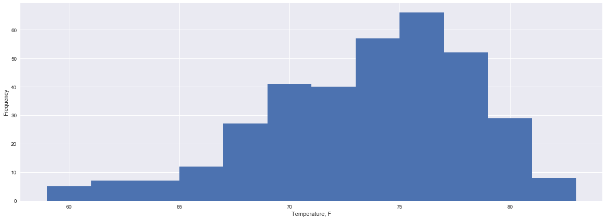

## Step 3 - Climate Analysis and Exploration

You are now ready to use Python and SQLAlchemy to do basic climate analysis and data exploration on your new weather station tables. All of the following analysis should be completed using SQLAlchemy ORM queries, Pandas, and Matplotlib.

* Create a Jupyter Notebook file called `climate_analysis.ipynb` and use it to complete your climate analysis and data exporation.

* Choose a start date and end date for your trip. Make sure that your vacation range is approximately 3-15 days total.


```python
import pandas as pd
import sqlalchemy
from sqlalchemy.ext.automap import automap_base
from sqlalchemy.orm import Session
from sqlalchemy import create_engine, inspect, func
import matplotlib.pyplot as plt
```

* Use SQLAlchemy `create_engine` to connect to your sqlite database.


```python
engine = create_engine("sqlite:///resources/hawaii.sqlite", echo=False)
```


```python
inspector = inspect(engine)
inspector.get_table_names()
```


    ['measurement', 'station']


* Use SQLAlchemy `automap_base()` to reflect your tables into classes and save a reference to those classes called `Station` and `Measurement`.


```python
Base = automap_base()
Base.prepare(engine, reflect=True)
```


```python
for c in Base.classes: 
    print(c)
```

    <class 'sqlalchemy.ext.automap.measurement'>
    <class 'sqlalchemy.ext.automap.station'>


```python
Station = Base.classes.station
Measurement = Base.classes.measurement
```

### Precipitation Analysis

* Design a query to retrieve the last 12 months of precipitation data.
* Select only the `date` and `prcp` values.


```python
session = Session(engine)
```


```python
prcp = session.query(Measurement.date, func.avg(Measurement.prcp)).\
    filter(Measurement.date>'2016-08-23').group_by(Measurement.date)
```

* Load the query results into a Pandas DataFrame and set the index to the date column.


```python
prcp_df = pd.read_sql(prcp.statement,session.bind)
prcp_df['date'] = pd.to_datetime(prcp_df['date'])
prcp_df = prcp_df.set_index('date')
```

* Plot the results using the DataFrame `plot` method.

`<center></center>`


```python
f, ax = plt.subplots(figsize=(20,7))
plt.style.use('seaborn')
prcp_df.plot(ax=ax,legend=False)
plt.xlabel('Date')
plt.ylabel('Precipitation, in')
ax.set_xlim([prcp_df.index.min(),prcp_df.index.max()])
plt.show()
```


* Use Pandas to print the summary statistics for the precipitation data.


```python
prcp_df.describe()
```


<div>
<style scoped>
    .dataframe tbody tr th:only-of-type {
        vertical-align: middle;
    }

    .dataframe tbody tr th {
        vertical-align: top;
    }

    .dataframe thead th {
        text-align: right;
    }
</style>
<table border="1" class="dataframe">
  <thead>
    <tr style="text-align: right;">
      <th></th>
      <th>avg_1</th>
    </tr>
  </thead>
  <tbody>
    <tr>
      <th>count</th>
      <td>365.000000</td>
    </tr>
    <tr>
      <th>mean</th>
      <td>0.156103</td>
    </tr>
    <tr>
      <th>std</th>
      <td>0.275657</td>
    </tr>
    <tr>
      <th>min</th>
      <td>0.000000</td>
    </tr>
    <tr>
      <th>25%</th>
      <td>0.008571</td>
    </tr>
    <tr>
      <th>50%</th>
      <td>0.065000</td>
    </tr>
    <tr>
      <th>75%</th>
      <td>0.175714</td>
    </tr>
    <tr>
      <th>max</th>
      <td>2.040000</td>
    </tr>
  </tbody>
</table>
</div>


### Station Analysis

* Design a query to calculate the total number of stations.


```python
number_of_stations = session.query(Station.name).distinct().count()

print(f'There are {number_of_stations} stations')
```

    There are 9 stations


* Design a query to find the most active stations.

  * List the stations and observation counts in descending order

  * Which station has the highest number of observations?


```python
most_active_stations = session.query(Measurement.station, func.count(Measurement.prcp))\
                        .group_by(Measurement.station)\
                        .order_by(func.count(Measurement.prcp).desc()).all()
df = pd.DataFrame(most_active_stations,columns=['Station','Number of observations'])
df
```


<div>
<style scoped>
    .dataframe tbody tr th:only-of-type {
        vertical-align: middle;
    }

    .dataframe tbody tr th {
        vertical-align: top;
    }

    .dataframe thead th {
        text-align: right;
    }
</style>
<table border="1" class="dataframe">
  <thead>
    <tr style="text-align: right;">
      <th></th>
      <th>Station</th>
      <th>Number of observations</th>
    </tr>
  </thead>
  <tbody>
    <tr>
      <th>0</th>
      <td>USC00519281</td>
      <td>2772</td>
    </tr>
    <tr>
      <th>1</th>
      <td>USC00519397</td>
      <td>2724</td>
    </tr>
    <tr>
      <th>2</th>
      <td>USC00513117</td>
      <td>2709</td>
    </tr>
    <tr>
      <th>3</th>
      <td>USC00519523</td>
      <td>2669</td>
    </tr>
    <tr>
      <th>4</th>
      <td>USC00516128</td>
      <td>2612</td>
    </tr>
    <tr>
      <th>5</th>
      <td>USC00514830</td>
      <td>2202</td>
    </tr>
    <tr>
      <th>6</th>
      <td>USC00511918</td>
      <td>1979</td>
    </tr>
    <tr>
      <th>7</th>
      <td>USC00517948</td>
      <td>1372</td>
    </tr>
    <tr>
      <th>8</th>
      <td>USC00518838</td>
      <td>511</td>
    </tr>
  </tbody>
</table>
</div>


* Design a query to retrieve the last 12 months of temperature observation data (tobs).
* Filter by the station with the highest number of observations.


```python
tobs = session.query(Measurement.date, Measurement.tobs).\
    filter(Measurement.date>'2016-08-23', Measurement.station == 'USC00519281').group_by(Measurement.date)
```


```python
tobs_df = pd.read_sql(tobs.statement,session.bind)
tobs_df['date'] = pd.to_datetime(tobs_df['date'])
tobs_df = tobs_df.set_index('date')
tobs_df.head()
```


<div>
<style scoped>
    .dataframe tbody tr th:only-of-type {
        vertical-align: middle;
    }

    .dataframe tbody tr th {
        vertical-align: top;
    }

    .dataframe thead th {
        text-align: right;
    }
</style>
<table border="1" class="dataframe">
  <thead>
    <tr style="text-align: right;">
      <th></th>
      <th>tobs</th>
    </tr>
    <tr>
      <th>date</th>
      <th></th>
    </tr>
  </thead>
  <tbody>
    <tr>
      <th>2016-08-24</th>
      <td>77.0</td>
    </tr>
    <tr>
      <th>2016-08-25</th>
      <td>80.0</td>
    </tr>
    <tr>
      <th>2016-08-26</th>
      <td>80.0</td>
    </tr>
    <tr>
      <th>2016-08-27</th>
      <td>75.0</td>
    </tr>
    <tr>
      <th>2016-08-28</th>
      <td>73.0</td>
    </tr>
  </tbody>
</table>
</div>


  * Plot the results as a histogram with `bins=12`.

 ` <center></center>`


```python
f, ax = plt.subplots(figsize=(20,7))
plt.style.use('seaborn')
tobs_df.plot(kind='hist',ax=ax,legend=False, bins=12)
plt.xlabel('Temperature, F')
plt.show()
```





### Temperature Analysis

* Write a function called `calc_temps` that will accept a start date and end date in the format `%Y-%m-%d` and return the minimum, average, and maximum temperatures for that range of dates.


```python
def calc_temps(start_date, end_date):
    min_temp = session.query(func.min(Measurement.tobs).label('name')).\
        filter(Measurement.date>=start_date, Measurement.date<=end_date).all()[0][0]
    max_temp = session.query(func.max(Measurement.tobs).label('name')).\
        filter(Measurement.date>=start_date, Measurement.date<=end_date).all()[0][0]
    avg_temp = session.query(func.avg(Measurement.tobs).label('name')).\
        filter(Measurement.date>=start_date, Measurement.date<=end_date).all()[0][0]
    res = {
        'Min':round(min_temp,2),
        'Max':round(max_temp,2),
        'Avg':round(avg_temp,2)
        }
    return res
```

* Use the `calc_temps` function to calculate the min, avg, and max temperatures for your trip using the matching dates from the previous year (i.e. use "2017-01-01" if your trip start date was "2018-01-01")


```python
vacation_start = '2018-08-15'
vacation_end   = '2018-08-30'
```


```python
start_date, end_date = '2017-08-15','2017-08-30'
mn, mx, av = calc_temps(start_date, end_date)
print(f'Temperatures for {start_date}:{end_date} is:')
print(f'Min: {mn}, max: {mx}, average: {round(av,2)}')
```

    Temperatures for 2017-08-15:2017-08-30 is:
    Min: 71.0, max: 85.0, average: 78.73


* Plot the min, avg, and max temperature from your previous query as a bar chart.

  * Use the average temperature as the bar height.

  * Use the peak-to-peak (tmax-tmin) value as the y error bar (yerr).

`<center></center>`


```python
import numpy as np
f, ax = plt.subplots(figsize=(2,5))
plt.style.use('seaborn')
yerr=np.array([(av-mn,mx-av)])
plt.bar(1,av,yerr=yerr,width=0.5)
plt.suptitle('Trip Avg Temp')
ax.set_ylim((0,100))
ax.get_xaxis().set_visible(False)
plt.show()
```


### Optional Recommended Analysis

* The following are optional challenge queries. These are highly recommended to attempt, but not required for the homework.

  * Calcualte the rainfall per weather station using the previous year's matching dates.


```python
rainfall_by_station = session.query( \
    func.strftime('%Y', Measurement.date), Measurement.station, func.sum(Measurement.prcp)
                                   )\
    .group_by(func.strftime('%Y', Measurement.date),Measurement.station).all()
    
for year, station, rainfall in rainfall_by_station:
    print(f'{year}  {station}  {round(rainfall,2)}')
```

    2010  USC00511918  21.33
    2010  USC00513117  40.63
    2010  USC00514830  25.76
    2010  USC00516128  135.32
    2010  USC00517948  5.24
    2010  USC00518838  33.14
    2010  USC00519281  65.69
    2010  USC00519397  9.86
    2010  USC00519523  34.41
    2011  USC00511918  16.46
    2011  USC00513117  63.6
    2011  USC00514830  36.34
    2011  USC00516128  131.65
    2011  USC00517948  13.07
    2011  USC00518838  26.11
    2011  USC00519281  77.92
    2011  USC00519397  21.93
    2011  USC00519523  32.9
    2012  USC00511918  9.17
    2012  USC00513117  32.5
    2012  USC00514830  14.47
    2012  USC00516128  122.59
    2012  USC00517948  2.26
    2012  USC00518838  9.59
    2012  USC00519281  54.9
    2012  USC00519397  14.22
    2012  USC00519523  27.76
    2013  USC00511918  17.69
    2013  USC00513117  47.22
    2013  USC00514830  27.97
    2013  USC00516128  136.8
    2013  USC00517948  5.68
    2013  USC00518838  1.52
    2013  USC00519281  89.03
    2013  USC00519397  19.25
    2013  USC00519523  39.66
    2014  USC00511918  21.94
    2014  USC00513117  58.41
    2014  USC00514830  39.31
    2014  USC00516128  144.55
    2014  USC00517948  7.21
    2014  USC00518838  0.51
    2014  USC00519281  89.85
    2014  USC00519397  21.19
    2014  USC00519523  45.93
    2015  USC00511918  6.09
    2015  USC00513117  53.49
    2015  USC00514830  41.55
    2015  USC00516128  165.52
    2015  USC00517948  3.62
    2015  USC00518838  0.0
    2015  USC00519281  87.7
    2015  USC00519397  18.36
    2015  USC00519523  56.93
    2016  USC00513117  52.15
    2016  USC00514830  27.29
    2016  USC00516128  162.88
    2016  USC00517948  2.97
    2016  USC00519281  79.89
    2016  USC00519397  16.15
    2016  USC00519523  30.77
    2017  USC00513117  34.62
    2017  USC00514830  21.8
    2017  USC00516128  68.78
    2017  USC00517948  3.39
    2017  USC00519281  43.66
    2017  USC00519397  10.66
    2017  USC00519523  27.32


* Calculate the daily normals. Normals are the averages for min, avg, and max temperatures.

  * Create a function called `daily_normals` that will calculate the daily normals for a specific date. This date string will be in the format `%m-%d`. Be sure to use all historic tobs that match that date string.

  * Create a list of dates for your trip in the format `%m-%d`. Use the `daily_normals` function to calculate the normals for each date string and append the results to a list.

  * Load the list of daily normals into a Pandas DataFrame and set the index equal to the date.

  * Use Pandas to plot an area plot (`stacked=False`) for the daily normals.

  `<center></center>`


```python
def daily_normals(date):
    max_year = session.query(func.strftime('%Y', func.max(Measurement.date))).all()[0][0]
    min_year = session.query(func.strftime('%Y', func.min(Measurement.date))).all()[0][0]

    res = pd.DataFrame(columns=['Min','Max','Avg'])
    
    for year in range(int(min_year),int(max_year)+1):
        d = str(year)+'-'+date
        res = res.append(calc_temps(d,d),ignore_index=True)
    
    daily_min = round(res['Min'].mean(),2)
    daily_max = round(res['Max'].mean(),2)
    daily_avg = round(res['Avg'].mean(),2)
    
    return daily_min, daily_max, daily_avg
```


```python
dates = ['08-15','08-16','08-17','08-18','08-19','08-20','08-21','08-22','08-23']

normals = [daily_normals(x) for x in dates]

# add year to dates
dates = pd.to_datetime(['2018-'+x for x in dates])

normals_df = pd.DataFrame.from_records(normals).T
normals_df.columns = dates
normals_df = normals_df.T
normals_df.columns = ['Min','Max','Avg']
normals_df
```


<div>
<style scoped>
    .dataframe tbody tr th:only-of-type {
        vertical-align: middle;
    }

    .dataframe tbody tr th {
        vertical-align: top;
    }

    .dataframe thead th {
        text-align: right;
    }
</style>
<table border="1" class="dataframe">
  <thead>
    <tr style="text-align: right;">
      <th></th>
      <th>Min</th>
      <th>Max</th>
      <th>Avg</th>
    </tr>
  </thead>
  <tbody>
    <tr>
      <th>2018-08-15</th>
      <td>71.62</td>
      <td>80.38</td>
      <td>76.53</td>
    </tr>
    <tr>
      <th>2018-08-16</th>
      <td>71.50</td>
      <td>81.25</td>
      <td>76.32</td>
    </tr>
    <tr>
      <th>2018-08-17</th>
      <td>71.62</td>
      <td>80.62</td>
      <td>76.29</td>
    </tr>
    <tr>
      <th>2018-08-18</th>
      <td>72.62</td>
      <td>80.50</td>
      <td>77.12</td>
    </tr>
    <tr>
      <th>2018-08-19</th>
      <td>70.88</td>
      <td>81.00</td>
      <td>76.18</td>
    </tr>
    <tr>
      <th>2018-08-20</th>
      <td>72.12</td>
      <td>80.12</td>
      <td>76.83</td>
    </tr>
    <tr>
      <th>2018-08-21</th>
      <td>72.38</td>
      <td>80.38</td>
      <td>76.79</td>
    </tr>
    <tr>
      <th>2018-08-22</th>
      <td>72.50</td>
      <td>80.38</td>
      <td>76.81</td>
    </tr>
    <tr>
      <th>2018-08-23</th>
      <td>72.38</td>
      <td>81.12</td>
      <td>76.92</td>
    </tr>
  </tbody>
</table>
</div>


```python
f, ax = plt.subplots(figsize=(20,7))
plt.style.use('seaborn')
normals_df.plot(kind='area',stacked=False,ax=ax)
plt.ylabel('Daily Normals, F')
ax.get_xaxis().set_visible(True)
plt.show()


```


## Step 4 - Climate App

Now that you have completed your initial analysis, design a Flask api based on the queries that you have just developed.

* Use FLASK to create your routes.

### Routes

* `/api/v1.0/precipitation`

  * Query for the dates and temperature observations from the last year.

  * Convert the query results to a Dictionary using `date` as the key and `tobs` as the value.

  * Return the json representation of your dictionary.

* `/api/v1.0/stations`

  * Return a json list of stations from the dataset.

* `/api/v1.0/tobs`

  * Return a json list of Temperature Observations (tobs) for the previous year

* `/api/v1.0/<start>` and `/api/v1.0/<start>/<end>`

  * Return a json list of the minimum temperature, the average temperature, and the max temperature for a given start or start-end range.

  * When given the start only, calculate `TMIN`, `TAVG`, and `TMAX` for all dates greater than and equal to the start date.

  * When given the start and the end date, calculate the `TMIN`, `TAVG`, and `TMAX` for dates between the start and end date inclusive.

## Hints

* You will need to join the station and measurement tables for some of the analysis queries.

* Use Flask `jsonify` to convert your api data into a valid json response object.


```python
from flask import Flask, jsonify

app = Flask(__name__)

@app.route("/")
def welcome():
    """List all available api routes."""
    return (
        f'Available routes:</br>'
        f'/api/v1.0/precipitation</br>'
        f'/api/v1.0/stations</br>'
        f'/api/v1.0/tobs</br>'
        f'/api/v1.0/date and /api/v1.0/start_date/end_date'
    )

@app.route("/api/v1.0/tobs")
def tobs():
    """
    Query for the dates and temperature observations from the last year.
    Convert the query results to a Dictionary using date as the key and tobs as the value.
    Return the json representation of your dictionary.
    """
    prcp = session.query(Measurement.date, func.avg(Measurement.tobs))\
        .filter(Measurement.date>'2015-12-31')\
        .filter(Measurement.date<'2017-01-01')\
        .group_by(Measurement.date).all()
    res = {}
    for d, t in prcp:
        res[str(d)] = t
    return jsonify(res)

@app.route("/api/v1.0/stations")
def stations():
    """
    Return a json list of stations from the dataset.
    """
    res = session.query(Station.station, Station.name).distinct().all()
    res = [{s: n} for s, n in res]
    return jsonify(res)

@app.route("/api/v1.0/precipitation")
def precipitation():
    """
    Query for the dates and precipitation observations from the last year.
    Convert the query results to a Dictionary using date as the key and tobs as the value.
    Return the json representation of your dictionary.
    """
    prcp = session.query(Measurement.date, func.avg(Measurement.prcp))\
        .filter(Measurement.date>'2015-12-31')\
        .filter(Measurement.date<'2017-01-01')\
        .group_by(Measurement.date).all()
    res = {}
    for d, t in prcp:
        res[str(d)] = round(t,2)
    return jsonify(res)


@app.route('/api/v1.0/<start>')
def start(start):
    '''
    Calculate TMIN, TAVG, and TMAX for all dates 
    greater than and equal to the start date.
    '''
    end = session.query(func.strftime('%Y-%m-%d',func.max(Measurement.date))).all()
    end = end[0][0]
    return jsonify(calc_temps(start,end))

@app.route('/api/v1.0/<start>/<end>')
def between(start,end):
    '''
    When given the start and the end date, calculate the TMIN, TAVG, and TMAX 
    for dates between the start and end date inclusive.
    '''
    return jsonify(calc_temps(start,end))
```


```python
# for Jupyter only
from werkzeug.wrappers import Request, Response

if __name__ == '__main__':
    from werkzeug.serving import run_simple
    run_simple('localhost', 5000, app)
```

     * Running on http://localhost:5000/ (Press CTRL+C to quit)
    127.0.0.1 - - [11/May/2018 21:09:18] "GET / HTTP/1.1" 200 -
    127.0.0.1 - - [11/May/2018 21:09:20] "GET / HTTP/1.1" 200 -
    127.0.0.1 - - [11/May/2018 21:09:22] "GET /api/v1.0/precipitation HTTP/1.1" 200 -
    127.0.0.1 - - [11/May/2018 21:09:26] "GET /api/v1.0/2017-01-01 HTTP/1.1" 200 -
    127.0.0.1 - - [11/May/2018 21:09:27] "GET /api/v1.0/2017-01-01 HTTP/1.1" 200 -
    127.0.0.1 - - [11/May/2018 21:09:32] "GET /api/v1.0/2017-01-01/ HTTP/1.1" 404 -
    127.0.0.1 - - [11/May/2018 21:09:33] "GET /api/v1.0/2017-01-01/2018-01-05 HTTP/1.1" 200 -
    127.0.0.1 - - [11/May/2018 21:09:37] "GET /api/v1.0/2017-01-01/2017-08-30 HTTP/1.1" 200 -
    127.0.0.1 - - [11/May/2018 21:09:37] "GET /favicon.ico HTTP/1.1" 404 -

