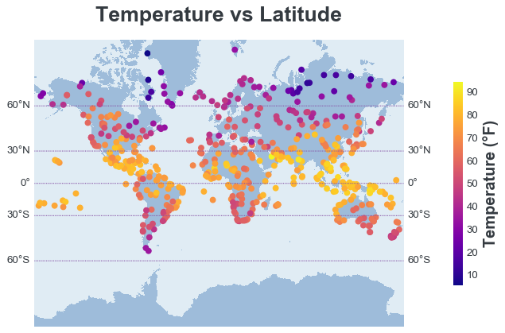
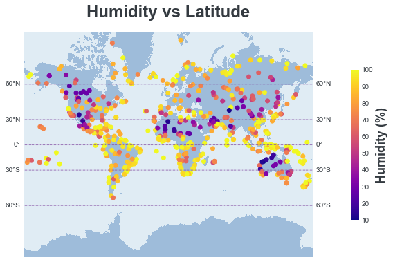
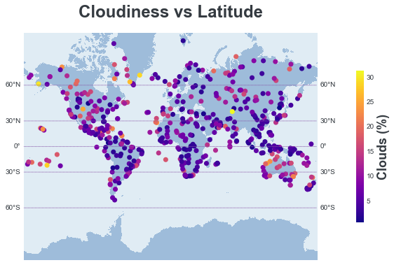
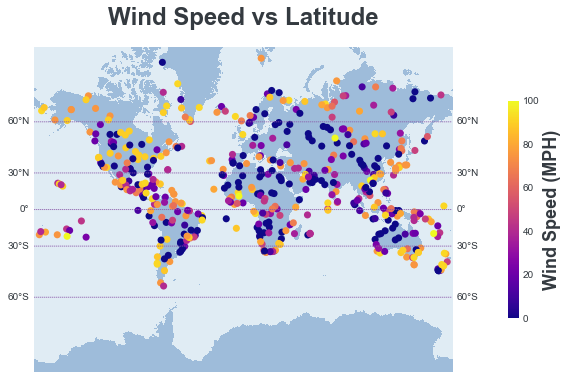
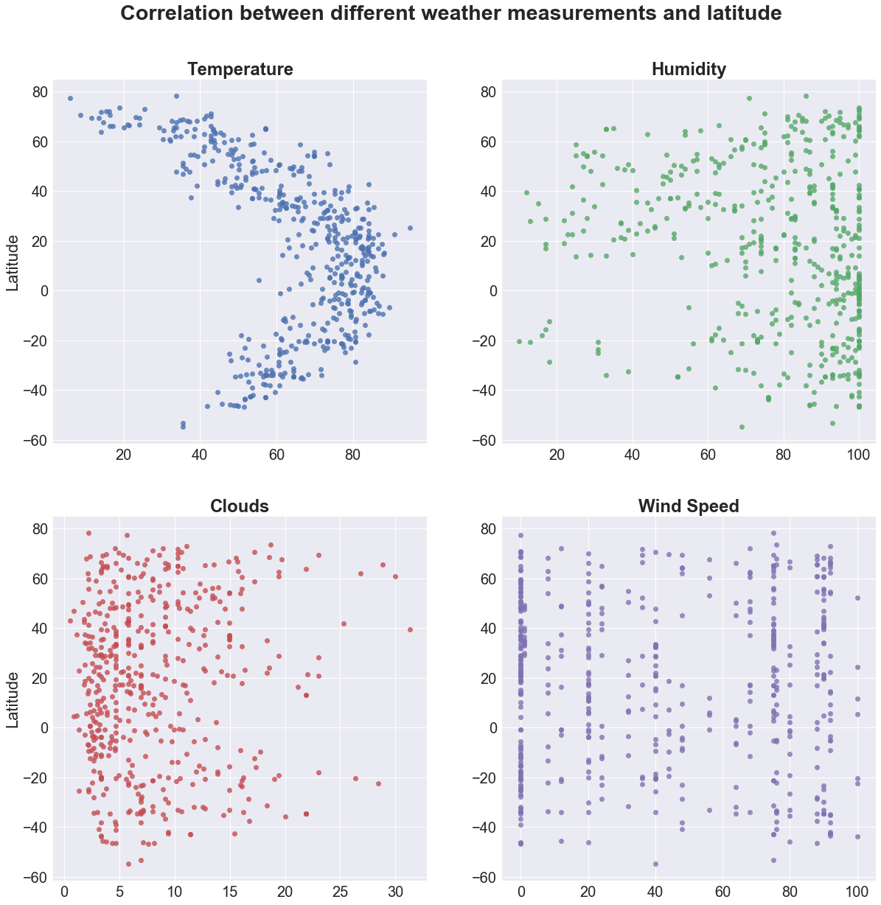
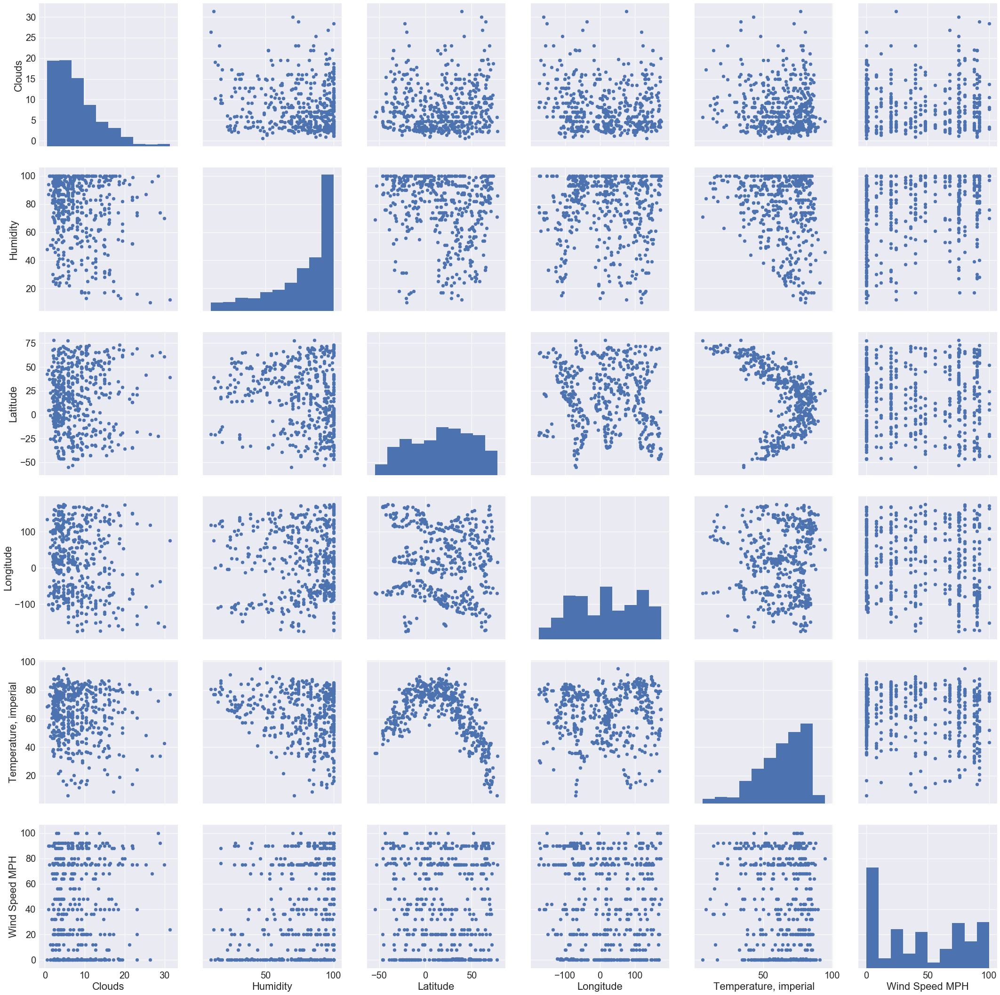

## Unit 6 | Assignment - What's the Weather Like?

## Background

Whether financial, political, or social -- data's true power lies in its ability to answer questions definitively. So let's take what you've learned about Python requests, APIs, and JSON traversals to answer a fundamental question: "What's the weather like as we approach the equator?"

Now, we know what you may be thinking: _"Duh. It gets hotter..."_ 

But, if pressed, how would you **prove** it? 


## WeatherPy

In this example, you'll be creating a Python script to visualize the weather of 500+ cities across the world of varying distance from the equator. To accomplish this, you'll be utilizing a [simple Python library](https://pypi.python.org/pypi/citipy), the [OpenWeatherMap API](https://openweathermap.org/api), and a little common sense to create a representative model of weather across world cities.

Your objective is to build a series of scatter plots to showcase the following relationships:

* Temperature (F) vs. Latitude
* Humidity (%) vs. Latitude
* Cloudiness (%) vs. Latitude
* Wind Speed (mph) vs. Latitude

Your final notebook must:

* Randomly select **at least** 500 unique (non-repeat) cities based on latitude and longitude.
* Perform a weather check on each of the cities using a series of successive API calls. 
* Include a print log of each city as it's being processed with the city number, city name, and requested URL.
* Save both a CSV of all data retrieved and png images for each scatter plot.

As final considerations:

* You must use the Matplotlib and Seaborn libraries.
* You must include a written description of three observable trends based on the data. 
* You must use proper labeling of your plots, including aspects like: Plot Titles (with date of analysis) and Axes Labels.
* You must include an exported markdown version of your Notebook called  `README.md` in your GitHub repository.  
* See [Example Solution](WeatherPy_Example.pdf) for a reference on expected format. 


```python
#dependencies
import random
from mpl_toolkits.basemap import Basemap, cm
import numpy as np
import matplotlib.pyplot as plt
import pandas as pd
from config import *
import requests
from pprint import pprint
from citipy import citipy
import matplotlib as mpl
from matplotlib import rcParams
```


```python
#generate cities list
#longitude (-180,180), latitude (-90,90)
def city_gen(cities, countries):
    '''
    Returns a list of randomly generated lat, lng coordinates and closest city
    '''
    lat, lng = random.uniform(-90, 90), random.uniform(-180, 180)
    city = citipy.nearest_city(lat, lng)
    
    city_name = city.city_name.title()
    country = city.country_code.upper()
    
    if city_name in cities and country in countries:
        #print(f'Found duplicate: {city_name},{country}')
        city_marker = city_gen(cities, countries)[2]
    else:
        city_marker = city_name+','+country
        #print(f'returning {city_marker}')
    return [lat, lng, city_marker]
```


```python
#request current weather
# Save config information.
url = "http://api.openweathermap.org/data/2.5/weather?"
units = "imperial"

# Build partial query URL
query_url = f"{url}appid={api_key}&units={units}&q="

#set up number of cities to query
iterator = 1
number_of_cities = 500

#set up lists for storing results
lat = []
lng = []
temp = []
cities = []
countries = []
humidity = []
cloudiness = []
windspeed =[]

#set up text formatting
bold = "\033[1m"
reset = "\033[0;0m"

while iterator <= number_of_cities:
    print(bold + f'Requesting weather for city # {iterator}' + reset)
    #generate random city
    city_g = city_gen(cities, countries)
    
    r = requests.get(query_url + city_g[2])
    print(f'   requested URL: {r.url}')
    
    if r.status_code == 200:
        response = r.json()
        #pprint(response)
        try:
            city = response['name']
            country = response['sys']['country']
            #make sure city is unique
            if  city in cities and country in countries:
                print(f'   {city}, {country} has already been added, retrying with different city...\n')
            else:
                print('   recording weather for ' + bold + f'{city}, {country}' + reset + '\n')
                temp.append(response['main']['temp'])
                lat.append(response['coord']['lat'])
                lng.append(response['coord']['lon'])
                humidity.append(response['main']['humidity'])
                cloudiness.append(response['wind']['speed'])
                windspeed.append(response['clouds']['all'])
                cities.append(city)
                countries.append(country)
                iterator += 1
        except KeyError:
            print('Key is not found')
    elif r.status_code == 404:
        print('   city not found, retrying with different city... \n')
        
print(bold + f'Recorded weather for {len(cities)} cities.' + reset)
```

    Requesting weather for city # 1
       requested URL: http://api.openweathermap.org/data/2.5/weather?appid=25bc90a1196e6f153eece0bc0b0fc9eb&units=imperial&q=Kapaa,US
       recording weather for Kapaa, US
    
    Requesting weather for city # 2
       requested URL: http://api.openweathermap.org/data/2.5/weather?appid=25bc90a1196e6f153eece0bc0b0fc9eb&units=imperial&q=Hasaki,JP
       recording weather for Hasaki, JP
    
    Requesting weather for city # 3
       requested URL: http://api.openweathermap.org/data/2.5/weather?appid=25bc90a1196e6f153eece0bc0b0fc9eb&units=imperial&q=Bengkulu,ID
       city not found, retrying with different city... 
    
    Requesting weather for city # 3
       requested URL: http://api.openweathermap.org/data/2.5/weather?appid=25bc90a1196e6f153eece0bc0b0fc9eb&units=imperial&q=Attawapiskat,CA
       city not found, retrying with different city... 
    
    Requesting weather for city # 3
       requested URL: http://api.openweathermap.org/data/2.5/weather?appid=25bc90a1196e6f153eece0bc0b0fc9eb&units=imperial&q=Hilo,US
       recording weather for Hilo, US
    
    Requesting weather for city # 4
       requested URL: http://api.openweathermap.org/data/2.5/weather?appid=25bc90a1196e6f153eece0bc0b0fc9eb&units=imperial&q=Cherskiy,RU
       recording weather for Cherskiy, RU
    
    Requesting weather for city # 5
       requested URL: http://api.openweathermap.org/data/2.5/weather?appid=25bc90a1196e6f153eece0bc0b0fc9eb&units=imperial&q=Amderma,RU
       city not found, retrying with different city... 
    
    Requesting weather for city # 5
       requested URL: http://api.openweathermap.org/data/2.5/weather?appid=25bc90a1196e6f153eece0bc0b0fc9eb&units=imperial&q=Punta%20Arenas,CL
       recording weather for Punta Arenas, CL
    
    Requesting weather for city # 6
       requested URL: http://api.openweathermap.org/data/2.5/weather?appid=25bc90a1196e6f153eece0bc0b0fc9eb&units=imperial&q=Codrington,AG
       city not found, retrying with different city... 
    
    Requesting weather for city # 6
       requested URL: http://api.openweathermap.org/data/2.5/weather?appid=25bc90a1196e6f153eece0bc0b0fc9eb&units=imperial&q=Souillac,MU
       recording weather for Souillac, MU
    
    Requesting weather for city # 7
       requested URL: http://api.openweathermap.org/data/2.5/weather?appid=25bc90a1196e6f153eece0bc0b0fc9eb&units=imperial&q=Port%20Alfred,ZA
       recording weather for Port Alfred, ZA
    
    Requesting weather for city # 8
       requested URL: http://api.openweathermap.org/data/2.5/weather?appid=25bc90a1196e6f153eece0bc0b0fc9eb&units=imperial&q=Henties%20Bay,NA
       recording weather for Henties Bay, NA
    
    Requesting weather for city # 9
       requested URL: http://api.openweathermap.org/data/2.5/weather?appid=25bc90a1196e6f153eece0bc0b0fc9eb&units=imperial&q=Coquimbo,CL
       recording weather for Coquimbo, CL
    
    Requesting weather for city # 10
       requested URL: http://api.openweathermap.org/data/2.5/weather?appid=25bc90a1196e6f153eece0bc0b0fc9eb&units=imperial&q=Versalles,CO
       recording weather for Versalles, CO
    
    Requesting weather for city # 11
       requested URL: http://api.openweathermap.org/data/2.5/weather?appid=25bc90a1196e6f153eece0bc0b0fc9eb&units=imperial&q=Cardston,CA
       recording weather for Cardston, CA
    
    Requesting weather for city # 12
       requested URL: http://api.openweathermap.org/data/2.5/weather?appid=25bc90a1196e6f153eece0bc0b0fc9eb&units=imperial&q=Bluff,NZ
       recording weather for Bluff, NZ
    
    Requesting weather for city # 13
       requested URL: http://api.openweathermap.org/data/2.5/weather?appid=25bc90a1196e6f153eece0bc0b0fc9eb&units=imperial&q=Kavieng,PG
       recording weather for Kavieng, PG
    
    Requesting weather for city # 14
       requested URL: http://api.openweathermap.org/data/2.5/weather?appid=25bc90a1196e6f153eece0bc0b0fc9eb&units=imperial&q=Chokurdakh,RU
       recording weather for Chokurdakh, RU
    
    Requesting weather for city # 15
       requested URL: http://api.openweathermap.org/data/2.5/weather?appid=25bc90a1196e6f153eece0bc0b0fc9eb&units=imperial&q=Ancud,CL
       recording weather for Ancud, CL
    
    Requesting weather for city # 16
       requested URL: http://api.openweathermap.org/data/2.5/weather?appid=25bc90a1196e6f153eece0bc0b0fc9eb&units=imperial&q=Doha,QA
       recording weather for Doha, QA
    
    Requesting weather for city # 17
       requested URL: http://api.openweathermap.org/data/2.5/weather?appid=25bc90a1196e6f153eece0bc0b0fc9eb&units=imperial&q=Hobart,AU
       recording weather for Hobart, AU
    
    Requesting weather for city # 18
       requested URL: http://api.openweathermap.org/data/2.5/weather?appid=25bc90a1196e6f153eece0bc0b0fc9eb&units=imperial&q=Rikitea,PF
       recording weather for Rikitea, PF
    
    Requesting weather for city # 19
       requested URL: http://api.openweathermap.org/data/2.5/weather?appid=25bc90a1196e6f153eece0bc0b0fc9eb&units=imperial&q=Kenai,US
       recording weather for Kenai, US
    
    Requesting weather for city # 20
       requested URL: http://api.openweathermap.org/data/2.5/weather?appid=25bc90a1196e6f153eece0bc0b0fc9eb&units=imperial&q=Mys%20Shmidta,RU
       city not found, retrying with different city... 
    
    Requesting weather for city # 20
       requested URL: http://api.openweathermap.org/data/2.5/weather?appid=25bc90a1196e6f153eece0bc0b0fc9eb&units=imperial&q=Kouroussa,GN
       recording weather for Kouroussa, GN
    
    Requesting weather for city # 21
       requested URL: http://api.openweathermap.org/data/2.5/weather?appid=25bc90a1196e6f153eece0bc0b0fc9eb&units=imperial&q=Lebu,CL
       recording weather for Lebu, CL
    
    Requesting weather for city # 22
       requested URL: http://api.openweathermap.org/data/2.5/weather?appid=25bc90a1196e6f153eece0bc0b0fc9eb&units=imperial&q=Havre-Saint-Pierre,CA
       recording weather for Havre-Saint-Pierre, CA
    
    Requesting weather for city # 23
       requested URL: http://api.openweathermap.org/data/2.5/weather?appid=25bc90a1196e6f153eece0bc0b0fc9eb&units=imperial&q=East%20London,ZA
       recording weather for East London, ZA
    
    Requesting weather for city # 24
       requested URL: http://api.openweathermap.org/data/2.5/weather?appid=25bc90a1196e6f153eece0bc0b0fc9eb&units=imperial&q=Hami,CN
       recording weather for Hami, CN
    
    Requesting weather for city # 25
       requested URL: http://api.openweathermap.org/data/2.5/weather?appid=25bc90a1196e6f153eece0bc0b0fc9eb&units=imperial&q=Yar-Sale,RU
       recording weather for Yar-Sale, RU
    
    Requesting weather for city # 26
       requested URL: http://api.openweathermap.org/data/2.5/weather?appid=25bc90a1196e6f153eece0bc0b0fc9eb&units=imperial&q=Qaanaaq,GL
       recording weather for Qaanaaq, GL
    
    Requesting weather for city # 27
       requested URL: http://api.openweathermap.org/data/2.5/weather?appid=25bc90a1196e6f153eece0bc0b0fc9eb&units=imperial&q=Carnarvon,AU
       recording weather for Carnarvon, AU
    
    Requesting weather for city # 28
       requested URL: http://api.openweathermap.org/data/2.5/weather?appid=25bc90a1196e6f153eece0bc0b0fc9eb&units=imperial&q=Tuatapere,NZ
       recording weather for Tuatapere, NZ
    
    Requesting weather for city # 29
       requested URL: http://api.openweathermap.org/data/2.5/weather?appid=25bc90a1196e6f153eece0bc0b0fc9eb&units=imperial&q=Luxor,EG
       recording weather for Luxor, EG
    
    Requesting weather for city # 30
       requested URL: http://api.openweathermap.org/data/2.5/weather?appid=25bc90a1196e6f153eece0bc0b0fc9eb&units=imperial&q=Novoagansk,RU
       recording weather for Novoagansk, RU
    
    Requesting weather for city # 31
       requested URL: http://api.openweathermap.org/data/2.5/weather?appid=25bc90a1196e6f153eece0bc0b0fc9eb&units=imperial&q=Listvyanka,RU
       recording weather for Listvyanka, RU
    
    Requesting weather for city # 32
       requested URL: http://api.openweathermap.org/data/2.5/weather?appid=25bc90a1196e6f153eece0bc0b0fc9eb&units=imperial&q=Mataura,PF
       city not found, retrying with different city... 
    
    Requesting weather for city # 32
       requested URL: http://api.openweathermap.org/data/2.5/weather?appid=25bc90a1196e6f153eece0bc0b0fc9eb&units=imperial&q=Busselton,AU
       recording weather for Busselton, AU
    
    Requesting weather for city # 33
       requested URL: http://api.openweathermap.org/data/2.5/weather?appid=25bc90a1196e6f153eece0bc0b0fc9eb&units=imperial&q=Tiksi,RU
       recording weather for Tiksi, RU
    
    Requesting weather for city # 34
       requested URL: http://api.openweathermap.org/data/2.5/weather?appid=25bc90a1196e6f153eece0bc0b0fc9eb&units=imperial&q=Grootfontein,NA
       recording weather for Grootfontein, NA
    
    Requesting weather for city # 35
       requested URL: http://api.openweathermap.org/data/2.5/weather?appid=25bc90a1196e6f153eece0bc0b0fc9eb&units=imperial&q=Lorengau,PG
       recording weather for Lorengau, PG
    
    Requesting weather for city # 36
       requested URL: http://api.openweathermap.org/data/2.5/weather?appid=25bc90a1196e6f153eece0bc0b0fc9eb&units=imperial&q=Santo%20Augusto,BR
       recording weather for Santo Augusto, BR
    
    Requesting weather for city # 37
       requested URL: http://api.openweathermap.org/data/2.5/weather?appid=25bc90a1196e6f153eece0bc0b0fc9eb&units=imperial&q=Dikson,RU
       recording weather for Dikson, RU
    
    Requesting weather for city # 38
       requested URL: http://api.openweathermap.org/data/2.5/weather?appid=25bc90a1196e6f153eece0bc0b0fc9eb&units=imperial&q=Dancheng,CN
       recording weather for Dancheng, CN
    
    Requesting weather for city # 39
       requested URL: http://api.openweathermap.org/data/2.5/weather?appid=25bc90a1196e6f153eece0bc0b0fc9eb&units=imperial&q=Attawapiskat,CA
       city not found, retrying with different city... 
    
    Requesting weather for city # 39
       requested URL: http://api.openweathermap.org/data/2.5/weather?appid=25bc90a1196e6f153eece0bc0b0fc9eb&units=imperial&q=Maraba,BR
       recording weather for Maraba, BR
    
    Requesting weather for city # 40
       requested URL: http://api.openweathermap.org/data/2.5/weather?appid=25bc90a1196e6f153eece0bc0b0fc9eb&units=imperial&q=Faanui,PF
       recording weather for Faanui, PF
    
    Requesting weather for city # 41
       requested URL: http://api.openweathermap.org/data/2.5/weather?appid=25bc90a1196e6f153eece0bc0b0fc9eb&units=imperial&q=Ushuaia,AR
       recording weather for Ushuaia, AR
    
    Requesting weather for city # 42
       requested URL: http://api.openweathermap.org/data/2.5/weather?appid=25bc90a1196e6f153eece0bc0b0fc9eb&units=imperial&q=Wahiawa,US
       recording weather for Wahiawa, US
    
    Requesting weather for city # 43
       requested URL: http://api.openweathermap.org/data/2.5/weather?appid=25bc90a1196e6f153eece0bc0b0fc9eb&units=imperial&q=Walvis%20Bay,NA
       recording weather for Walvis Bay, NA
    
    Requesting weather for city # 44
       requested URL: http://api.openweathermap.org/data/2.5/weather?appid=25bc90a1196e6f153eece0bc0b0fc9eb&units=imperial&q=Savannah%20Bight,HN
       recording weather for Savannah Bight, HN
    
    Requesting weather for city # 45
       requested URL: http://api.openweathermap.org/data/2.5/weather?appid=25bc90a1196e6f153eece0bc0b0fc9eb&units=imperial&q=Torbay,CA
       recording weather for Torbay, CA
    
    Requesting weather for city # 46
       requested URL: http://api.openweathermap.org/data/2.5/weather?appid=25bc90a1196e6f153eece0bc0b0fc9eb&units=imperial&q=Jamestown,SH
       recording weather for Jamestown, SH
    
    Requesting weather for city # 47
       requested URL: http://api.openweathermap.org/data/2.5/weather?appid=25bc90a1196e6f153eece0bc0b0fc9eb&units=imperial&q=Burgeo,CA
       recording weather for Burgeo, CA
    
    Requesting weather for city # 48
       requested URL: http://api.openweathermap.org/data/2.5/weather?appid=25bc90a1196e6f153eece0bc0b0fc9eb&units=imperial&q=Abu%20Samrah,QA
       city not found, retrying with different city... 
    
    Requesting weather for city # 48
       requested URL: http://api.openweathermap.org/data/2.5/weather?appid=25bc90a1196e6f153eece0bc0b0fc9eb&units=imperial&q=Port%20Lincoln,AU
       recording weather for Port Lincoln, AU
    
    Requesting weather for city # 49
       requested URL: http://api.openweathermap.org/data/2.5/weather?appid=25bc90a1196e6f153eece0bc0b0fc9eb&units=imperial&q=Visnes,NO
       recording weather for Visnes, NO
    
    Requesting weather for city # 50
       requested URL: http://api.openweathermap.org/data/2.5/weather?appid=25bc90a1196e6f153eece0bc0b0fc9eb&units=imperial&q=Celle,DE
       recording weather for Celle, DE
    
    Requesting weather for city # 51
       requested URL: http://api.openweathermap.org/data/2.5/weather?appid=25bc90a1196e6f153eece0bc0b0fc9eb&units=imperial&q=Albany,AU
       recording weather for Albany, AU
    
    Requesting weather for city # 52
       requested URL: http://api.openweathermap.org/data/2.5/weather?appid=25bc90a1196e6f153eece0bc0b0fc9eb&units=imperial&q=Terney,RU
       recording weather for Terney, RU
    
    Requesting weather for city # 53
       requested URL: http://api.openweathermap.org/data/2.5/weather?appid=25bc90a1196e6f153eece0bc0b0fc9eb&units=imperial&q=Barrow,US
       recording weather for Barrow, US
    
    Requesting weather for city # 54
       requested URL: http://api.openweathermap.org/data/2.5/weather?appid=25bc90a1196e6f153eece0bc0b0fc9eb&units=imperial&q=Riberalta,BO
       recording weather for Riberalta, BO
    
    Requesting weather for city # 55
       requested URL: http://api.openweathermap.org/data/2.5/weather?appid=25bc90a1196e6f153eece0bc0b0fc9eb&units=imperial&q=Tianpeng,CN
       recording weather for Tianpeng, CN
    
    Requesting weather for city # 56
       requested URL: http://api.openweathermap.org/data/2.5/weather?appid=25bc90a1196e6f153eece0bc0b0fc9eb&units=imperial&q=Palmerston,AU
       recording weather for Palmerston, AU
    
    Requesting weather for city # 57
       requested URL: http://api.openweathermap.org/data/2.5/weather?appid=25bc90a1196e6f153eece0bc0b0fc9eb&units=imperial&q=Longyearbyen,SJ
       recording weather for Longyearbyen, SJ
    
    Requesting weather for city # 58
       requested URL: http://api.openweathermap.org/data/2.5/weather?appid=25bc90a1196e6f153eece0bc0b0fc9eb&units=imperial&q=Skiathos,GR
       recording weather for Skiathos, GR
    
    Requesting weather for city # 59
       requested URL: http://api.openweathermap.org/data/2.5/weather?appid=25bc90a1196e6f153eece0bc0b0fc9eb&units=imperial&q=Soto%20La%20Marina,MX
       recording weather for Soto la Marina, MX
    
    Requesting weather for city # 60
       requested URL: http://api.openweathermap.org/data/2.5/weather?appid=25bc90a1196e6f153eece0bc0b0fc9eb&units=imperial&q=Puerto%20Ayora,EC
       recording weather for Puerto Ayora, EC
    
    Requesting weather for city # 61
       requested URL: http://api.openweathermap.org/data/2.5/weather?appid=25bc90a1196e6f153eece0bc0b0fc9eb&units=imperial&q=Envira,BR
       city not found, retrying with different city... 
    
    Requesting weather for city # 61
       requested URL: http://api.openweathermap.org/data/2.5/weather?appid=25bc90a1196e6f153eece0bc0b0fc9eb&units=imperial&q=Chimoio,MZ
       recording weather for Chimoio, MZ
    
    Requesting weather for city # 62
       requested URL: http://api.openweathermap.org/data/2.5/weather?appid=25bc90a1196e6f153eece0bc0b0fc9eb&units=imperial&q=Mataura,PF
       city not found, retrying with different city... 
    
    Requesting weather for city # 62
       requested URL: http://api.openweathermap.org/data/2.5/weather?appid=25bc90a1196e6f153eece0bc0b0fc9eb&units=imperial&q=Cape%20Town,ZA
       recording weather for Cape Town, ZA
    
    Requesting weather for city # 63
       requested URL: http://api.openweathermap.org/data/2.5/weather?appid=25bc90a1196e6f153eece0bc0b0fc9eb&units=imperial&q=Vulcan,CA
       recording weather for Vulcan, CA
    
    Requesting weather for city # 64
       requested URL: http://api.openweathermap.org/data/2.5/weather?appid=25bc90a1196e6f153eece0bc0b0fc9eb&units=imperial&q=Kalabo,ZM
       recording weather for Kalabo, ZM
    
    Requesting weather for city # 65
       requested URL: http://api.openweathermap.org/data/2.5/weather?appid=25bc90a1196e6f153eece0bc0b0fc9eb&units=imperial&q=Maniitsoq,GL
       recording weather for Maniitsoq, GL
    
    Requesting weather for city # 66
       requested URL: http://api.openweathermap.org/data/2.5/weather?appid=25bc90a1196e6f153eece0bc0b0fc9eb&units=imperial&q=Rakaia,NZ
       recording weather for Rakaia, NZ
    
    Requesting weather for city # 67
       requested URL: http://api.openweathermap.org/data/2.5/weather?appid=25bc90a1196e6f153eece0bc0b0fc9eb&units=imperial&q=Kaliua,TZ
       recording weather for Kaliua, TZ
    
    Requesting weather for city # 68
       requested URL: http://api.openweathermap.org/data/2.5/weather?appid=25bc90a1196e6f153eece0bc0b0fc9eb&units=imperial&q=Port%20Macquarie,AU
       recording weather for Port Macquarie, AU
    
    Requesting weather for city # 69
       requested URL: http://api.openweathermap.org/data/2.5/weather?appid=25bc90a1196e6f153eece0bc0b0fc9eb&units=imperial&q=Freeport,US
       recording weather for Freeport, US
    
    Requesting weather for city # 70
       requested URL: http://api.openweathermap.org/data/2.5/weather?appid=25bc90a1196e6f153eece0bc0b0fc9eb&units=imperial&q=Nagarote,NI
       recording weather for Nagarote, NI
    
    Requesting weather for city # 71
       requested URL: http://api.openweathermap.org/data/2.5/weather?appid=25bc90a1196e6f153eece0bc0b0fc9eb&units=imperial&q=Mogadishu,SO
       recording weather for Mogadishu, SO
    
    Requesting weather for city # 72
       requested URL: http://api.openweathermap.org/data/2.5/weather?appid=25bc90a1196e6f153eece0bc0b0fc9eb&units=imperial&q=Nikolskoye,RU
       recording weather for Nikolskoye, RU
    
    Requesting weather for city # 73
       requested URL: http://api.openweathermap.org/data/2.5/weather?appid=25bc90a1196e6f153eece0bc0b0fc9eb&units=imperial&q=Leshukonskoye,RU
       recording weather for Leshukonskoye, RU
    
    Requesting weather for city # 74
       requested URL: http://api.openweathermap.org/data/2.5/weather?appid=25bc90a1196e6f153eece0bc0b0fc9eb&units=imperial&q=Kahului,US
       recording weather for Kahului, US
    
    Requesting weather for city # 75
       requested URL: http://api.openweathermap.org/data/2.5/weather?appid=25bc90a1196e6f153eece0bc0b0fc9eb&units=imperial&q=Portland,AU
       recording weather for Portland, AU
    
    Requesting weather for city # 76
       requested URL: http://api.openweathermap.org/data/2.5/weather?appid=25bc90a1196e6f153eece0bc0b0fc9eb&units=imperial&q=Isangel,VU
       recording weather for Isangel, VU
    
    Requesting weather for city # 77
       requested URL: http://api.openweathermap.org/data/2.5/weather?appid=25bc90a1196e6f153eece0bc0b0fc9eb&units=imperial&q=Caraballeda,VE
       recording weather for Caraballeda, VE
    
    Requesting weather for city # 78
       requested URL: http://api.openweathermap.org/data/2.5/weather?appid=25bc90a1196e6f153eece0bc0b0fc9eb&units=imperial&q=Cockburn%20Town,TC
       recording weather for Cockburn Town, TC
    
    Requesting weather for city # 79
       requested URL: http://api.openweathermap.org/data/2.5/weather?appid=25bc90a1196e6f153eece0bc0b0fc9eb&units=imperial&q=Atuona,PF
       recording weather for Atuona, PF
    
    Requesting weather for city # 80
       requested URL: http://api.openweathermap.org/data/2.5/weather?appid=25bc90a1196e6f153eece0bc0b0fc9eb&units=imperial&q=Yellowknife,CA
       recording weather for Yellowknife, CA
    
    Requesting weather for city # 81
       requested URL: http://api.openweathermap.org/data/2.5/weather?appid=25bc90a1196e6f153eece0bc0b0fc9eb&units=imperial&q=Dicabisagan,PH
       recording weather for Dicabisagan, PH
    
    Requesting weather for city # 82
       requested URL: http://api.openweathermap.org/data/2.5/weather?appid=25bc90a1196e6f153eece0bc0b0fc9eb&units=imperial&q=Moradabad,IN
       recording weather for Moradabad, IN
    
    Requesting weather for city # 83
       requested URL: http://api.openweathermap.org/data/2.5/weather?appid=25bc90a1196e6f153eece0bc0b0fc9eb&units=imperial&q=Sechura,PE
       recording weather for Sechura, PE
    
    Requesting weather for city # 84
       requested URL: http://api.openweathermap.org/data/2.5/weather?appid=25bc90a1196e6f153eece0bc0b0fc9eb&units=imperial&q=Broken%20Hill,AU
       recording weather for Broken Hill, AU
    
    Requesting weather for city # 85
       requested URL: http://api.openweathermap.org/data/2.5/weather?appid=25bc90a1196e6f153eece0bc0b0fc9eb&units=imperial&q=Lodja,CD
       recording weather for Lodja, CD
    
    Requesting weather for city # 86
       requested URL: http://api.openweathermap.org/data/2.5/weather?appid=25bc90a1196e6f153eece0bc0b0fc9eb&units=imperial&q=Emba,KZ
       city not found, retrying with different city... 
    
    Requesting weather for city # 86
       requested URL: http://api.openweathermap.org/data/2.5/weather?appid=25bc90a1196e6f153eece0bc0b0fc9eb&units=imperial&q=Kaitangata,NZ
       recording weather for Kaitangata, NZ
    
    Requesting weather for city # 87
       requested URL: http://api.openweathermap.org/data/2.5/weather?appid=25bc90a1196e6f153eece0bc0b0fc9eb&units=imperial&q=Barentsburg,SJ
       city not found, retrying with different city... 
    
    Requesting weather for city # 87
       requested URL: http://api.openweathermap.org/data/2.5/weather?appid=25bc90a1196e6f153eece0bc0b0fc9eb&units=imperial&q=Bow%20Island,CA
       recording weather for Bow Island, CA
    
    Requesting weather for city # 88
       requested URL: http://api.openweathermap.org/data/2.5/weather?appid=25bc90a1196e6f153eece0bc0b0fc9eb&units=imperial&q=Tottori,JP
       recording weather for Tottori, JP
    
    Requesting weather for city # 89
       requested URL: http://api.openweathermap.org/data/2.5/weather?appid=25bc90a1196e6f153eece0bc0b0fc9eb&units=imperial&q=Tecoanapa,MX
       recording weather for Tecoanapa, MX
    
    Requesting weather for city # 90
       requested URL: http://api.openweathermap.org/data/2.5/weather?appid=25bc90a1196e6f153eece0bc0b0fc9eb&units=imperial&q=Uwajima,JP
       recording weather for Uwajima, JP
    
    Requesting weather for city # 91
       requested URL: http://api.openweathermap.org/data/2.5/weather?appid=25bc90a1196e6f153eece0bc0b0fc9eb&units=imperial&q=Tuktoyaktuk,CA
       recording weather for Tuktoyaktuk, CA
    
    Requesting weather for city # 92
       requested URL: http://api.openweathermap.org/data/2.5/weather?appid=25bc90a1196e6f153eece0bc0b0fc9eb&units=imperial&q=Samusu,WS
       city not found, retrying with different city... 
    
    Requesting weather for city # 92
       requested URL: http://api.openweathermap.org/data/2.5/weather?appid=25bc90a1196e6f153eece0bc0b0fc9eb&units=imperial&q=Oranjemund,NA
       recording weather for Oranjemund, NA
    
    Requesting weather for city # 93
       requested URL: http://api.openweathermap.org/data/2.5/weather?appid=25bc90a1196e6f153eece0bc0b0fc9eb&units=imperial&q=Thompson,CA
       recording weather for Thompson, CA
    
    Requesting weather for city # 94
       requested URL: http://api.openweathermap.org/data/2.5/weather?appid=25bc90a1196e6f153eece0bc0b0fc9eb&units=imperial&q=Barroualie,VC
       city not found, retrying with different city... 
    
    Requesting weather for city # 94
       requested URL: http://api.openweathermap.org/data/2.5/weather?appid=25bc90a1196e6f153eece0bc0b0fc9eb&units=imperial&q=Hay%20River,CA
       recording weather for Hay River, CA
    
    Requesting weather for city # 95
       requested URL: http://api.openweathermap.org/data/2.5/weather?appid=25bc90a1196e6f153eece0bc0b0fc9eb&units=imperial&q=Saint%20Anthony,CA
       city not found, retrying with different city... 
    
    Requesting weather for city # 95
       requested URL: http://api.openweathermap.org/data/2.5/weather?appid=25bc90a1196e6f153eece0bc0b0fc9eb&units=imperial&q=Kodiak,US
       recording weather for Kodiak, US
    
    Requesting weather for city # 96
       requested URL: http://api.openweathermap.org/data/2.5/weather?appid=25bc90a1196e6f153eece0bc0b0fc9eb&units=imperial&q=Mendahara,ID
       city not found, retrying with different city... 
    
    Requesting weather for city # 96
       requested URL: http://api.openweathermap.org/data/2.5/weather?appid=25bc90a1196e6f153eece0bc0b0fc9eb&units=imperial&q=Severo-Kurilsk,RU
       recording weather for Severo-Kurilsk, RU
    
    Requesting weather for city # 97
       requested URL: http://api.openweathermap.org/data/2.5/weather?appid=25bc90a1196e6f153eece0bc0b0fc9eb&units=imperial&q=Lompoc,US
       recording weather for Lompoc, US
    
    Requesting weather for city # 98
       requested URL: http://api.openweathermap.org/data/2.5/weather?appid=25bc90a1196e6f153eece0bc0b0fc9eb&units=imperial&q=New%20Norfolk,AU
       recording weather for New Norfolk, AU
    
    Requesting weather for city # 99
       requested URL: http://api.openweathermap.org/data/2.5/weather?appid=25bc90a1196e6f153eece0bc0b0fc9eb&units=imperial&q=Pisco,PE
       recording weather for Pisco, PE
    
    Requesting weather for city # 100
       requested URL: http://api.openweathermap.org/data/2.5/weather?appid=25bc90a1196e6f153eece0bc0b0fc9eb&units=imperial&q=Thinadhoo,MV
       recording weather for Thinadhoo, MV
    
    Requesting weather for city # 101
       requested URL: http://api.openweathermap.org/data/2.5/weather?appid=25bc90a1196e6f153eece0bc0b0fc9eb&units=imperial&q=Castro,CL
       recording weather for Castro, CL
    
    Requesting weather for city # 102
       requested URL: http://api.openweathermap.org/data/2.5/weather?appid=25bc90a1196e6f153eece0bc0b0fc9eb&units=imperial&q=Mataura,PF
       city not found, retrying with different city... 
    
    Requesting weather for city # 102
       requested URL: http://api.openweathermap.org/data/2.5/weather?appid=25bc90a1196e6f153eece0bc0b0fc9eb&units=imperial&q=Mataura,PF
       city not found, retrying with different city... 
    
    Requesting weather for city # 102
       requested URL: http://api.openweathermap.org/data/2.5/weather?appid=25bc90a1196e6f153eece0bc0b0fc9eb&units=imperial&q=Te%20Anau,NZ
       recording weather for Te Anau, NZ
    
    Requesting weather for city # 103
       requested URL: http://api.openweathermap.org/data/2.5/weather?appid=25bc90a1196e6f153eece0bc0b0fc9eb&units=imperial&q=Georgetown,SH
       recording weather for Georgetown, SH
    
    Requesting weather for city # 104
       requested URL: http://api.openweathermap.org/data/2.5/weather?appid=25bc90a1196e6f153eece0bc0b0fc9eb&units=imperial&q=Ilhabela,BR
       recording weather for Ilhabela, BR
    
    Requesting weather for city # 105
       requested URL: http://api.openweathermap.org/data/2.5/weather?appid=25bc90a1196e6f153eece0bc0b0fc9eb&units=imperial&q=Namtsy,RU
       recording weather for Namtsy, RU
    
    Requesting weather for city # 106
       requested URL: http://api.openweathermap.org/data/2.5/weather?appid=25bc90a1196e6f153eece0bc0b0fc9eb&units=imperial&q=Victoria,SC
       recording weather for Victoria, SC
    
    Requesting weather for city # 107
       requested URL: http://api.openweathermap.org/data/2.5/weather?appid=25bc90a1196e6f153eece0bc0b0fc9eb&units=imperial&q=Ahumada,MX
       city not found, retrying with different city... 
    
    Requesting weather for city # 107
       requested URL: http://api.openweathermap.org/data/2.5/weather?appid=25bc90a1196e6f153eece0bc0b0fc9eb&units=imperial&q=Manokwari,ID
       recording weather for Manokwari, ID
    
    Requesting weather for city # 108
       requested URL: http://api.openweathermap.org/data/2.5/weather?appid=25bc90a1196e6f153eece0bc0b0fc9eb&units=imperial&q=Biak,ID
       recording weather for Biak, ID
    
    Requesting weather for city # 109
       requested URL: http://api.openweathermap.org/data/2.5/weather?appid=25bc90a1196e6f153eece0bc0b0fc9eb&units=imperial&q=Huilong,CN
       recording weather for Huilong, CN
    
    Requesting weather for city # 110
       requested URL: http://api.openweathermap.org/data/2.5/weather?appid=25bc90a1196e6f153eece0bc0b0fc9eb&units=imperial&q=Mar%20Del%20Plata,AR
       recording weather for Mar del Plata, AR
    
    Requesting weather for city # 111
       requested URL: http://api.openweathermap.org/data/2.5/weather?appid=25bc90a1196e6f153eece0bc0b0fc9eb&units=imperial&q=Bredasdorp,ZA
       recording weather for Bredasdorp, ZA
    
    Requesting weather for city # 112
       requested URL: http://api.openweathermap.org/data/2.5/weather?appid=25bc90a1196e6f153eece0bc0b0fc9eb&units=imperial&q=College,US
       recording weather for College, US
    
    Requesting weather for city # 113
       requested URL: http://api.openweathermap.org/data/2.5/weather?appid=25bc90a1196e6f153eece0bc0b0fc9eb&units=imperial&q=Narsaq,GL
       recording weather for Narsaq, GL
    
    Requesting weather for city # 114
       requested URL: http://api.openweathermap.org/data/2.5/weather?appid=25bc90a1196e6f153eece0bc0b0fc9eb&units=imperial&q=Binga,CD
       recording weather for Binga, CD
    
    Requesting weather for city # 115
       requested URL: http://api.openweathermap.org/data/2.5/weather?appid=25bc90a1196e6f153eece0bc0b0fc9eb&units=imperial&q=Mar%20Del%20Plata,AR
       Mar del Plata, AR has already been added, retrying with different city...
    
    Requesting weather for city # 115
       requested URL: http://api.openweathermap.org/data/2.5/weather?appid=25bc90a1196e6f153eece0bc0b0fc9eb&units=imperial&q=Cidreira,BR
       recording weather for Cidreira, BR
    
    Requesting weather for city # 116
       requested URL: http://api.openweathermap.org/data/2.5/weather?appid=25bc90a1196e6f153eece0bc0b0fc9eb&units=imperial&q=Mataura,PF
       city not found, retrying with different city... 
    
    Requesting weather for city # 116
       requested URL: http://api.openweathermap.org/data/2.5/weather?appid=25bc90a1196e6f153eece0bc0b0fc9eb&units=imperial&q=Umm%20Kaddadah,SD
       recording weather for Umm Kaddadah, SD
    
    Requesting weather for city # 117
       requested URL: http://api.openweathermap.org/data/2.5/weather?appid=25bc90a1196e6f153eece0bc0b0fc9eb&units=imperial&q=Mount%20Isa,AU
       recording weather for Mount Isa, AU
    
    Requesting weather for city # 118
       requested URL: http://api.openweathermap.org/data/2.5/weather?appid=25bc90a1196e6f153eece0bc0b0fc9eb&units=imperial&q=Tema,GH
       recording weather for Tema, GH
    
    Requesting weather for city # 119
       requested URL: http://api.openweathermap.org/data/2.5/weather?appid=25bc90a1196e6f153eece0bc0b0fc9eb&units=imperial&q=Ustye,RU
       recording weather for Ustye, RU
    
    Requesting weather for city # 120
       requested URL: http://api.openweathermap.org/data/2.5/weather?appid=25bc90a1196e6f153eece0bc0b0fc9eb&units=imperial&q=San%20Patricio,MX
       recording weather for San Patricio, MX
    
    Requesting weather for city # 121
       requested URL: http://api.openweathermap.org/data/2.5/weather?appid=25bc90a1196e6f153eece0bc0b0fc9eb&units=imperial&q=Terrace%20Bay,CA
       recording weather for Terrace Bay, CA
    
    Requesting weather for city # 122
       requested URL: http://api.openweathermap.org/data/2.5/weather?appid=25bc90a1196e6f153eece0bc0b0fc9eb&units=imperial&q=Sao%20Joao%20Da%20Barra,BR
       recording weather for Sao Joao da Barra, BR
    
    Requesting weather for city # 123
       requested URL: http://api.openweathermap.org/data/2.5/weather?appid=25bc90a1196e6f153eece0bc0b0fc9eb&units=imperial&q=Belmopan,BZ
       recording weather for Belmopan, BZ
    
    Requesting weather for city # 124
       requested URL: http://api.openweathermap.org/data/2.5/weather?appid=25bc90a1196e6f153eece0bc0b0fc9eb&units=imperial&q=Vagamo,NO
       recording weather for Vagamo, NO
    
    Requesting weather for city # 125
       requested URL: http://api.openweathermap.org/data/2.5/weather?appid=25bc90a1196e6f153eece0bc0b0fc9eb&units=imperial&q=Kuhdasht,IR
       recording weather for Kuhdasht, IR
    
    Requesting weather for city # 126
       requested URL: http://api.openweathermap.org/data/2.5/weather?appid=25bc90a1196e6f153eece0bc0b0fc9eb&units=imperial&q=Chuy,UY
       recording weather for Chuy, UY
    
    Requesting weather for city # 127
       requested URL: http://api.openweathermap.org/data/2.5/weather?appid=25bc90a1196e6f153eece0bc0b0fc9eb&units=imperial&q=Isiro,CD
       recording weather for Isiro, CD
    
    Requesting weather for city # 128
       requested URL: http://api.openweathermap.org/data/2.5/weather?appid=25bc90a1196e6f153eece0bc0b0fc9eb&units=imperial&q=Saint-Philippe,RE
       recording weather for Saint-Philippe, RE
    
    Requesting weather for city # 129
       requested URL: http://api.openweathermap.org/data/2.5/weather?appid=25bc90a1196e6f153eece0bc0b0fc9eb&units=imperial&q=Hithadhoo,MV
       recording weather for Hithadhoo, MV
    
    Requesting weather for city # 130
       requested URL: http://api.openweathermap.org/data/2.5/weather?appid=25bc90a1196e6f153eece0bc0b0fc9eb&units=imperial&q=Vaini,TO
       recording weather for Vaini, TO
    
    Requesting weather for city # 131
       requested URL: http://api.openweathermap.org/data/2.5/weather?appid=25bc90a1196e6f153eece0bc0b0fc9eb&units=imperial&q=Don%20Sak,TH
       recording weather for Don Sak, TH
    
    Requesting weather for city # 132
       requested URL: http://api.openweathermap.org/data/2.5/weather?appid=25bc90a1196e6f153eece0bc0b0fc9eb&units=imperial&q=Scottsburgh,ZA
       city not found, retrying with different city... 
    
    Requesting weather for city # 132
       requested URL: http://api.openweathermap.org/data/2.5/weather?appid=25bc90a1196e6f153eece0bc0b0fc9eb&units=imperial&q=Mafinga,TZ
       city not found, retrying with different city... 
    
    Requesting weather for city # 132
       requested URL: http://api.openweathermap.org/data/2.5/weather?appid=25bc90a1196e6f153eece0bc0b0fc9eb&units=imperial&q=Kruisfontein,ZA
       recording weather for Kruisfontein, ZA
    
    Requesting weather for city # 133
       requested URL: http://api.openweathermap.org/data/2.5/weather?appid=25bc90a1196e6f153eece0bc0b0fc9eb&units=imperial&q=Rungata,KI
       city not found, retrying with different city... 
    
    Requesting weather for city # 133
       requested URL: http://api.openweathermap.org/data/2.5/weather?appid=25bc90a1196e6f153eece0bc0b0fc9eb&units=imperial&q=Palabuhanratu,ID
       city not found, retrying with different city... 
    
    Requesting weather for city # 133
       requested URL: http://api.openweathermap.org/data/2.5/weather?appid=25bc90a1196e6f153eece0bc0b0fc9eb&units=imperial&q=Tubruq,LY
       city not found, retrying with different city... 
    
    Requesting weather for city # 133
       requested URL: http://api.openweathermap.org/data/2.5/weather?appid=25bc90a1196e6f153eece0bc0b0fc9eb&units=imperial&q=Mangai,CD
       recording weather for Mangai, CD
    
    Requesting weather for city # 134
       requested URL: http://api.openweathermap.org/data/2.5/weather?appid=25bc90a1196e6f153eece0bc0b0fc9eb&units=imperial&q=Vagay,RU
       recording weather for Vagay, RU
    
    Requesting weather for city # 135
       requested URL: http://api.openweathermap.org/data/2.5/weather?appid=25bc90a1196e6f153eece0bc0b0fc9eb&units=imperial&q=Taolanaro,MG
       city not found, retrying with different city... 
    
    Requesting weather for city # 135
       requested URL: http://api.openweathermap.org/data/2.5/weather?appid=25bc90a1196e6f153eece0bc0b0fc9eb&units=imperial&q=Esperance,AU
       recording weather for Esperance, AU
    
    Requesting weather for city # 136
       requested URL: http://api.openweathermap.org/data/2.5/weather?appid=25bc90a1196e6f153eece0bc0b0fc9eb&units=imperial&q=Ndouci,CI
       city not found, retrying with different city... 
    
    Requesting weather for city # 136
       requested URL: http://api.openweathermap.org/data/2.5/weather?appid=25bc90a1196e6f153eece0bc0b0fc9eb&units=imperial&q=Mayumba,GA
       recording weather for Mayumba, GA
    
    Requesting weather for city # 137
       requested URL: http://api.openweathermap.org/data/2.5/weather?appid=25bc90a1196e6f153eece0bc0b0fc9eb&units=imperial&q=Klaksvik,FO
       recording weather for Klaksvik, FO
    
    Requesting weather for city # 138
       requested URL: http://api.openweathermap.org/data/2.5/weather?appid=25bc90a1196e6f153eece0bc0b0fc9eb&units=imperial&q=San%20Quintin,MX
       city not found, retrying with different city... 
    
    Requesting weather for city # 138
       requested URL: http://api.openweathermap.org/data/2.5/weather?appid=25bc90a1196e6f153eece0bc0b0fc9eb&units=imperial&q=Payo,PH
       city not found, retrying with different city... 
    
    Requesting weather for city # 138
       requested URL: http://api.openweathermap.org/data/2.5/weather?appid=25bc90a1196e6f153eece0bc0b0fc9eb&units=imperial&q=Taoudenni,ML
       recording weather for Taoudenni, ML
    
    Requesting weather for city # 139
       requested URL: http://api.openweathermap.org/data/2.5/weather?appid=25bc90a1196e6f153eece0bc0b0fc9eb&units=imperial&q=Rio%20Grande,BR
       recording weather for Rio Grande, BR
    
    Requesting weather for city # 140
       requested URL: http://api.openweathermap.org/data/2.5/weather?appid=25bc90a1196e6f153eece0bc0b0fc9eb&units=imperial&q=Great%20Falls,US
       recording weather for Great Falls, US
    
    Requesting weather for city # 141
       requested URL: http://api.openweathermap.org/data/2.5/weather?appid=25bc90a1196e6f153eece0bc0b0fc9eb&units=imperial&q=Morant%20Bay,JM
       recording weather for Morant Bay, JM
    
    Requesting weather for city # 142
       requested URL: http://api.openweathermap.org/data/2.5/weather?appid=25bc90a1196e6f153eece0bc0b0fc9eb&units=imperial&q=Yulara,AU
       recording weather for Yulara, AU
    
    Requesting weather for city # 143
       requested URL: http://api.openweathermap.org/data/2.5/weather?appid=25bc90a1196e6f153eece0bc0b0fc9eb&units=imperial&q=Korla,CN
       recording weather for Korla, CN
    
    Requesting weather for city # 144
       requested URL: http://api.openweathermap.org/data/2.5/weather?appid=25bc90a1196e6f153eece0bc0b0fc9eb&units=imperial&q=Estelle,US
       recording weather for Estelle, US
    
    Requesting weather for city # 145
       requested URL: http://api.openweathermap.org/data/2.5/weather?appid=25bc90a1196e6f153eece0bc0b0fc9eb&units=imperial&q=Jiaozuo,CN
       recording weather for Jiaozuo, CN
    
    Requesting weather for city # 146
       requested URL: http://api.openweathermap.org/data/2.5/weather?appid=25bc90a1196e6f153eece0bc0b0fc9eb&units=imperial&q=Mataura,PF
       city not found, retrying with different city... 
    
    Requesting weather for city # 146
       requested URL: http://api.openweathermap.org/data/2.5/weather?appid=25bc90a1196e6f153eece0bc0b0fc9eb&units=imperial&q=Port%20Hedland,AU
       recording weather for Port Hedland, AU
    
    Requesting weather for city # 147
       requested URL: http://api.openweathermap.org/data/2.5/weather?appid=25bc90a1196e6f153eece0bc0b0fc9eb&units=imperial&q=Bambous%20Virieux,MU
       recording weather for Bambous Virieux, MU
    
    Requesting weather for city # 148
       requested URL: http://api.openweathermap.org/data/2.5/weather?appid=25bc90a1196e6f153eece0bc0b0fc9eb&units=imperial&q=Mataura,PF
       city not found, retrying with different city... 
    
    Requesting weather for city # 148
       requested URL: http://api.openweathermap.org/data/2.5/weather?appid=25bc90a1196e6f153eece0bc0b0fc9eb&units=imperial&q=Ponta%20Do%20Sol,CV
       recording weather for Ponta do Sol, CV
    
    Requesting weather for city # 149
       requested URL: http://api.openweathermap.org/data/2.5/weather?appid=25bc90a1196e6f153eece0bc0b0fc9eb&units=imperial&q=Cabo%20San%20Lucas,MX
       recording weather for Cabo San Lucas, MX
    
    Requesting weather for city # 150
       requested URL: http://api.openweathermap.org/data/2.5/weather?appid=25bc90a1196e6f153eece0bc0b0fc9eb&units=imperial&q=Jalu,LY
       recording weather for Jalu, LY
    
    Requesting weather for city # 151
       requested URL: http://api.openweathermap.org/data/2.5/weather?appid=25bc90a1196e6f153eece0bc0b0fc9eb&units=imperial&q=Bhanpuri,IN
       recording weather for Bhanpuri, IN
    
    Requesting weather for city # 152
       requested URL: http://api.openweathermap.org/data/2.5/weather?appid=25bc90a1196e6f153eece0bc0b0fc9eb&units=imperial&q=Yatou,CN
       recording weather for Yatou, CN
    
    Requesting weather for city # 153
       requested URL: http://api.openweathermap.org/data/2.5/weather?appid=25bc90a1196e6f153eece0bc0b0fc9eb&units=imperial&q=Cacoal,BR
       recording weather for Cacoal, BR
    
    Requesting weather for city # 154
       requested URL: http://api.openweathermap.org/data/2.5/weather?appid=25bc90a1196e6f153eece0bc0b0fc9eb&units=imperial&q=Tual,ID
       recording weather for Tual, ID
    
    Requesting weather for city # 155
       requested URL: http://api.openweathermap.org/data/2.5/weather?appid=25bc90a1196e6f153eece0bc0b0fc9eb&units=imperial&q=Chumikan,RU
       recording weather for Chumikan, RU
    
    Requesting weather for city # 156
       requested URL: http://api.openweathermap.org/data/2.5/weather?appid=25bc90a1196e6f153eece0bc0b0fc9eb&units=imperial&q=Butaritari,KI
       recording weather for Butaritari, KI
    
    Requesting weather for city # 157
       requested URL: http://api.openweathermap.org/data/2.5/weather?appid=25bc90a1196e6f153eece0bc0b0fc9eb&units=imperial&q=Agadez,NE
       recording weather for Agadez, NE
    
    Requesting weather for city # 158
       requested URL: http://api.openweathermap.org/data/2.5/weather?appid=25bc90a1196e6f153eece0bc0b0fc9eb&units=imperial&q=Barentsburg,SJ
       city not found, retrying with different city... 
    
    Requesting weather for city # 158
       requested URL: http://api.openweathermap.org/data/2.5/weather?appid=25bc90a1196e6f153eece0bc0b0fc9eb&units=imperial&q=Malakwal,PK
       recording weather for Malakwal, PK
    
    Requesting weather for city # 159
       requested URL: http://api.openweathermap.org/data/2.5/weather?appid=25bc90a1196e6f153eece0bc0b0fc9eb&units=imperial&q=Georgetown,GY
       recording weather for Georgetown, GY
    
    Requesting weather for city # 160
       requested URL: http://api.openweathermap.org/data/2.5/weather?appid=25bc90a1196e6f153eece0bc0b0fc9eb&units=imperial&q=Luena,AO
       recording weather for Luena, AO
    
    Requesting weather for city # 161
       requested URL: http://api.openweathermap.org/data/2.5/weather?appid=25bc90a1196e6f153eece0bc0b0fc9eb&units=imperial&q=Peniche,PT
       recording weather for Peniche, PT
    
    Requesting weather for city # 162
       requested URL: http://api.openweathermap.org/data/2.5/weather?appid=25bc90a1196e6f153eece0bc0b0fc9eb&units=imperial&q=Mataura,PF
       city not found, retrying with different city... 
    
    Requesting weather for city # 162
       requested URL: http://api.openweathermap.org/data/2.5/weather?appid=25bc90a1196e6f153eece0bc0b0fc9eb&units=imperial&q=Charters%20Towers,AU
       recording weather for Charters Towers, AU
    
    Requesting weather for city # 163
       requested URL: http://api.openweathermap.org/data/2.5/weather?appid=25bc90a1196e6f153eece0bc0b0fc9eb&units=imperial&q=Geraldton,AU
       recording weather for Geraldton, AU
    
    Requesting weather for city # 164
       requested URL: http://api.openweathermap.org/data/2.5/weather?appid=25bc90a1196e6f153eece0bc0b0fc9eb&units=imperial&q=Touros,BR
       recording weather for Touros, BR
    
    Requesting weather for city # 165
       requested URL: http://api.openweathermap.org/data/2.5/weather?appid=25bc90a1196e6f153eece0bc0b0fc9eb&units=imperial&q=Dunedin,NZ
       recording weather for Dunedin, NZ
    
    Requesting weather for city # 166
       requested URL: http://api.openweathermap.org/data/2.5/weather?appid=25bc90a1196e6f153eece0bc0b0fc9eb&units=imperial&q=Mataura,PF
       city not found, retrying with different city... 
    
    Requesting weather for city # 166
       requested URL: http://api.openweathermap.org/data/2.5/weather?appid=25bc90a1196e6f153eece0bc0b0fc9eb&units=imperial&q=Harrisburg,US
       recording weather for Harrisburg, US
    
    Requesting weather for city # 167
       requested URL: http://api.openweathermap.org/data/2.5/weather?appid=25bc90a1196e6f153eece0bc0b0fc9eb&units=imperial&q=San%20Cristobal,EC
       recording weather for San Cristobal, EC
    
    Requesting weather for city # 168
       requested URL: http://api.openweathermap.org/data/2.5/weather?appid=25bc90a1196e6f153eece0bc0b0fc9eb&units=imperial&q=Ngunguru,NZ
       recording weather for Ngunguru, NZ
    
    Requesting weather for city # 169
       requested URL: http://api.openweathermap.org/data/2.5/weather?appid=25bc90a1196e6f153eece0bc0b0fc9eb&units=imperial&q=Clyde%20River,CA
       recording weather for Clyde River, CA
    
    Requesting weather for city # 170
       requested URL: http://api.openweathermap.org/data/2.5/weather?appid=25bc90a1196e6f153eece0bc0b0fc9eb&units=imperial&q=Sorvag,FO
       city not found, retrying with different city... 
    
    Requesting weather for city # 170
       requested URL: http://api.openweathermap.org/data/2.5/weather?appid=25bc90a1196e6f153eece0bc0b0fc9eb&units=imperial&q=Tabiauea,KI
       city not found, retrying with different city... 
    
    Requesting weather for city # 170
       requested URL: http://api.openweathermap.org/data/2.5/weather?appid=25bc90a1196e6f153eece0bc0b0fc9eb&units=imperial&q=Naze,JP
       recording weather for Naze, JP
    
    Requesting weather for city # 171
       requested URL: http://api.openweathermap.org/data/2.5/weather?appid=25bc90a1196e6f153eece0bc0b0fc9eb&units=imperial&q=Half%20Moon%20Bay,US
       recording weather for Half Moon Bay, US
    
    Requesting weather for city # 172
       requested URL: http://api.openweathermap.org/data/2.5/weather?appid=25bc90a1196e6f153eece0bc0b0fc9eb&units=imperial&q=Umzimvubu,ZA
       city not found, retrying with different city... 
    
    Requesting weather for city # 172
       requested URL: http://api.openweathermap.org/data/2.5/weather?appid=25bc90a1196e6f153eece0bc0b0fc9eb&units=imperial&q=Gwadar,PK
       recording weather for Gwadar, PK
    
    Requesting weather for city # 173
       requested URL: http://api.openweathermap.org/data/2.5/weather?appid=25bc90a1196e6f153eece0bc0b0fc9eb&units=imperial&q=Port%20Hardy,CA
       recording weather for Port Hardy, CA
    
    Requesting weather for city # 174
       requested URL: http://api.openweathermap.org/data/2.5/weather?appid=25bc90a1196e6f153eece0bc0b0fc9eb&units=imperial&q=Auriflama,BR
       recording weather for Auriflama, BR
    
    Requesting weather for city # 175
       requested URL: http://api.openweathermap.org/data/2.5/weather?appid=25bc90a1196e6f153eece0bc0b0fc9eb&units=imperial&q=Upernavik,GL
       recording weather for Upernavik, GL
    
    Requesting weather for city # 176
       requested URL: http://api.openweathermap.org/data/2.5/weather?appid=25bc90a1196e6f153eece0bc0b0fc9eb&units=imperial&q=Cam%20Ranh,VN
       recording weather for Cam Ranh, VN
    
    Requesting weather for city # 177
       requested URL: http://api.openweathermap.org/data/2.5/weather?appid=25bc90a1196e6f153eece0bc0b0fc9eb&units=imperial&q=Erdenet,MN
       recording weather for Erdenet, MN
    
    Requesting weather for city # 178
       requested URL: http://api.openweathermap.org/data/2.5/weather?appid=25bc90a1196e6f153eece0bc0b0fc9eb&units=imperial&q=Nador,MA
       recording weather for Nador, MA
    
    Requesting weather for city # 179
       requested URL: http://api.openweathermap.org/data/2.5/weather?appid=25bc90a1196e6f153eece0bc0b0fc9eb&units=imperial&q=Itarsi,IN
       recording weather for Itarsi, IN
    
    Requesting weather for city # 180
       requested URL: http://api.openweathermap.org/data/2.5/weather?appid=25bc90a1196e6f153eece0bc0b0fc9eb&units=imperial&q=Airai,PW
       city not found, retrying with different city... 
    
    Requesting weather for city # 180
       requested URL: http://api.openweathermap.org/data/2.5/weather?appid=25bc90a1196e6f153eece0bc0b0fc9eb&units=imperial&q=Tecolutla,MX
       recording weather for Tecolutla, MX
    
    Requesting weather for city # 181
       requested URL: http://api.openweathermap.org/data/2.5/weather?appid=25bc90a1196e6f153eece0bc0b0fc9eb&units=imperial&q=Xining,CN
       recording weather for Xining, CN
    
    Requesting weather for city # 182
       requested URL: http://api.openweathermap.org/data/2.5/weather?appid=25bc90a1196e6f153eece0bc0b0fc9eb&units=imperial&q=Kununurra,AU
       recording weather for Kununurra, AU
    
    Requesting weather for city # 183
       requested URL: http://api.openweathermap.org/data/2.5/weather?appid=25bc90a1196e6f153eece0bc0b0fc9eb&units=imperial&q=Sentyabrskiy,RU
       city not found, retrying with different city... 
    
    Requesting weather for city # 183
       requested URL: http://api.openweathermap.org/data/2.5/weather?appid=25bc90a1196e6f153eece0bc0b0fc9eb&units=imperial&q=Jingdezhen,CN
       recording weather for Jingdezhen, CN
    
    Requesting weather for city # 184
       requested URL: http://api.openweathermap.org/data/2.5/weather?appid=25bc90a1196e6f153eece0bc0b0fc9eb&units=imperial&q=Pevek,RU
       recording weather for Pevek, RU
    
    Requesting weather for city # 185
       requested URL: http://api.openweathermap.org/data/2.5/weather?appid=25bc90a1196e6f153eece0bc0b0fc9eb&units=imperial&q=Sumbawa,ID
       city not found, retrying with different city... 
    
    Requesting weather for city # 185
       requested URL: http://api.openweathermap.org/data/2.5/weather?appid=25bc90a1196e6f153eece0bc0b0fc9eb&units=imperial&q=Mataura,PF
       city not found, retrying with different city... 
    
    Requesting weather for city # 185
       requested URL: http://api.openweathermap.org/data/2.5/weather?appid=25bc90a1196e6f153eece0bc0b0fc9eb&units=imperial&q=Mahebourg,MU
       recording weather for Mahebourg, MU
    
    Requesting weather for city # 186
       requested URL: http://api.openweathermap.org/data/2.5/weather?appid=25bc90a1196e6f153eece0bc0b0fc9eb&units=imperial&q=Quelimane,MZ
       recording weather for Quelimane, MZ
    
    Requesting weather for city # 187
       requested URL: http://api.openweathermap.org/data/2.5/weather?appid=25bc90a1196e6f153eece0bc0b0fc9eb&units=imperial&q=Hermanus,ZA
       recording weather for Hermanus, ZA
    
    Requesting weather for city # 188
       requested URL: http://api.openweathermap.org/data/2.5/weather?appid=25bc90a1196e6f153eece0bc0b0fc9eb&units=imperial&q=Provideniya,RU
       recording weather for Provideniya, RU
    
    Requesting weather for city # 189
       requested URL: http://api.openweathermap.org/data/2.5/weather?appid=25bc90a1196e6f153eece0bc0b0fc9eb&units=imperial&q=Vaitupu,WF
       city not found, retrying with different city... 
    
    Requesting weather for city # 189
       requested URL: http://api.openweathermap.org/data/2.5/weather?appid=25bc90a1196e6f153eece0bc0b0fc9eb&units=imperial&q=Ketchikan,US
       recording weather for Ketchikan, US
    
    Requesting weather for city # 190
       requested URL: http://api.openweathermap.org/data/2.5/weather?appid=25bc90a1196e6f153eece0bc0b0fc9eb&units=imperial&q=Saryshagan,KZ
       city not found, retrying with different city... 
    
    Requesting weather for city # 190
       requested URL: http://api.openweathermap.org/data/2.5/weather?appid=25bc90a1196e6f153eece0bc0b0fc9eb&units=imperial&q=Tonj,SD
       city not found, retrying with different city... 
    
    Requesting weather for city # 190
       requested URL: http://api.openweathermap.org/data/2.5/weather?appid=25bc90a1196e6f153eece0bc0b0fc9eb&units=imperial&q=Masterton,NZ
       recording weather for Masterton, NZ
    
    Requesting weather for city # 191
       requested URL: http://api.openweathermap.org/data/2.5/weather?appid=25bc90a1196e6f153eece0bc0b0fc9eb&units=imperial&q=Norman%20Wells,CA
       recording weather for Norman Wells, CA
    
    Requesting weather for city # 192
       requested URL: http://api.openweathermap.org/data/2.5/weather?appid=25bc90a1196e6f153eece0bc0b0fc9eb&units=imperial&q=Avarua,CK
       recording weather for Avarua, CK
    
    Requesting weather for city # 193
       requested URL: http://api.openweathermap.org/data/2.5/weather?appid=25bc90a1196e6f153eece0bc0b0fc9eb&units=imperial&q=Tevriz,RU
       recording weather for Tevriz, RU
    
    Requesting weather for city # 194
       requested URL: http://api.openweathermap.org/data/2.5/weather?appid=25bc90a1196e6f153eece0bc0b0fc9eb&units=imperial&q=Tasiilaq,GL
       recording weather for Tasiilaq, GL
    
    Requesting weather for city # 195
       requested URL: http://api.openweathermap.org/data/2.5/weather?appid=25bc90a1196e6f153eece0bc0b0fc9eb&units=imperial&q=Cayenne,GF
       recording weather for Cayenne, GF
    
    Requesting weather for city # 196
       requested URL: http://api.openweathermap.org/data/2.5/weather?appid=25bc90a1196e6f153eece0bc0b0fc9eb&units=imperial&q=Atlantic%20City,US
       city not found, retrying with different city... 
    
    Requesting weather for city # 196
       requested URL: http://api.openweathermap.org/data/2.5/weather?appid=25bc90a1196e6f153eece0bc0b0fc9eb&units=imperial&q=Novopokrovka,RU
       recording weather for Novopokrovka, RU
    
    Requesting weather for city # 197
       requested URL: http://api.openweathermap.org/data/2.5/weather?appid=25bc90a1196e6f153eece0bc0b0fc9eb&units=imperial&q=Ribeira%20Grande,PT
       recording weather for Ribeira Grande, PT
    
    Requesting weather for city # 198
       requested URL: http://api.openweathermap.org/data/2.5/weather?appid=25bc90a1196e6f153eece0bc0b0fc9eb&units=imperial&q=Boa%20Vista,BR
       recording weather for Boa Vista, BR
    
    Requesting weather for city # 199
       requested URL: http://api.openweathermap.org/data/2.5/weather?appid=25bc90a1196e6f153eece0bc0b0fc9eb&units=imperial&q=Belushya%20Guba,RU
       city not found, retrying with different city... 
    
    Requesting weather for city # 199
       requested URL: http://api.openweathermap.org/data/2.5/weather?appid=25bc90a1196e6f153eece0bc0b0fc9eb&units=imperial&q=Port%20Elizabeth,ZA
       recording weather for Port Elizabeth, ZA
    
    Requesting weather for city # 200
       requested URL: http://api.openweathermap.org/data/2.5/weather?appid=25bc90a1196e6f153eece0bc0b0fc9eb&units=imperial&q=Barentsburg,SJ
       city not found, retrying with different city... 
    
    Requesting weather for city # 200
       requested URL: http://api.openweathermap.org/data/2.5/weather?appid=25bc90a1196e6f153eece0bc0b0fc9eb&units=imperial&q=Nadym,RU
       recording weather for Nadym, RU
    
    Requesting weather for city # 201
       requested URL: http://api.openweathermap.org/data/2.5/weather?appid=25bc90a1196e6f153eece0bc0b0fc9eb&units=imperial&q=Nanortalik,GL
       recording weather for Nanortalik, GL
    
    Requesting weather for city # 202
       requested URL: http://api.openweathermap.org/data/2.5/weather?appid=25bc90a1196e6f153eece0bc0b0fc9eb&units=imperial&q=Ambon,ID
       recording weather for Ambon, ID
    
    Requesting weather for city # 203
       requested URL: http://api.openweathermap.org/data/2.5/weather?appid=25bc90a1196e6f153eece0bc0b0fc9eb&units=imperial&q=Bengkulu,ID
       city not found, retrying with different city... 
    
    Requesting weather for city # 203
       requested URL: http://api.openweathermap.org/data/2.5/weather?appid=25bc90a1196e6f153eece0bc0b0fc9eb&units=imperial&q=Salalah,OM
       recording weather for Salalah, OM
    
    Requesting weather for city # 204
       requested URL: http://api.openweathermap.org/data/2.5/weather?appid=25bc90a1196e6f153eece0bc0b0fc9eb&units=imperial&q=Hualmay,PE
       recording weather for Hualmay, PE
    
    Requesting weather for city # 205
       requested URL: http://api.openweathermap.org/data/2.5/weather?appid=25bc90a1196e6f153eece0bc0b0fc9eb&units=imperial&q=Muromtsevo,RU
       recording weather for Muromtsevo, RU
    
    Requesting weather for city # 206
       requested URL: http://api.openweathermap.org/data/2.5/weather?appid=25bc90a1196e6f153eece0bc0b0fc9eb&units=imperial&q=Chokwe,MZ
       recording weather for Chokwe, MZ
    
    Requesting weather for city # 207
       requested URL: http://api.openweathermap.org/data/2.5/weather?appid=25bc90a1196e6f153eece0bc0b0fc9eb&units=imperial&q=Clarence%20Town,BS
       recording weather for Clarence Town, BS
    
    Requesting weather for city # 208
       requested URL: http://api.openweathermap.org/data/2.5/weather?appid=25bc90a1196e6f153eece0bc0b0fc9eb&units=imperial&q=Saskylakh,RU
       recording weather for Saskylakh, RU
    
    Requesting weather for city # 209
       requested URL: http://api.openweathermap.org/data/2.5/weather?appid=25bc90a1196e6f153eece0bc0b0fc9eb&units=imperial&q=Belushya%20Guba,RU
       city not found, retrying with different city... 
    
    Requesting weather for city # 209
       requested URL: http://api.openweathermap.org/data/2.5/weather?appid=25bc90a1196e6f153eece0bc0b0fc9eb&units=imperial&q=Ugoofaaru,MV
       recording weather for Ugoofaaru, MV
    
    Requesting weather for city # 210
       requested URL: http://api.openweathermap.org/data/2.5/weather?appid=25bc90a1196e6f153eece0bc0b0fc9eb&units=imperial&q=Buala,SB
       recording weather for Buala, SB
    
    Requesting weather for city # 211
       requested URL: http://api.openweathermap.org/data/2.5/weather?appid=25bc90a1196e6f153eece0bc0b0fc9eb&units=imperial&q=Santa%20Cruz,CR
       recording weather for Santa Cruz, CR
    
    Requesting weather for city # 212
       requested URL: http://api.openweathermap.org/data/2.5/weather?appid=25bc90a1196e6f153eece0bc0b0fc9eb&units=imperial&q=Nizwa,OM
       recording weather for Nizwa, OM
    
    Requesting weather for city # 213
       requested URL: http://api.openweathermap.org/data/2.5/weather?appid=25bc90a1196e6f153eece0bc0b0fc9eb&units=imperial&q=Erzin,RU
       recording weather for Erzin, RU
    
    Requesting weather for city # 214
       requested URL: http://api.openweathermap.org/data/2.5/weather?appid=25bc90a1196e6f153eece0bc0b0fc9eb&units=imperial&q=Belaya%20Gora,RU
       recording weather for Belaya Gora, RU
    
    Requesting weather for city # 215
       requested URL: http://api.openweathermap.org/data/2.5/weather?appid=25bc90a1196e6f153eece0bc0b0fc9eb&units=imperial&q=Mopti,ML
       recording weather for Mopti, ML
    
    Requesting weather for city # 216
       requested URL: http://api.openweathermap.org/data/2.5/weather?appid=25bc90a1196e6f153eece0bc0b0fc9eb&units=imperial&q=Lata,SB
       city not found, retrying with different city... 
    
    Requesting weather for city # 216
       requested URL: http://api.openweathermap.org/data/2.5/weather?appid=25bc90a1196e6f153eece0bc0b0fc9eb&units=imperial&q=Vila%20Velha,BR
       recording weather for Vila Velha, BR
    
    Requesting weather for city # 217
       requested URL: http://api.openweathermap.org/data/2.5/weather?appid=25bc90a1196e6f153eece0bc0b0fc9eb&units=imperial&q=Roald,NO
       recording weather for Roald, NO
    
    Requesting weather for city # 218
       requested URL: http://api.openweathermap.org/data/2.5/weather?appid=25bc90a1196e6f153eece0bc0b0fc9eb&units=imperial&q=Bethel,US
       recording weather for Bethel, US
    
    Requesting weather for city # 219
       requested URL: http://api.openweathermap.org/data/2.5/weather?appid=25bc90a1196e6f153eece0bc0b0fc9eb&units=imperial&q=Illoqqortoormiut,GL
       city not found, retrying with different city... 
    
    Requesting weather for city # 219
       requested URL: http://api.openweathermap.org/data/2.5/weather?appid=25bc90a1196e6f153eece0bc0b0fc9eb&units=imperial&q=Ostrovnoy,RU
       recording weather for Ostrovnoy, RU
    
    Requesting weather for city # 220
       requested URL: http://api.openweathermap.org/data/2.5/weather?appid=25bc90a1196e6f153eece0bc0b0fc9eb&units=imperial&q=Nizhneyansk,RU
       city not found, retrying with different city... 
    
    Requesting weather for city # 220
       requested URL: http://api.openweathermap.org/data/2.5/weather?appid=25bc90a1196e6f153eece0bc0b0fc9eb&units=imperial&q=Sinnamary,GF
       recording weather for Sinnamary, GF
    
    Requesting weather for city # 221
       requested URL: http://api.openweathermap.org/data/2.5/weather?appid=25bc90a1196e6f153eece0bc0b0fc9eb&units=imperial&q=Karratha,AU
       recording weather for Karratha, AU
    
    Requesting weather for city # 222
       requested URL: http://api.openweathermap.org/data/2.5/weather?appid=25bc90a1196e6f153eece0bc0b0fc9eb&units=imperial&q=Kaihua,CN
       recording weather for Kaihua, CN
    
    Requesting weather for city # 223
       requested URL: http://api.openweathermap.org/data/2.5/weather?appid=25bc90a1196e6f153eece0bc0b0fc9eb&units=imperial&q=Saint-Pierre,PM
       recording weather for Saint-Pierre, PM
    
    Requesting weather for city # 224
       requested URL: http://api.openweathermap.org/data/2.5/weather?appid=25bc90a1196e6f153eece0bc0b0fc9eb&units=imperial&q=Mataura,PF
       city not found, retrying with different city... 
    
    Requesting weather for city # 224
       requested URL: http://api.openweathermap.org/data/2.5/weather?appid=25bc90a1196e6f153eece0bc0b0fc9eb&units=imperial&q=Mittagong,AU
       recording weather for Mittagong, AU
    
    Requesting weather for city # 225
       requested URL: http://api.openweathermap.org/data/2.5/weather?appid=25bc90a1196e6f153eece0bc0b0fc9eb&units=imperial&q=Nouakchott,MR
       recording weather for Nouakchott, MR
    
    Requesting weather for city # 226
       requested URL: http://api.openweathermap.org/data/2.5/weather?appid=25bc90a1196e6f153eece0bc0b0fc9eb&units=imperial&q=Adrar,DZ
       recording weather for Adrar, DZ
    
    Requesting weather for city # 227
       requested URL: http://api.openweathermap.org/data/2.5/weather?appid=25bc90a1196e6f153eece0bc0b0fc9eb&units=imperial&q=Pangnirtung,CA
       recording weather for Pangnirtung, CA
    
    Requesting weather for city # 228
       requested URL: http://api.openweathermap.org/data/2.5/weather?appid=25bc90a1196e6f153eece0bc0b0fc9eb&units=imperial&q=Malwan,IN
       city not found, retrying with different city... 
    
    Requesting weather for city # 228
       requested URL: http://api.openweathermap.org/data/2.5/weather?appid=25bc90a1196e6f153eece0bc0b0fc9eb&units=imperial&q=Taolanaro,MG
       city not found, retrying with different city... 
    
    Requesting weather for city # 228
       requested URL: http://api.openweathermap.org/data/2.5/weather?appid=25bc90a1196e6f153eece0bc0b0fc9eb&units=imperial&q=Bathsheba,BB
       recording weather for Bathsheba, BB
    
    Requesting weather for city # 229
       requested URL: http://api.openweathermap.org/data/2.5/weather?appid=25bc90a1196e6f153eece0bc0b0fc9eb&units=imperial&q=Taolanaro,MG
       city not found, retrying with different city... 
    
    Requesting weather for city # 229
       requested URL: http://api.openweathermap.org/data/2.5/weather?appid=25bc90a1196e6f153eece0bc0b0fc9eb&units=imperial&q=Belmonte,BR
       recording weather for Belmonte, BR
    
    Requesting weather for city # 230
       requested URL: http://api.openweathermap.org/data/2.5/weather?appid=25bc90a1196e6f153eece0bc0b0fc9eb&units=imperial&q=Mataura,PF
       city not found, retrying with different city... 
    
    Requesting weather for city # 230
       requested URL: http://api.openweathermap.org/data/2.5/weather?appid=25bc90a1196e6f153eece0bc0b0fc9eb&units=imperial&q=Morondava,MG
       recording weather for Morondava, MG
    
    Requesting weather for city # 231
       requested URL: http://api.openweathermap.org/data/2.5/weather?appid=25bc90a1196e6f153eece0bc0b0fc9eb&units=imperial&q=West%20Bay,KY
       recording weather for West Bay, KY
    
    Requesting weather for city # 232
       requested URL: http://api.openweathermap.org/data/2.5/weather?appid=25bc90a1196e6f153eece0bc0b0fc9eb&units=imperial&q=Leiyang,CN
       recording weather for Leiyang, CN
    
    Requesting weather for city # 233
       requested URL: http://api.openweathermap.org/data/2.5/weather?appid=25bc90a1196e6f153eece0bc0b0fc9eb&units=imperial&q=Katsuura,JP
       recording weather for Katsuura, JP
    
    Requesting weather for city # 234
       requested URL: http://api.openweathermap.org/data/2.5/weather?appid=25bc90a1196e6f153eece0bc0b0fc9eb&units=imperial&q=Winslow,US
       recording weather for Winslow, US
    
    Requesting weather for city # 235
       requested URL: http://api.openweathermap.org/data/2.5/weather?appid=25bc90a1196e6f153eece0bc0b0fc9eb&units=imperial&q=Dombarovskiy,RU
       recording weather for Dombarovskiy, RU
    
    Requesting weather for city # 236
       requested URL: http://api.openweathermap.org/data/2.5/weather?appid=25bc90a1196e6f153eece0bc0b0fc9eb&units=imperial&q=Mount%20Gambier,AU
       recording weather for Mount Gambier, AU
    
    Requesting weather for city # 237
       requested URL: http://api.openweathermap.org/data/2.5/weather?appid=25bc90a1196e6f153eece0bc0b0fc9eb&units=imperial&q=Asau,TV
       city not found, retrying with different city... 
    
    Requesting weather for city # 237
       requested URL: http://api.openweathermap.org/data/2.5/weather?appid=25bc90a1196e6f153eece0bc0b0fc9eb&units=imperial&q=Champasak,LA
       recording weather for Champasak, LA
    
    Requesting weather for city # 238
       requested URL: http://api.openweathermap.org/data/2.5/weather?appid=25bc90a1196e6f153eece0bc0b0fc9eb&units=imperial&q=Tsihombe,MG
       city not found, retrying with different city... 
    
    Requesting weather for city # 238
       requested URL: http://api.openweathermap.org/data/2.5/weather?appid=25bc90a1196e6f153eece0bc0b0fc9eb&units=imperial&q=Caravelas,BR
       recording weather for Caravelas, BR
    
    Requesting weather for city # 239
       requested URL: http://api.openweathermap.org/data/2.5/weather?appid=25bc90a1196e6f153eece0bc0b0fc9eb&units=imperial&q=Sola,VU
       recording weather for Sola, VU
    
    Requesting weather for city # 240
       requested URL: http://api.openweathermap.org/data/2.5/weather?appid=25bc90a1196e6f153eece0bc0b0fc9eb&units=imperial&q=Arcata,US
       recording weather for Arcata, US
    
    Requesting weather for city # 241
       requested URL: http://api.openweathermap.org/data/2.5/weather?appid=25bc90a1196e6f153eece0bc0b0fc9eb&units=imperial&q=Bajo%20Baudo,CO
       city not found, retrying with different city... 
    
    Requesting weather for city # 241
       requested URL: http://api.openweathermap.org/data/2.5/weather?appid=25bc90a1196e6f153eece0bc0b0fc9eb&units=imperial&q=Muros,ES
       recording weather for Muros, ES
    
    Requesting weather for city # 242
       requested URL: http://api.openweathermap.org/data/2.5/weather?appid=25bc90a1196e6f153eece0bc0b0fc9eb&units=imperial&q=Baghdad,IQ
       recording weather for Baghdad, IQ
    
    Requesting weather for city # 243
       requested URL: http://api.openweathermap.org/data/2.5/weather?appid=25bc90a1196e6f153eece0bc0b0fc9eb&units=imperial&q=Changping,CN
       recording weather for Changping, CN
    
    Requesting weather for city # 244
       requested URL: http://api.openweathermap.org/data/2.5/weather?appid=25bc90a1196e6f153eece0bc0b0fc9eb&units=imperial&q=Yomitan,JP
       city not found, retrying with different city... 
    
    Requesting weather for city # 244
       requested URL: http://api.openweathermap.org/data/2.5/weather?appid=25bc90a1196e6f153eece0bc0b0fc9eb&units=imperial&q=Kostyantynivka,UA
       recording weather for Kostyantynivka, UA
    
    Requesting weather for city # 245
       requested URL: http://api.openweathermap.org/data/2.5/weather?appid=25bc90a1196e6f153eece0bc0b0fc9eb&units=imperial&q=Asau,TV
       city not found, retrying with different city... 
    
    Requesting weather for city # 245
       requested URL: http://api.openweathermap.org/data/2.5/weather?appid=25bc90a1196e6f153eece0bc0b0fc9eb&units=imperial&q=Nishihara,JP
       recording weather for Nishihara, JP
    
    Requesting weather for city # 246
       requested URL: http://api.openweathermap.org/data/2.5/weather?appid=25bc90a1196e6f153eece0bc0b0fc9eb&units=imperial&q=Tabou,CI
       recording weather for Tabou, CI
    
    Requesting weather for city # 247
       requested URL: http://api.openweathermap.org/data/2.5/weather?appid=25bc90a1196e6f153eece0bc0b0fc9eb&units=imperial&q=Bagdarin,RU
       recording weather for Bagdarin, RU
    
    Requesting weather for city # 248
       requested URL: http://api.openweathermap.org/data/2.5/weather?appid=25bc90a1196e6f153eece0bc0b0fc9eb&units=imperial&q=Redlands,US
       recording weather for Redlands, US
    
    Requesting weather for city # 249
       requested URL: http://api.openweathermap.org/data/2.5/weather?appid=25bc90a1196e6f153eece0bc0b0fc9eb&units=imperial&q=Codrington,AG
       city not found, retrying with different city... 
    
    Requesting weather for city # 249
       requested URL: http://api.openweathermap.org/data/2.5/weather?appid=25bc90a1196e6f153eece0bc0b0fc9eb&units=imperial&q=Tsihombe,MG
       city not found, retrying with different city... 
    
    Requesting weather for city # 249
       requested URL: http://api.openweathermap.org/data/2.5/weather?appid=25bc90a1196e6f153eece0bc0b0fc9eb&units=imperial&q=Sangar,RU
       recording weather for Sangar, RU
    
    Requesting weather for city # 250
       requested URL: http://api.openweathermap.org/data/2.5/weather?appid=25bc90a1196e6f153eece0bc0b0fc9eb&units=imperial&q=Denton,US
       recording weather for Denton, US
    
    Requesting weather for city # 251
       requested URL: http://api.openweathermap.org/data/2.5/weather?appid=25bc90a1196e6f153eece0bc0b0fc9eb&units=imperial&q=Sentyabrskiy,RU
       city not found, retrying with different city... 
    
    Requesting weather for city # 251
       requested URL: http://api.openweathermap.org/data/2.5/weather?appid=25bc90a1196e6f153eece0bc0b0fc9eb&units=imperial&q=Arraial%20Do%20Cabo,BR
       recording weather for Arraial do Cabo, BR
    
    Requesting weather for city # 252
       requested URL: http://api.openweathermap.org/data/2.5/weather?appid=25bc90a1196e6f153eece0bc0b0fc9eb&units=imperial&q=Wellington,AU
       recording weather for Wellington, AU
    
    Requesting weather for city # 253
       requested URL: http://api.openweathermap.org/data/2.5/weather?appid=25bc90a1196e6f153eece0bc0b0fc9eb&units=imperial&q=Tazovskiy,RU
       recording weather for Tazovskiy, RU
    
    Requesting weather for city # 254
       requested URL: http://api.openweathermap.org/data/2.5/weather?appid=25bc90a1196e6f153eece0bc0b0fc9eb&units=imperial&q=Avera,PF
       city not found, retrying with different city... 
    
    Requesting weather for city # 254
       requested URL: http://api.openweathermap.org/data/2.5/weather?appid=25bc90a1196e6f153eece0bc0b0fc9eb&units=imperial&q=Grand%20River%20South%20East,MU
       city not found, retrying with different city... 
    
    Requesting weather for city # 254
       requested URL: http://api.openweathermap.org/data/2.5/weather?appid=25bc90a1196e6f153eece0bc0b0fc9eb&units=imperial&q=Airai,PW
       city not found, retrying with different city... 
    
    Requesting weather for city # 254
       requested URL: http://api.openweathermap.org/data/2.5/weather?appid=25bc90a1196e6f153eece0bc0b0fc9eb&units=imperial&q=Alikalia,SL
       recording weather for Alikalia, SL
    
    Requesting weather for city # 255
       requested URL: http://api.openweathermap.org/data/2.5/weather?appid=25bc90a1196e6f153eece0bc0b0fc9eb&units=imperial&q=San%20Quintin,MX
       city not found, retrying with different city... 
    
    Requesting weather for city # 255
       requested URL: http://api.openweathermap.org/data/2.5/weather?appid=25bc90a1196e6f153eece0bc0b0fc9eb&units=imperial&q=Nome,US
       recording weather for Nome, US
    
    Requesting weather for city # 256
       requested URL: http://api.openweathermap.org/data/2.5/weather?appid=25bc90a1196e6f153eece0bc0b0fc9eb&units=imperial&q=Sorong,ID
       recording weather for Sorong, ID
    
    Requesting weather for city # 257
       requested URL: http://api.openweathermap.org/data/2.5/weather?appid=25bc90a1196e6f153eece0bc0b0fc9eb&units=imperial&q=Hamilton,BM
       recording weather for Hamilton, BM
    
    Requesting weather for city # 258
       requested URL: http://api.openweathermap.org/data/2.5/weather?appid=25bc90a1196e6f153eece0bc0b0fc9eb&units=imperial&q=Ahipara,NZ
       recording weather for Ahipara, NZ
    
    Requesting weather for city # 259
       requested URL: http://api.openweathermap.org/data/2.5/weather?appid=25bc90a1196e6f153eece0bc0b0fc9eb&units=imperial&q=Nizhneyansk,RU
       city not found, retrying with different city... 
    
    Requesting weather for city # 259
       requested URL: http://api.openweathermap.org/data/2.5/weather?appid=25bc90a1196e6f153eece0bc0b0fc9eb&units=imperial&q=Taolanaro,MG
       city not found, retrying with different city... 
    
    Requesting weather for city # 259
       requested URL: http://api.openweathermap.org/data/2.5/weather?appid=25bc90a1196e6f153eece0bc0b0fc9eb&units=imperial&q=Kangaatsiaq,GL
       recording weather for Kangaatsiaq, GL
    
    Requesting weather for city # 260
       requested URL: http://api.openweathermap.org/data/2.5/weather?appid=25bc90a1196e6f153eece0bc0b0fc9eb&units=imperial&q=Bara,SD
       city not found, retrying with different city... 
    
    Requesting weather for city # 260
       requested URL: http://api.openweathermap.org/data/2.5/weather?appid=25bc90a1196e6f153eece0bc0b0fc9eb&units=imperial&q=Polis,CY
       recording weather for Polis, CY
    
    Requesting weather for city # 261
       requested URL: http://api.openweathermap.org/data/2.5/weather?appid=25bc90a1196e6f153eece0bc0b0fc9eb&units=imperial&q=Celestun,MX
       recording weather for Celestun, MX
    
    Requesting weather for city # 262
       requested URL: http://api.openweathermap.org/data/2.5/weather?appid=25bc90a1196e6f153eece0bc0b0fc9eb&units=imperial&q=Namibe,AO
       recording weather for Namibe, AO
    
    Requesting weather for city # 263
       requested URL: http://api.openweathermap.org/data/2.5/weather?appid=25bc90a1196e6f153eece0bc0b0fc9eb&units=imperial&q=Sao%20Miguel%20Do%20Araguaia,BR
       recording weather for Sao Miguel do Araguaia, BR
    
    Requesting weather for city # 264
       requested URL: http://api.openweathermap.org/data/2.5/weather?appid=25bc90a1196e6f153eece0bc0b0fc9eb&units=imperial&q=Quang%20Ngai,VN
       recording weather for Quang Ngai, VN
    
    Requesting weather for city # 265
       requested URL: http://api.openweathermap.org/data/2.5/weather?appid=25bc90a1196e6f153eece0bc0b0fc9eb&units=imperial&q=Barentsburg,SJ
       city not found, retrying with different city... 
    
    Requesting weather for city # 265
       requested URL: http://api.openweathermap.org/data/2.5/weather?appid=25bc90a1196e6f153eece0bc0b0fc9eb&units=imperial&q=Taolanaro,MG
       city not found, retrying with different city... 
    
    Requesting weather for city # 265
       requested URL: http://api.openweathermap.org/data/2.5/weather?appid=25bc90a1196e6f153eece0bc0b0fc9eb&units=imperial&q=Lagoa,PT
       recording weather for Lagoa, PT
    
    Requesting weather for city # 266
       requested URL: http://api.openweathermap.org/data/2.5/weather?appid=25bc90a1196e6f153eece0bc0b0fc9eb&units=imperial&q=Isla%20Mujeres,MX
       recording weather for Isla Mujeres, MX
    
    Requesting weather for city # 267
       requested URL: http://api.openweathermap.org/data/2.5/weather?appid=25bc90a1196e6f153eece0bc0b0fc9eb&units=imperial&q=Meulaboh,ID
       recording weather for Meulaboh, ID
    
    Requesting weather for city # 268
       requested URL: http://api.openweathermap.org/data/2.5/weather?appid=25bc90a1196e6f153eece0bc0b0fc9eb&units=imperial&q=Carutapera,BR
       recording weather for Carutapera, BR
    
    Requesting weather for city # 269
       requested URL: http://api.openweathermap.org/data/2.5/weather?appid=25bc90a1196e6f153eece0bc0b0fc9eb&units=imperial&q=Ixtapa,MX
       recording weather for Ixtapa, MX
    
    Requesting weather for city # 270
       requested URL: http://api.openweathermap.org/data/2.5/weather?appid=25bc90a1196e6f153eece0bc0b0fc9eb&units=imperial&q=Nabire,ID
       recording weather for Nabire, ID
    
    Requesting weather for city # 271
       requested URL: http://api.openweathermap.org/data/2.5/weather?appid=25bc90a1196e6f153eece0bc0b0fc9eb&units=imperial&q=Vardo,NO
       recording weather for Vardo, NO
    
    Requesting weather for city # 272
       requested URL: http://api.openweathermap.org/data/2.5/weather?appid=25bc90a1196e6f153eece0bc0b0fc9eb&units=imperial&q=Salta,AR
       recording weather for Salta, AR
    
    Requesting weather for city # 273
       requested URL: http://api.openweathermap.org/data/2.5/weather?appid=25bc90a1196e6f153eece0bc0b0fc9eb&units=imperial&q=Saint%20George,BM
       recording weather for Saint George, BM
    
    Requesting weather for city # 274
       requested URL: http://api.openweathermap.org/data/2.5/weather?appid=25bc90a1196e6f153eece0bc0b0fc9eb&units=imperial&q=Ribeira%20Brava,PT
       recording weather for Ribeira Brava, PT
    
    Requesting weather for city # 275
       requested URL: http://api.openweathermap.org/data/2.5/weather?appid=25bc90a1196e6f153eece0bc0b0fc9eb&units=imperial&q=Illoqqortoormiut,GL
       city not found, retrying with different city... 
    
    Requesting weather for city # 275
       requested URL: http://api.openweathermap.org/data/2.5/weather?appid=25bc90a1196e6f153eece0bc0b0fc9eb&units=imperial&q=Saldanha,ZA
       recording weather for Saldanha, ZA
    
    Requesting weather for city # 276
       requested URL: http://api.openweathermap.org/data/2.5/weather?appid=25bc90a1196e6f153eece0bc0b0fc9eb&units=imperial&q=Skjervoy,NO
       recording weather for Skjervoy, NO
    
    Requesting weather for city # 277
       requested URL: http://api.openweathermap.org/data/2.5/weather?appid=25bc90a1196e6f153eece0bc0b0fc9eb&units=imperial&q=Pontal%20Do%20Parana,BR
       recording weather for Pontal do Parana, BR
    
    Requesting weather for city # 278
       requested URL: http://api.openweathermap.org/data/2.5/weather?appid=25bc90a1196e6f153eece0bc0b0fc9eb&units=imperial&q=Grand%20Gaube,MU
       recording weather for Grand Gaube, MU
    
    Requesting weather for city # 279
       requested URL: http://api.openweathermap.org/data/2.5/weather?appid=25bc90a1196e6f153eece0bc0b0fc9eb&units=imperial&q=Falmouth,US
       recording weather for Falmouth, US
    
    Requesting weather for city # 280
       requested URL: http://api.openweathermap.org/data/2.5/weather?appid=25bc90a1196e6f153eece0bc0b0fc9eb&units=imperial&q=Marapanim,BR
       recording weather for Marapanim, BR
    
    Requesting weather for city # 281
       requested URL: http://api.openweathermap.org/data/2.5/weather?appid=25bc90a1196e6f153eece0bc0b0fc9eb&units=imperial&q=Mataura,PF
       city not found, retrying with different city... 
    
    Requesting weather for city # 281
       requested URL: http://api.openweathermap.org/data/2.5/weather?appid=25bc90a1196e6f153eece0bc0b0fc9eb&units=imperial&q=Bac%20Lieu,VN
       city not found, retrying with different city... 
    
    Requesting weather for city # 281
       requested URL: http://api.openweathermap.org/data/2.5/weather?appid=25bc90a1196e6f153eece0bc0b0fc9eb&units=imperial&q=Oktyabrskoye,RU
       recording weather for Oktyabrskoye, RU
    
    Requesting weather for city # 282
       requested URL: http://api.openweathermap.org/data/2.5/weather?appid=25bc90a1196e6f153eece0bc0b0fc9eb&units=imperial&q=Diffa,NE
       recording weather for Diffa, NE
    
    Requesting weather for city # 283
       requested URL: http://api.openweathermap.org/data/2.5/weather?appid=25bc90a1196e6f153eece0bc0b0fc9eb&units=imperial&q=Oktyabrskiy,RU
       recording weather for Oktyabrskiy, RU
    
    Requesting weather for city # 284
       requested URL: http://api.openweathermap.org/data/2.5/weather?appid=25bc90a1196e6f153eece0bc0b0fc9eb&units=imperial&q=Alotau,PG
       city not found, retrying with different city... 
    
    Requesting weather for city # 284
       requested URL: http://api.openweathermap.org/data/2.5/weather?appid=25bc90a1196e6f153eece0bc0b0fc9eb&units=imperial&q=Viedma,AR
       recording weather for Viedma, AR
    
    Requesting weather for city # 285
       requested URL: http://api.openweathermap.org/data/2.5/weather?appid=25bc90a1196e6f153eece0bc0b0fc9eb&units=imperial&q=Ponta%20Do%20Sol,CV
       Ponta do Sol, CV has already been added, retrying with different city...
    
    Requesting weather for city # 285
       requested URL: http://api.openweathermap.org/data/2.5/weather?appid=25bc90a1196e6f153eece0bc0b0fc9eb&units=imperial&q=Amderma,RU
       city not found, retrying with different city... 
    
    Requesting weather for city # 285
       requested URL: http://api.openweathermap.org/data/2.5/weather?appid=25bc90a1196e6f153eece0bc0b0fc9eb&units=imperial&q=Grand-Lahou,CI
       recording weather for Grand-Lahou, CI
    
    Requesting weather for city # 286
       requested URL: http://api.openweathermap.org/data/2.5/weather?appid=25bc90a1196e6f153eece0bc0b0fc9eb&units=imperial&q=Airai,PW
       city not found, retrying with different city... 
    
    Requesting weather for city # 286
       requested URL: http://api.openweathermap.org/data/2.5/weather?appid=25bc90a1196e6f153eece0bc0b0fc9eb&units=imperial&q=Araouane,ML
       recording weather for Araouane, ML
    
    Requesting weather for city # 287
       requested URL: http://api.openweathermap.org/data/2.5/weather?appid=25bc90a1196e6f153eece0bc0b0fc9eb&units=imperial&q=Rorvik,NO
       recording weather for Rorvik, NO
    
    Requesting weather for city # 288
       requested URL: http://api.openweathermap.org/data/2.5/weather?appid=25bc90a1196e6f153eece0bc0b0fc9eb&units=imperial&q=Vostok,RU
       recording weather for Vostok, RU
    
    Requesting weather for city # 289
       requested URL: http://api.openweathermap.org/data/2.5/weather?appid=25bc90a1196e6f153eece0bc0b0fc9eb&units=imperial&q=Banda%20Aceh,ID
       recording weather for Banda Aceh, ID
    
    Requesting weather for city # 290
       requested URL: http://api.openweathermap.org/data/2.5/weather?appid=25bc90a1196e6f153eece0bc0b0fc9eb&units=imperial&q=Solnechnyy,RU
       recording weather for Solnechnyy, RU
    
    Requesting weather for city # 291
       requested URL: http://api.openweathermap.org/data/2.5/weather?appid=25bc90a1196e6f153eece0bc0b0fc9eb&units=imperial&q=Talnakh,RU
       recording weather for Talnakh, RU
    
    Requesting weather for city # 292
       requested URL: http://api.openweathermap.org/data/2.5/weather?appid=25bc90a1196e6f153eece0bc0b0fc9eb&units=imperial&q=Taolanaro,MG
       city not found, retrying with different city... 
    
    Requesting weather for city # 292
       requested URL: http://api.openweathermap.org/data/2.5/weather?appid=25bc90a1196e6f153eece0bc0b0fc9eb&units=imperial&q=Ravar,IR
       recording weather for Ravar, IR
    
    Requesting weather for city # 293
       requested URL: http://api.openweathermap.org/data/2.5/weather?appid=25bc90a1196e6f153eece0bc0b0fc9eb&units=imperial&q=Illoqqortoormiut,GL
       city not found, retrying with different city... 
    
    Requesting weather for city # 293
       requested URL: http://api.openweathermap.org/data/2.5/weather?appid=25bc90a1196e6f153eece0bc0b0fc9eb&units=imperial&q=Kota%20Kinabalu,MY
       recording weather for Kota Kinabalu, MY
    
    Requesting weather for city # 294
       requested URL: http://api.openweathermap.org/data/2.5/weather?appid=25bc90a1196e6f153eece0bc0b0fc9eb&units=imperial&q=Fortuna,US
       recording weather for Fortuna, US
    
    Requesting weather for city # 295
       requested URL: http://api.openweathermap.org/data/2.5/weather?appid=25bc90a1196e6f153eece0bc0b0fc9eb&units=imperial&q=Rungata,KI
       city not found, retrying with different city... 
    
    Requesting weather for city # 295
       requested URL: http://api.openweathermap.org/data/2.5/weather?appid=25bc90a1196e6f153eece0bc0b0fc9eb&units=imperial&q=Arona,ES
       recording weather for Arona, ES
    
    Requesting weather for city # 296
       requested URL: http://api.openweathermap.org/data/2.5/weather?appid=25bc90a1196e6f153eece0bc0b0fc9eb&units=imperial&q=Guane,CU
       recording weather for Guane, CU
    
    Requesting weather for city # 297
       requested URL: http://api.openweathermap.org/data/2.5/weather?appid=25bc90a1196e6f153eece0bc0b0fc9eb&units=imperial&q=Coahuayana,MX
       recording weather for Coahuayana, MX
    
    Requesting weather for city # 298
       requested URL: http://api.openweathermap.org/data/2.5/weather?appid=25bc90a1196e6f153eece0bc0b0fc9eb&units=imperial&q=El%20Alto,PE
       city not found, retrying with different city... 
    
    Requesting weather for city # 298
       requested URL: http://api.openweathermap.org/data/2.5/weather?appid=25bc90a1196e6f153eece0bc0b0fc9eb&units=imperial&q=Boyolangu,ID
       recording weather for Boyolangu, ID
    
    Requesting weather for city # 299
       requested URL: http://api.openweathermap.org/data/2.5/weather?appid=25bc90a1196e6f153eece0bc0b0fc9eb&units=imperial&q=Kirakira,SB
       recording weather for Kirakira, SB
    
    Requesting weather for city # 300
       requested URL: http://api.openweathermap.org/data/2.5/weather?appid=25bc90a1196e6f153eece0bc0b0fc9eb&units=imperial&q=Comonfort,MX
       recording weather for Comonfort, MX
    
    Requesting weather for city # 301
       requested URL: http://api.openweathermap.org/data/2.5/weather?appid=25bc90a1196e6f153eece0bc0b0fc9eb&units=imperial&q=Nakatsu,JP
       recording weather for Nakatsu, JP
    
    Requesting weather for city # 302
       requested URL: http://api.openweathermap.org/data/2.5/weather?appid=25bc90a1196e6f153eece0bc0b0fc9eb&units=imperial&q=Cabedelo,BR
       recording weather for Cabedelo, BR
    
    Requesting weather for city # 303
       requested URL: http://api.openweathermap.org/data/2.5/weather?appid=25bc90a1196e6f153eece0bc0b0fc9eb&units=imperial&q=Ormond%20Beach,US
       recording weather for Ormond Beach, US
    
    Requesting weather for city # 304
       requested URL: http://api.openweathermap.org/data/2.5/weather?appid=25bc90a1196e6f153eece0bc0b0fc9eb&units=imperial&q=Richards%20Bay,ZA
       recording weather for Richards Bay, ZA
    
    Requesting weather for city # 305
       requested URL: http://api.openweathermap.org/data/2.5/weather?appid=25bc90a1196e6f153eece0bc0b0fc9eb&units=imperial&q=Attawapiskat,CA
       city not found, retrying with different city... 
    
    Requesting weather for city # 305
       requested URL: http://api.openweathermap.org/data/2.5/weather?appid=25bc90a1196e6f153eece0bc0b0fc9eb&units=imperial&q=Mataura,PF
       city not found, retrying with different city... 
    
    Requesting weather for city # 305
       requested URL: http://api.openweathermap.org/data/2.5/weather?appid=25bc90a1196e6f153eece0bc0b0fc9eb&units=imperial&q=Taolanaro,MG
       city not found, retrying with different city... 
    
    Requesting weather for city # 305
       requested URL: http://api.openweathermap.org/data/2.5/weather?appid=25bc90a1196e6f153eece0bc0b0fc9eb&units=imperial&q=Brae,GB
       recording weather for Brae, GB
    
    Requesting weather for city # 306
       requested URL: http://api.openweathermap.org/data/2.5/weather?appid=25bc90a1196e6f153eece0bc0b0fc9eb&units=imperial&q=Oistins,BB
       recording weather for Oistins, BB
    
    Requesting weather for city # 307
       requested URL: http://api.openweathermap.org/data/2.5/weather?appid=25bc90a1196e6f153eece0bc0b0fc9eb&units=imperial&q=Red%20Wing,US
       recording weather for Red Wing, US
    
    Requesting weather for city # 308
       requested URL: http://api.openweathermap.org/data/2.5/weather?appid=25bc90a1196e6f153eece0bc0b0fc9eb&units=imperial&q=Illoqqortoormiut,GL
       city not found, retrying with different city... 
    
    Requesting weather for city # 308
       requested URL: http://api.openweathermap.org/data/2.5/weather?appid=25bc90a1196e6f153eece0bc0b0fc9eb&units=imperial&q=Codrington,AG
       city not found, retrying with different city... 
    
    Requesting weather for city # 308
       requested URL: http://api.openweathermap.org/data/2.5/weather?appid=25bc90a1196e6f153eece0bc0b0fc9eb&units=imperial&q=Darhan,MN
       recording weather for Darhan, MN
    
    Requesting weather for city # 309
       requested URL: http://api.openweathermap.org/data/2.5/weather?appid=25bc90a1196e6f153eece0bc0b0fc9eb&units=imperial&q=Schramberg,DE
       recording weather for Schramberg, DE
    
    Requesting weather for city # 310
       requested URL: http://api.openweathermap.org/data/2.5/weather?appid=25bc90a1196e6f153eece0bc0b0fc9eb&units=imperial&q=Fairlie,NZ
       city not found, retrying with different city... 
    
    Requesting weather for city # 310
       requested URL: http://api.openweathermap.org/data/2.5/weather?appid=25bc90a1196e6f153eece0bc0b0fc9eb&units=imperial&q=Gryazovets,RU
       recording weather for Gryazovets, RU
    
    Requesting weather for city # 311
       requested URL: http://api.openweathermap.org/data/2.5/weather?appid=25bc90a1196e6f153eece0bc0b0fc9eb&units=imperial&q=Hambantota,LK
       recording weather for Hambantota, LK
    
    Requesting weather for city # 312
       requested URL: http://api.openweathermap.org/data/2.5/weather?appid=25bc90a1196e6f153eece0bc0b0fc9eb&units=imperial&q=Phan%20Rang,VN
       city not found, retrying with different city... 
    
    Requesting weather for city # 312
       requested URL: http://api.openweathermap.org/data/2.5/weather?appid=25bc90a1196e6f153eece0bc0b0fc9eb&units=imperial&q=Dhadar,PK
       city not found, retrying with different city... 
    
    Requesting weather for city # 312
       requested URL: http://api.openweathermap.org/data/2.5/weather?appid=25bc90a1196e6f153eece0bc0b0fc9eb&units=imperial&q=Seoul,KR
       recording weather for Seoul, KR
    
    Requesting weather for city # 313
       requested URL: http://api.openweathermap.org/data/2.5/weather?appid=25bc90a1196e6f153eece0bc0b0fc9eb&units=imperial&q=Zhezkazgan,KZ
       recording weather for Zhezkazgan, KZ
    
    Requesting weather for city # 314
       requested URL: http://api.openweathermap.org/data/2.5/weather?appid=25bc90a1196e6f153eece0bc0b0fc9eb&units=imperial&q=Taolanaro,MG
       city not found, retrying with different city... 
    
    Requesting weather for city # 314
       requested URL: http://api.openweathermap.org/data/2.5/weather?appid=25bc90a1196e6f153eece0bc0b0fc9eb&units=imperial&q=Bismarck,US
       recording weather for Bismarck, US
    
    Requesting weather for city # 315
       requested URL: http://api.openweathermap.org/data/2.5/weather?appid=25bc90a1196e6f153eece0bc0b0fc9eb&units=imperial&q=Dalvik,IS
       recording weather for Dalvik, IS
    
    Requesting weather for city # 316
       requested URL: http://api.openweathermap.org/data/2.5/weather?appid=25bc90a1196e6f153eece0bc0b0fc9eb&units=imperial&q=Bridlington,GB
       recording weather for Bridlington, GB
    
    Requesting weather for city # 317
       requested URL: http://api.openweathermap.org/data/2.5/weather?appid=25bc90a1196e6f153eece0bc0b0fc9eb&units=imperial&q=Kapoeta,SD
       city not found, retrying with different city... 
    
    Requesting weather for city # 317
       requested URL: http://api.openweathermap.org/data/2.5/weather?appid=25bc90a1196e6f153eece0bc0b0fc9eb&units=imperial&q=Eirunepe,BR
       recording weather for Eirunepe, BR
    
    Requesting weather for city # 318
       requested URL: http://api.openweathermap.org/data/2.5/weather?appid=25bc90a1196e6f153eece0bc0b0fc9eb&units=imperial&q=Christchurch,NZ
       recording weather for Christchurch, NZ
    
    Requesting weather for city # 319
       requested URL: http://api.openweathermap.org/data/2.5/weather?appid=25bc90a1196e6f153eece0bc0b0fc9eb&units=imperial&q=Illoqqortoormiut,GL
       city not found, retrying with different city... 
    
    Requesting weather for city # 319
       requested URL: http://api.openweathermap.org/data/2.5/weather?appid=25bc90a1196e6f153eece0bc0b0fc9eb&units=imperial&q=Eresos,GR
       recording weather for Eresos, GR
    
    Requesting weather for city # 320
       requested URL: http://api.openweathermap.org/data/2.5/weather?appid=25bc90a1196e6f153eece0bc0b0fc9eb&units=imperial&q=Barentsburg,SJ
       city not found, retrying with different city... 
    
    Requesting weather for city # 320
       requested URL: http://api.openweathermap.org/data/2.5/weather?appid=25bc90a1196e6f153eece0bc0b0fc9eb&units=imperial&q=Vao,NC
       recording weather for Vao, NC
    
    Requesting weather for city # 321
       requested URL: http://api.openweathermap.org/data/2.5/weather?appid=25bc90a1196e6f153eece0bc0b0fc9eb&units=imperial&q=Arraial%20Do%20Cabo,BR
       Arraial do Cabo, BR has already been added, retrying with different city...
    
    Requesting weather for city # 321
       requested URL: http://api.openweathermap.org/data/2.5/weather?appid=25bc90a1196e6f153eece0bc0b0fc9eb&units=imperial&q=Taolanaro,MG
       city not found, retrying with different city... 
    
    Requesting weather for city # 321
       requested URL: http://api.openweathermap.org/data/2.5/weather?appid=25bc90a1196e6f153eece0bc0b0fc9eb&units=imperial&q=Chihuahua,MX
       recording weather for Chihuahua, MX
    
    Requesting weather for city # 322
       requested URL: http://api.openweathermap.org/data/2.5/weather?appid=25bc90a1196e6f153eece0bc0b0fc9eb&units=imperial&q=Preobrazheniye,RU
       recording weather for Preobrazheniye, RU
    
    Requesting weather for city # 323
       requested URL: http://api.openweathermap.org/data/2.5/weather?appid=25bc90a1196e6f153eece0bc0b0fc9eb&units=imperial&q=Riverton,NZ
       recording weather for Riverton, NZ
    
    Requesting weather for city # 324
       requested URL: http://api.openweathermap.org/data/2.5/weather?appid=25bc90a1196e6f153eece0bc0b0fc9eb&units=imperial&q=Kuche,CN
       city not found, retrying with different city... 
    
    Requesting weather for city # 324
       requested URL: http://api.openweathermap.org/data/2.5/weather?appid=25bc90a1196e6f153eece0bc0b0fc9eb&units=imperial&q=Mataura,PF
       city not found, retrying with different city... 
    
    Requesting weather for city # 324
       requested URL: http://api.openweathermap.org/data/2.5/weather?appid=25bc90a1196e6f153eece0bc0b0fc9eb&units=imperial&q=Taolanaro,MG
       city not found, retrying with different city... 
    
    Requesting weather for city # 324
       requested URL: http://api.openweathermap.org/data/2.5/weather?appid=25bc90a1196e6f153eece0bc0b0fc9eb&units=imperial&q=Rawannawi,KI
       city not found, retrying with different city... 
    
    Requesting weather for city # 324
       requested URL: http://api.openweathermap.org/data/2.5/weather?appid=25bc90a1196e6f153eece0bc0b0fc9eb&units=imperial&q=Mataura,PF
       city not found, retrying with different city... 
    
    Requesting weather for city # 324
       requested URL: http://api.openweathermap.org/data/2.5/weather?appid=25bc90a1196e6f153eece0bc0b0fc9eb&units=imperial&q=Barentsburg,SJ
       city not found, retrying with different city... 
    
    Requesting weather for city # 324
       requested URL: http://api.openweathermap.org/data/2.5/weather?appid=25bc90a1196e6f153eece0bc0b0fc9eb&units=imperial&q=Nichinan,JP
       recording weather for Nichinan, JP
    
    Requesting weather for city # 325
       requested URL: http://api.openweathermap.org/data/2.5/weather?appid=25bc90a1196e6f153eece0bc0b0fc9eb&units=imperial&q=Tupik,RU
       recording weather for Tupik, RU
    
    Requesting weather for city # 326
       requested URL: http://api.openweathermap.org/data/2.5/weather?appid=25bc90a1196e6f153eece0bc0b0fc9eb&units=imperial&q=Atar,MR
       recording weather for Atar, MR
    
    Requesting weather for city # 327
       requested URL: http://api.openweathermap.org/data/2.5/weather?appid=25bc90a1196e6f153eece0bc0b0fc9eb&units=imperial&q=Linxia,CN
       recording weather for Linxia, CN
    
    Requesting weather for city # 328
       requested URL: http://api.openweathermap.org/data/2.5/weather?appid=25bc90a1196e6f153eece0bc0b0fc9eb&units=imperial&q=Banaue,PH
       recording weather for Banaue, PH
    
    Requesting weather for city # 329
       requested URL: http://api.openweathermap.org/data/2.5/weather?appid=25bc90a1196e6f153eece0bc0b0fc9eb&units=imperial&q=Mardin,TR
       recording weather for Mardin, TR
    
    Requesting weather for city # 330
       requested URL: http://api.openweathermap.org/data/2.5/weather?appid=25bc90a1196e6f153eece0bc0b0fc9eb&units=imperial&q=Pemba,MZ
       recording weather for Pemba, MZ
    
    Requesting weather for city # 331
       requested URL: http://api.openweathermap.org/data/2.5/weather?appid=25bc90a1196e6f153eece0bc0b0fc9eb&units=imperial&q=Kutum,SD
       recording weather for Kutum, SD
    
    Requesting weather for city # 332
       requested URL: http://api.openweathermap.org/data/2.5/weather?appid=25bc90a1196e6f153eece0bc0b0fc9eb&units=imperial&q=Monrovia,LR
       recording weather for Monrovia, LR
    
    Requesting weather for city # 333
       requested URL: http://api.openweathermap.org/data/2.5/weather?appid=25bc90a1196e6f153eece0bc0b0fc9eb&units=imperial&q=The%20Pas,CA
       recording weather for The Pas, CA
    
    Requesting weather for city # 334
       requested URL: http://api.openweathermap.org/data/2.5/weather?appid=25bc90a1196e6f153eece0bc0b0fc9eb&units=imperial&q=Puerto%20Cabezas,NI
       recording weather for Puerto Cabezas, NI
    
    Requesting weather for city # 335
       requested URL: http://api.openweathermap.org/data/2.5/weather?appid=25bc90a1196e6f153eece0bc0b0fc9eb&units=imperial&q=Viligili,MV
       city not found, retrying with different city... 
    
    Requesting weather for city # 335
       requested URL: http://api.openweathermap.org/data/2.5/weather?appid=25bc90a1196e6f153eece0bc0b0fc9eb&units=imperial&q=El%20Calvario,CO
       recording weather for El Calvario, CO
    
    Requesting weather for city # 336
       requested URL: http://api.openweathermap.org/data/2.5/weather?appid=25bc90a1196e6f153eece0bc0b0fc9eb&units=imperial&q=Hovd,MN
       recording weather for Hovd, MN
    
    Requesting weather for city # 337
       requested URL: http://api.openweathermap.org/data/2.5/weather?appid=25bc90a1196e6f153eece0bc0b0fc9eb&units=imperial&q=Sur,OM
       recording weather for Sur, OM
    
    Requesting weather for city # 338
       requested URL: http://api.openweathermap.org/data/2.5/weather?appid=25bc90a1196e6f153eece0bc0b0fc9eb&units=imperial&q=Marcona,PE
       city not found, retrying with different city... 
    
    Requesting weather for city # 338
       requested URL: http://api.openweathermap.org/data/2.5/weather?appid=25bc90a1196e6f153eece0bc0b0fc9eb&units=imperial&q=Constitucion,MX
       recording weather for Constitucion, MX
    
    Requesting weather for city # 339
       requested URL: http://api.openweathermap.org/data/2.5/weather?appid=25bc90a1196e6f153eece0bc0b0fc9eb&units=imperial&q=Padang,ID
       recording weather for Padang, ID
    
    Requesting weather for city # 340
       requested URL: http://api.openweathermap.org/data/2.5/weather?appid=25bc90a1196e6f153eece0bc0b0fc9eb&units=imperial&q=Camaguey,CU
       recording weather for Camaguey, CU
    
    Requesting weather for city # 341
       requested URL: http://api.openweathermap.org/data/2.5/weather?appid=25bc90a1196e6f153eece0bc0b0fc9eb&units=imperial&q=Taolanaro,MG
       city not found, retrying with different city... 
    
    Requesting weather for city # 341
       requested URL: http://api.openweathermap.org/data/2.5/weather?appid=25bc90a1196e6f153eece0bc0b0fc9eb&units=imperial&q=Singarayakonda,IN
       recording weather for Singarayakonda, IN
    
    Requesting weather for city # 342
       requested URL: http://api.openweathermap.org/data/2.5/weather?appid=25bc90a1196e6f153eece0bc0b0fc9eb&units=imperial&q=Kiama,AU
       recording weather for Kiama, AU
    
    Requesting weather for city # 343
       requested URL: http://api.openweathermap.org/data/2.5/weather?appid=25bc90a1196e6f153eece0bc0b0fc9eb&units=imperial&q=Mataura,PF
       city not found, retrying with different city... 
    
    Requesting weather for city # 343
       requested URL: http://api.openweathermap.org/data/2.5/weather?appid=25bc90a1196e6f153eece0bc0b0fc9eb&units=imperial&q=Barrhead,CA
       recording weather for Barrhead, CA
    
    Requesting weather for city # 344
       requested URL: http://api.openweathermap.org/data/2.5/weather?appid=25bc90a1196e6f153eece0bc0b0fc9eb&units=imperial&q=Kyzyl-Suu,KG
       recording weather for Kyzyl-Suu, KG
    
    Requesting weather for city # 345
       requested URL: http://api.openweathermap.org/data/2.5/weather?appid=25bc90a1196e6f153eece0bc0b0fc9eb&units=imperial&q=Mondlo,ZA
       recording weather for Mondlo, ZA
    
    Requesting weather for city # 346
       requested URL: http://api.openweathermap.org/data/2.5/weather?appid=25bc90a1196e6f153eece0bc0b0fc9eb&units=imperial&q=Praia%20Da%20Vitoria,PT
       recording weather for Praia da Vitoria, PT
    
    Requesting weather for city # 347
       requested URL: http://api.openweathermap.org/data/2.5/weather?appid=25bc90a1196e6f153eece0bc0b0fc9eb&units=imperial&q=Saleaula,WS
       city not found, retrying with different city... 
    
    Requesting weather for city # 347
       requested URL: http://api.openweathermap.org/data/2.5/weather?appid=25bc90a1196e6f153eece0bc0b0fc9eb&units=imperial&q=Misratah,LY
       recording weather for Misratah, LY
    
    Requesting weather for city # 348
       requested URL: http://api.openweathermap.org/data/2.5/weather?appid=25bc90a1196e6f153eece0bc0b0fc9eb&units=imperial&q=Broome,AU
       recording weather for Broome, AU
    
    Requesting weather for city # 349
       requested URL: http://api.openweathermap.org/data/2.5/weather?appid=25bc90a1196e6f153eece0bc0b0fc9eb&units=imperial&q=Iqaluit,CA
       recording weather for Iqaluit, CA
    
    Requesting weather for city # 350
       requested URL: http://api.openweathermap.org/data/2.5/weather?appid=25bc90a1196e6f153eece0bc0b0fc9eb&units=imperial&q=Port%20Hueneme,US
       recording weather for Port Hueneme, US
    
    Requesting weather for city # 351
       requested URL: http://api.openweathermap.org/data/2.5/weather?appid=25bc90a1196e6f153eece0bc0b0fc9eb&units=imperial&q=Mitsamiouli,KM
       recording weather for Mitsamiouli, KM
    
    Requesting weather for city # 352
       requested URL: http://api.openweathermap.org/data/2.5/weather?appid=25bc90a1196e6f153eece0bc0b0fc9eb&units=imperial&q=Shar,KZ
       recording weather for Shar, KZ
    
    Requesting weather for city # 353
       requested URL: http://api.openweathermap.org/data/2.5/weather?appid=25bc90a1196e6f153eece0bc0b0fc9eb&units=imperial&q=Monaragala,LK
       recording weather for Monaragala, LK
    
    Requesting weather for city # 354
       requested URL: http://api.openweathermap.org/data/2.5/weather?appid=25bc90a1196e6f153eece0bc0b0fc9eb&units=imperial&q=Taolanaro,MG
       city not found, retrying with different city... 
    
    Requesting weather for city # 354
       requested URL: http://api.openweathermap.org/data/2.5/weather?appid=25bc90a1196e6f153eece0bc0b0fc9eb&units=imperial&q=Attawapiskat,CA
       city not found, retrying with different city... 
    
    Requesting weather for city # 354
       requested URL: http://api.openweathermap.org/data/2.5/weather?appid=25bc90a1196e6f153eece0bc0b0fc9eb&units=imperial&q=Mao,TD
       recording weather for Mao, TD
    
    Requesting weather for city # 355
       requested URL: http://api.openweathermap.org/data/2.5/weather?appid=25bc90a1196e6f153eece0bc0b0fc9eb&units=imperial&q=Sabha,LY
       recording weather for Sabha, LY
    
    Requesting weather for city # 356
       requested URL: http://api.openweathermap.org/data/2.5/weather?appid=25bc90a1196e6f153eece0bc0b0fc9eb&units=imperial&q=Alofi,NU
       recording weather for Alofi, NU
    
    Requesting weather for city # 357
       requested URL: http://api.openweathermap.org/data/2.5/weather?appid=25bc90a1196e6f153eece0bc0b0fc9eb&units=imperial&q=Mushie,CD
       recording weather for Mushie, CD
    
    Requesting weather for city # 358
       requested URL: http://api.openweathermap.org/data/2.5/weather?appid=25bc90a1196e6f153eece0bc0b0fc9eb&units=imperial&q=Dudinka,RU
       recording weather for Dudinka, RU
    
    Requesting weather for city # 359
       requested URL: http://api.openweathermap.org/data/2.5/weather?appid=25bc90a1196e6f153eece0bc0b0fc9eb&units=imperial&q=Rawlins,US
       recording weather for Rawlins, US
    
    Requesting weather for city # 360
       requested URL: http://api.openweathermap.org/data/2.5/weather?appid=25bc90a1196e6f153eece0bc0b0fc9eb&units=imperial&q=Alice%20Springs,AU
       recording weather for Alice Springs, AU
    
    Requesting weather for city # 361
       requested URL: http://api.openweathermap.org/data/2.5/weather?appid=25bc90a1196e6f153eece0bc0b0fc9eb&units=imperial&q=Phuket,TH
       recording weather for Phuket, TH
    
    Requesting weather for city # 362
       requested URL: http://api.openweathermap.org/data/2.5/weather?appid=25bc90a1196e6f153eece0bc0b0fc9eb&units=imperial&q=Flinders,AU
       recording weather for Flinders, AU
    
    Requesting weather for city # 363
       requested URL: http://api.openweathermap.org/data/2.5/weather?appid=25bc90a1196e6f153eece0bc0b0fc9eb&units=imperial&q=Luderitz,NA
       recording weather for Luderitz, NA
    
    Requesting weather for city # 364
       requested URL: http://api.openweathermap.org/data/2.5/weather?appid=25bc90a1196e6f153eece0bc0b0fc9eb&units=imperial&q=Laguna,BR
       city not found, retrying with different city... 
    
    Requesting weather for city # 364
       requested URL: http://api.openweathermap.org/data/2.5/weather?appid=25bc90a1196e6f153eece0bc0b0fc9eb&units=imperial&q=Mar%20Del%20Plata,AR
       Mar del Plata, AR has already been added, retrying with different city...
    
    Requesting weather for city # 364
       requested URL: http://api.openweathermap.org/data/2.5/weather?appid=25bc90a1196e6f153eece0bc0b0fc9eb&units=imperial&q=Aksarka,RU
       recording weather for Aksarka, RU
    
    Requesting weather for city # 365
       requested URL: http://api.openweathermap.org/data/2.5/weather?appid=25bc90a1196e6f153eece0bc0b0fc9eb&units=imperial&q=Birin,DZ
       city not found, retrying with different city... 
    
    Requesting weather for city # 365
       requested URL: http://api.openweathermap.org/data/2.5/weather?appid=25bc90a1196e6f153eece0bc0b0fc9eb&units=imperial&q=Arraial%20Do%20Cabo,BR
       Arraial do Cabo, BR has already been added, retrying with different city...
    
    Requesting weather for city # 365
       requested URL: http://api.openweathermap.org/data/2.5/weather?appid=25bc90a1196e6f153eece0bc0b0fc9eb&units=imperial&q=Airai,PW
       city not found, retrying with different city... 
    
    Requesting weather for city # 365
       requested URL: http://api.openweathermap.org/data/2.5/weather?appid=25bc90a1196e6f153eece0bc0b0fc9eb&units=imperial&q=Barbastro,ES
       recording weather for Barbastro, ES
    
    Requesting weather for city # 366
       requested URL: http://api.openweathermap.org/data/2.5/weather?appid=25bc90a1196e6f153eece0bc0b0fc9eb&units=imperial&q=Luorong,CN
       recording weather for Luorong, CN
    
    Requesting weather for city # 367
       requested URL: http://api.openweathermap.org/data/2.5/weather?appid=25bc90a1196e6f153eece0bc0b0fc9eb&units=imperial&q=Taolanaro,MG
       city not found, retrying with different city... 
    
    Requesting weather for city # 367
       requested URL: http://api.openweathermap.org/data/2.5/weather?appid=25bc90a1196e6f153eece0bc0b0fc9eb&units=imperial&q=Kandrian,PG
       recording weather for Kandrian, PG
    
    Requesting weather for city # 368
       requested URL: http://api.openweathermap.org/data/2.5/weather?appid=25bc90a1196e6f153eece0bc0b0fc9eb&units=imperial&q=Catumbela,AO
       recording weather for Catumbela, AO
    
    Requesting weather for city # 369
       requested URL: http://api.openweathermap.org/data/2.5/weather?appid=25bc90a1196e6f153eece0bc0b0fc9eb&units=imperial&q=Kalianget,ID
       recording weather for Kalianget, ID
    
    Requesting weather for city # 370
       requested URL: http://api.openweathermap.org/data/2.5/weather?appid=25bc90a1196e6f153eece0bc0b0fc9eb&units=imperial&q=Lae,PG
       recording weather for Lae, PG
    
    Requesting weather for city # 371
       requested URL: http://api.openweathermap.org/data/2.5/weather?appid=25bc90a1196e6f153eece0bc0b0fc9eb&units=imperial&q=Tautira,PF
       recording weather for Tautira, PF
    
    Requesting weather for city # 372
       requested URL: http://api.openweathermap.org/data/2.5/weather?appid=25bc90a1196e6f153eece0bc0b0fc9eb&units=imperial&q=Wahran,DZ
       city not found, retrying with different city... 
    
    Requesting weather for city # 372
       requested URL: http://api.openweathermap.org/data/2.5/weather?appid=25bc90a1196e6f153eece0bc0b0fc9eb&units=imperial&q=Defiance,US
       recording weather for Defiance, US
    
    Requesting weather for city # 373
       requested URL: http://api.openweathermap.org/data/2.5/weather?appid=25bc90a1196e6f153eece0bc0b0fc9eb&units=imperial&q=Garowe,SO
       recording weather for Garowe, SO
    
    Requesting weather for city # 374
       requested URL: http://api.openweathermap.org/data/2.5/weather?appid=25bc90a1196e6f153eece0bc0b0fc9eb&units=imperial&q=Kisangani,CD
       recording weather for Kisangani, CD
    
    Requesting weather for city # 375
       requested URL: http://api.openweathermap.org/data/2.5/weather?appid=25bc90a1196e6f153eece0bc0b0fc9eb&units=imperial&q=Atambua,ID
       recording weather for Atambua, ID
    
    Requesting weather for city # 376
       requested URL: http://api.openweathermap.org/data/2.5/weather?appid=25bc90a1196e6f153eece0bc0b0fc9eb&units=imperial&q=Mar%20Del%20Plata,AR
       Mar del Plata, AR has already been added, retrying with different city...
    
    Requesting weather for city # 376
       requested URL: http://api.openweathermap.org/data/2.5/weather?appid=25bc90a1196e6f153eece0bc0b0fc9eb&units=imperial&q=Bonthe,SL
       recording weather for Bonthe, SL
    
    Requesting weather for city # 377
       requested URL: http://api.openweathermap.org/data/2.5/weather?appid=25bc90a1196e6f153eece0bc0b0fc9eb&units=imperial&q=Aswan,EG
       recording weather for Aswan, EG
    
    Requesting weather for city # 378
       requested URL: http://api.openweathermap.org/data/2.5/weather?appid=25bc90a1196e6f153eece0bc0b0fc9eb&units=imperial&q=Ocala,US
       recording weather for Ocala, US
    
    Requesting weather for city # 379
       requested URL: http://api.openweathermap.org/data/2.5/weather?appid=25bc90a1196e6f153eece0bc0b0fc9eb&units=imperial&q=Mataura,PF
       city not found, retrying with different city... 
    
    Requesting weather for city # 379
       requested URL: http://api.openweathermap.org/data/2.5/weather?appid=25bc90a1196e6f153eece0bc0b0fc9eb&units=imperial&q=Gizo,SB
       recording weather for Gizo, SB
    
    Requesting weather for city # 380
       requested URL: http://api.openweathermap.org/data/2.5/weather?appid=25bc90a1196e6f153eece0bc0b0fc9eb&units=imperial&q=Irbil,IQ
       city not found, retrying with different city... 
    
    Requesting weather for city # 380
       requested URL: http://api.openweathermap.org/data/2.5/weather?appid=25bc90a1196e6f153eece0bc0b0fc9eb&units=imperial&q=Sabang,ID
       recording weather for Sabang, ID
    
    Requesting weather for city # 381
       requested URL: http://api.openweathermap.org/data/2.5/weather?appid=25bc90a1196e6f153eece0bc0b0fc9eb&units=imperial&q=Katobu,ID
       recording weather for Katobu, ID
    
    Requesting weather for city # 382
       requested URL: http://api.openweathermap.org/data/2.5/weather?appid=25bc90a1196e6f153eece0bc0b0fc9eb&units=imperial&q=Taltal,CL
       recording weather for Taltal, CL
    
    Requesting weather for city # 383
       requested URL: http://api.openweathermap.org/data/2.5/weather?appid=25bc90a1196e6f153eece0bc0b0fc9eb&units=imperial&q=Acapulco,MX
       recording weather for Acapulco, MX
    
    Requesting weather for city # 384
       requested URL: http://api.openweathermap.org/data/2.5/weather?appid=25bc90a1196e6f153eece0bc0b0fc9eb&units=imperial&q=Port%20Moresby,PG
       recording weather for Port Moresby, PG
    
    Requesting weather for city # 385
       requested URL: http://api.openweathermap.org/data/2.5/weather?appid=25bc90a1196e6f153eece0bc0b0fc9eb&units=imperial&q=Galiwinku,AU
       city not found, retrying with different city... 
    
    Requesting weather for city # 385
       requested URL: http://api.openweathermap.org/data/2.5/weather?appid=25bc90a1196e6f153eece0bc0b0fc9eb&units=imperial&q=Iskateley,RU
       recording weather for Iskateley, RU
    
    Requesting weather for city # 386
       requested URL: http://api.openweathermap.org/data/2.5/weather?appid=25bc90a1196e6f153eece0bc0b0fc9eb&units=imperial&q=Amderma,RU
       city not found, retrying with different city... 
    
    Requesting weather for city # 386
       requested URL: http://api.openweathermap.org/data/2.5/weather?appid=25bc90a1196e6f153eece0bc0b0fc9eb&units=imperial&q=Zhangye,CN
       recording weather for Zhangye, CN
    
    Requesting weather for city # 387
       requested URL: http://api.openweathermap.org/data/2.5/weather?appid=25bc90a1196e6f153eece0bc0b0fc9eb&units=imperial&q=Amderma,RU
       city not found, retrying with different city... 
    
    Requesting weather for city # 387
       requested URL: http://api.openweathermap.org/data/2.5/weather?appid=25bc90a1196e6f153eece0bc0b0fc9eb&units=imperial&q=Whyalla,AU
       recording weather for Whyalla, AU
    
    Requesting weather for city # 388
       requested URL: http://api.openweathermap.org/data/2.5/weather?appid=25bc90a1196e6f153eece0bc0b0fc9eb&units=imperial&q=Havoysund,NO
       recording weather for Havoysund, NO
    
    Requesting weather for city # 389
       requested URL: http://api.openweathermap.org/data/2.5/weather?appid=25bc90a1196e6f153eece0bc0b0fc9eb&units=imperial&q=Gravdal,NO
       recording weather for Gravdal, NO
    
    Requesting weather for city # 390
       requested URL: http://api.openweathermap.org/data/2.5/weather?appid=25bc90a1196e6f153eece0bc0b0fc9eb&units=imperial&q=Mrakovo,RU
       recording weather for Mrakovo, RU
    
    Requesting weather for city # 391
       requested URL: http://api.openweathermap.org/data/2.5/weather?appid=25bc90a1196e6f153eece0bc0b0fc9eb&units=imperial&q=Petropavlovsk-Kamchatskiy,RU
       recording weather for Petropavlovsk-Kamchatskiy, RU
    
    Requesting weather for city # 392
       requested URL: http://api.openweathermap.org/data/2.5/weather?appid=25bc90a1196e6f153eece0bc0b0fc9eb&units=imperial&q=Termoli,IT
       recording weather for Termoli, IT
    
    Requesting weather for city # 393
       requested URL: http://api.openweathermap.org/data/2.5/weather?appid=25bc90a1196e6f153eece0bc0b0fc9eb&units=imperial&q=Illoqqortoormiut,GL
       city not found, retrying with different city... 
    
    Requesting weather for city # 393
       requested URL: http://api.openweathermap.org/data/2.5/weather?appid=25bc90a1196e6f153eece0bc0b0fc9eb&units=imperial&q=Olafsvik,IS
       city not found, retrying with different city... 
    
    Requesting weather for city # 393
       requested URL: http://api.openweathermap.org/data/2.5/weather?appid=25bc90a1196e6f153eece0bc0b0fc9eb&units=imperial&q=Eureka,US
       recording weather for Eureka, US
    
    Requesting weather for city # 394
       requested URL: http://api.openweathermap.org/data/2.5/weather?appid=25bc90a1196e6f153eece0bc0b0fc9eb&units=imperial&q=Artyk,RU
       city not found, retrying with different city... 
    
    Requesting weather for city # 394
       requested URL: http://api.openweathermap.org/data/2.5/weather?appid=25bc90a1196e6f153eece0bc0b0fc9eb&units=imperial&q=Champerico,GT
       recording weather for Champerico, GT
    
    Requesting weather for city # 395
       requested URL: http://api.openweathermap.org/data/2.5/weather?appid=25bc90a1196e6f153eece0bc0b0fc9eb&units=imperial&q=Fairbanks,US
       recording weather for Fairbanks, US
    
    Requesting weather for city # 396
       requested URL: http://api.openweathermap.org/data/2.5/weather?appid=25bc90a1196e6f153eece0bc0b0fc9eb&units=imperial&q=Bardiyah,LY
       recording weather for Bardiyah, LY
    
    Requesting weather for city # 397
       requested URL: http://api.openweathermap.org/data/2.5/weather?appid=25bc90a1196e6f153eece0bc0b0fc9eb&units=imperial&q=Plettenberg%20Bay,ZA
       recording weather for Plettenberg Bay, ZA
    
    Requesting weather for city # 398
       requested URL: http://api.openweathermap.org/data/2.5/weather?appid=25bc90a1196e6f153eece0bc0b0fc9eb&units=imperial&q=Corrente,BR
       recording weather for Corrente, BR
    
    Requesting weather for city # 399
       requested URL: http://api.openweathermap.org/data/2.5/weather?appid=25bc90a1196e6f153eece0bc0b0fc9eb&units=imperial&q=Aklavik,CA
       recording weather for Aklavik, CA
    
    Requesting weather for city # 400
       requested URL: http://api.openweathermap.org/data/2.5/weather?appid=25bc90a1196e6f153eece0bc0b0fc9eb&units=imperial&q=Qaqortoq,GL
       recording weather for Qaqortoq, GL
    
    Requesting weather for city # 401
       requested URL: http://api.openweathermap.org/data/2.5/weather?appid=25bc90a1196e6f153eece0bc0b0fc9eb&units=imperial&q=Kashi,CN
       recording weather for Kashi, CN
    
    Requesting weather for city # 402
       requested URL: http://api.openweathermap.org/data/2.5/weather?appid=25bc90a1196e6f153eece0bc0b0fc9eb&units=imperial&q=Udachnyy,RU
       recording weather for Udachnyy, RU
    
    Requesting weather for city # 403
       requested URL: http://api.openweathermap.org/data/2.5/weather?appid=25bc90a1196e6f153eece0bc0b0fc9eb&units=imperial&q=Hofn,IS
       recording weather for Hofn, IS
    
    Requesting weather for city # 404
       requested URL: http://api.openweathermap.org/data/2.5/weather?appid=25bc90a1196e6f153eece0bc0b0fc9eb&units=imperial&q=Namatanai,PG
       recording weather for Namatanai, PG
    
    Requesting weather for city # 405
       requested URL: http://api.openweathermap.org/data/2.5/weather?appid=25bc90a1196e6f153eece0bc0b0fc9eb&units=imperial&q=Kedrovyy,RU
       recording weather for Kedrovyy, RU
    
    Requesting weather for city # 406
       requested URL: http://api.openweathermap.org/data/2.5/weather?appid=25bc90a1196e6f153eece0bc0b0fc9eb&units=imperial&q=Mataura,PF
       city not found, retrying with different city... 
    
    Requesting weather for city # 406
       requested URL: http://api.openweathermap.org/data/2.5/weather?appid=25bc90a1196e6f153eece0bc0b0fc9eb&units=imperial&q=Ponta%20Do%20Sol,CV
       Ponta do Sol, CV has already been added, retrying with different city...
    
    Requesting weather for city # 406
       requested URL: http://api.openweathermap.org/data/2.5/weather?appid=25bc90a1196e6f153eece0bc0b0fc9eb&units=imperial&q=Luau,AO
       recording weather for Luau, AO
    
    Requesting weather for city # 407
       requested URL: http://api.openweathermap.org/data/2.5/weather?appid=25bc90a1196e6f153eece0bc0b0fc9eb&units=imperial&q=Opuwo,NA
       recording weather for Opuwo, NA
    
    Requesting weather for city # 408
       requested URL: http://api.openweathermap.org/data/2.5/weather?appid=25bc90a1196e6f153eece0bc0b0fc9eb&units=imperial&q=Amderma,RU
       city not found, retrying with different city... 
    
    Requesting weather for city # 408
       requested URL: http://api.openweathermap.org/data/2.5/weather?appid=25bc90a1196e6f153eece0bc0b0fc9eb&units=imperial&q=Khash,IR
       recording weather for Khash, IR
    
    Requesting weather for city # 409
       requested URL: http://api.openweathermap.org/data/2.5/weather?appid=25bc90a1196e6f153eece0bc0b0fc9eb&units=imperial&q=Asau,TV
       city not found, retrying with different city... 
    
    Requesting weather for city # 409
       requested URL: http://api.openweathermap.org/data/2.5/weather?appid=25bc90a1196e6f153eece0bc0b0fc9eb&units=imperial&q=Kousseri,CM
       recording weather for Kousseri, CM
    
    Requesting weather for city # 410
       requested URL: http://api.openweathermap.org/data/2.5/weather?appid=25bc90a1196e6f153eece0bc0b0fc9eb&units=imperial&q=Puerto%20Escondido,MX
       recording weather for Puerto Escondido, MX
    
    Requesting weather for city # 411
       requested URL: http://api.openweathermap.org/data/2.5/weather?appid=25bc90a1196e6f153eece0bc0b0fc9eb&units=imperial&q=Revda,RU
       recording weather for Revda, RU
    
    Requesting weather for city # 412
       requested URL: http://api.openweathermap.org/data/2.5/weather?appid=25bc90a1196e6f153eece0bc0b0fc9eb&units=imperial&q=Mataura,PF
       city not found, retrying with different city... 
    
    Requesting weather for city # 412
       requested URL: http://api.openweathermap.org/data/2.5/weather?appid=25bc90a1196e6f153eece0bc0b0fc9eb&units=imperial&q=Lavrentiya,RU
       recording weather for Lavrentiya, RU
    
    Requesting weather for city # 413
       requested URL: http://api.openweathermap.org/data/2.5/weather?appid=25bc90a1196e6f153eece0bc0b0fc9eb&units=imperial&q=Mar%20Del%20Plata,AR
       Mar del Plata, AR has already been added, retrying with different city...
    
    Requesting weather for city # 413
       requested URL: http://api.openweathermap.org/data/2.5/weather?appid=25bc90a1196e6f153eece0bc0b0fc9eb&units=imperial&q=Nuevo%20Progreso,MX
       recording weather for Nuevo Progreso, MX
    
    Requesting weather for city # 414
       requested URL: http://api.openweathermap.org/data/2.5/weather?appid=25bc90a1196e6f153eece0bc0b0fc9eb&units=imperial&q=Amapa,BR
       recording weather for Amapa, BR
    
    Requesting weather for city # 415
       requested URL: http://api.openweathermap.org/data/2.5/weather?appid=25bc90a1196e6f153eece0bc0b0fc9eb&units=imperial&q=Saint-Augustin,CA
       recording weather for Saint-Augustin, CA
    
    Requesting weather for city # 416
       requested URL: http://api.openweathermap.org/data/2.5/weather?appid=25bc90a1196e6f153eece0bc0b0fc9eb&units=imperial&q=Minturno,IT
       recording weather for Minturno, IT
    
    Requesting weather for city # 417
       requested URL: http://api.openweathermap.org/data/2.5/weather?appid=25bc90a1196e6f153eece0bc0b0fc9eb&units=imperial&q=Koslan,RU
       recording weather for Koslan, RU
    
    Requesting weather for city # 418
       requested URL: http://api.openweathermap.org/data/2.5/weather?appid=25bc90a1196e6f153eece0bc0b0fc9eb&units=imperial&q=Warragul,AU
       recording weather for Warragul, AU
    
    Requesting weather for city # 419
       requested URL: http://api.openweathermap.org/data/2.5/weather?appid=25bc90a1196e6f153eece0bc0b0fc9eb&units=imperial&q=Algiers,DZ
       recording weather for Algiers, DZ
    
    Requesting weather for city # 420
       requested URL: http://api.openweathermap.org/data/2.5/weather?appid=25bc90a1196e6f153eece0bc0b0fc9eb&units=imperial&q=Illoqqortoormiut,GL
       city not found, retrying with different city... 
    
    Requesting weather for city # 420
       requested URL: http://api.openweathermap.org/data/2.5/weather?appid=25bc90a1196e6f153eece0bc0b0fc9eb&units=imperial&q=Fasa,IR
       recording weather for Fasa, IR
    
    Requesting weather for city # 421
       requested URL: http://api.openweathermap.org/data/2.5/weather?appid=25bc90a1196e6f153eece0bc0b0fc9eb&units=imperial&q=Ponta%20Do%20Sol,PT
       Ponta do Sol, PT has already been added, retrying with different city...
    
    Requesting weather for city # 421
       requested URL: http://api.openweathermap.org/data/2.5/weather?appid=25bc90a1196e6f153eece0bc0b0fc9eb&units=imperial&q=Nassau,BS
       recording weather for Nassau, BS
    
    Requesting weather for city # 422
       requested URL: http://api.openweathermap.org/data/2.5/weather?appid=25bc90a1196e6f153eece0bc0b0fc9eb&units=imperial&q=Lata,SB
       city not found, retrying with different city... 
    
    Requesting weather for city # 422
       requested URL: http://api.openweathermap.org/data/2.5/weather?appid=25bc90a1196e6f153eece0bc0b0fc9eb&units=imperial&q=Taolanaro,MG
       city not found, retrying with different city... 
    
    Requesting weather for city # 422
       requested URL: http://api.openweathermap.org/data/2.5/weather?appid=25bc90a1196e6f153eece0bc0b0fc9eb&units=imperial&q=Vaitupu,WF
       city not found, retrying with different city... 
    
    Requesting weather for city # 422
       requested URL: http://api.openweathermap.org/data/2.5/weather?appid=25bc90a1196e6f153eece0bc0b0fc9eb&units=imperial&q=Codrington,AG
       city not found, retrying with different city... 
    
    Requesting weather for city # 422
       requested URL: http://api.openweathermap.org/data/2.5/weather?appid=25bc90a1196e6f153eece0bc0b0fc9eb&units=imperial&q=Mataura,PF
       city not found, retrying with different city... 
    
    Requesting weather for city # 422
       requested URL: http://api.openweathermap.org/data/2.5/weather?appid=25bc90a1196e6f153eece0bc0b0fc9eb&units=imperial&q=General%20Roca,AR
       recording weather for General Roca, AR
    
    Requesting weather for city # 423
       requested URL: http://api.openweathermap.org/data/2.5/weather?appid=25bc90a1196e6f153eece0bc0b0fc9eb&units=imperial&q=Belushya%20Guba,RU
       city not found, retrying with different city... 
    
    Requesting weather for city # 423
       requested URL: http://api.openweathermap.org/data/2.5/weather?appid=25bc90a1196e6f153eece0bc0b0fc9eb&units=imperial&q=Wilhelmsburg,AT
       recording weather for Wilhelmsburg, AT
    
    Requesting weather for city # 424
       requested URL: http://api.openweathermap.org/data/2.5/weather?appid=25bc90a1196e6f153eece0bc0b0fc9eb&units=imperial&q=Mataura,PF
       city not found, retrying with different city... 
    
    Requesting weather for city # 424
       requested URL: http://api.openweathermap.org/data/2.5/weather?appid=25bc90a1196e6f153eece0bc0b0fc9eb&units=imperial&q=Khatanga,RU
       recording weather for Khatanga, RU
    
    Requesting weather for city # 425
       requested URL: http://api.openweathermap.org/data/2.5/weather?appid=25bc90a1196e6f153eece0bc0b0fc9eb&units=imperial&q=Amderma,RU
       city not found, retrying with different city... 
    
    Requesting weather for city # 425
       requested URL: http://api.openweathermap.org/data/2.5/weather?appid=25bc90a1196e6f153eece0bc0b0fc9eb&units=imperial&q=Metro,ID
       recording weather for Metro, ID
    
    Requesting weather for city # 426
       requested URL: http://api.openweathermap.org/data/2.5/weather?appid=25bc90a1196e6f153eece0bc0b0fc9eb&units=imperial&q=Kulachi,PK
       recording weather for Kulachi, PK
    
    Requesting weather for city # 427
       requested URL: http://api.openweathermap.org/data/2.5/weather?appid=25bc90a1196e6f153eece0bc0b0fc9eb&units=imperial&q=Tura,RU
       recording weather for Tura, RU
    
    Requesting weather for city # 428
       requested URL: http://api.openweathermap.org/data/2.5/weather?appid=25bc90a1196e6f153eece0bc0b0fc9eb&units=imperial&q=Inderborskiy,KZ
       city not found, retrying with different city... 
    
    Requesting weather for city # 428
       requested URL: http://api.openweathermap.org/data/2.5/weather?appid=25bc90a1196e6f153eece0bc0b0fc9eb&units=imperial&q=Iracoubo,GF
       recording weather for Iracoubo, GF
    
    Requesting weather for city # 429
       requested URL: http://api.openweathermap.org/data/2.5/weather?appid=25bc90a1196e6f153eece0bc0b0fc9eb&units=imperial&q=Sorsk,RU
       recording weather for Sorsk, RU
    
    Requesting weather for city # 430
       requested URL: http://api.openweathermap.org/data/2.5/weather?appid=25bc90a1196e6f153eece0bc0b0fc9eb&units=imperial&q=Nizhneyansk,RU
       city not found, retrying with different city... 
    
    Requesting weather for city # 430
       requested URL: http://api.openweathermap.org/data/2.5/weather?appid=25bc90a1196e6f153eece0bc0b0fc9eb&units=imperial&q=Luang%20Prabang,LA
       recording weather for Luang Prabang, LA
    
    Requesting weather for city # 431
       requested URL: http://api.openweathermap.org/data/2.5/weather?appid=25bc90a1196e6f153eece0bc0b0fc9eb&units=imperial&q=Chabahar,IR
       recording weather for Chabahar, IR
    
    Requesting weather for city # 432
       requested URL: http://api.openweathermap.org/data/2.5/weather?appid=25bc90a1196e6f153eece0bc0b0fc9eb&units=imperial&q=Keti%20Bandar,PK
       recording weather for Keti Bandar, PK
    
    Requesting weather for city # 433
       requested URL: http://api.openweathermap.org/data/2.5/weather?appid=25bc90a1196e6f153eece0bc0b0fc9eb&units=imperial&q=Asyut,EG
       recording weather for Asyut, EG
    
    Requesting weather for city # 434
       requested URL: http://api.openweathermap.org/data/2.5/weather?appid=25bc90a1196e6f153eece0bc0b0fc9eb&units=imperial&q=Grand%20River%20South%20East,MU
       city not found, retrying with different city... 
    
    Requesting weather for city # 434
       requested URL: http://api.openweathermap.org/data/2.5/weather?appid=25bc90a1196e6f153eece0bc0b0fc9eb&units=imperial&q=Snyder,US
       recording weather for Snyder, US
    
    Requesting weather for city # 435
       requested URL: http://api.openweathermap.org/data/2.5/weather?appid=25bc90a1196e6f153eece0bc0b0fc9eb&units=imperial&q=Moerai,PF
       recording weather for Moerai, PF
    
    Requesting weather for city # 436
       requested URL: http://api.openweathermap.org/data/2.5/weather?appid=25bc90a1196e6f153eece0bc0b0fc9eb&units=imperial&q=Arlit,NE
       recording weather for Arlit, NE
    
    Requesting weather for city # 437
       requested URL: http://api.openweathermap.org/data/2.5/weather?appid=25bc90a1196e6f153eece0bc0b0fc9eb&units=imperial&q=Ailigandi,PA
       recording weather for Ailigandi, PA
    
    Requesting weather for city # 438
       requested URL: http://api.openweathermap.org/data/2.5/weather?appid=25bc90a1196e6f153eece0bc0b0fc9eb&units=imperial&q=Seydisehir,TR
       recording weather for Seydisehir, TR
    
    Requesting weather for city # 439
       requested URL: http://api.openweathermap.org/data/2.5/weather?appid=25bc90a1196e6f153eece0bc0b0fc9eb&units=imperial&q=Sitka,US
       recording weather for Sitka, US
    
    Requesting weather for city # 440
       requested URL: http://api.openweathermap.org/data/2.5/weather?appid=25bc90a1196e6f153eece0bc0b0fc9eb&units=imperial&q=Halalo,WF
       city not found, retrying with different city... 
    
    Requesting weather for city # 440
       requested URL: http://api.openweathermap.org/data/2.5/weather?appid=25bc90a1196e6f153eece0bc0b0fc9eb&units=imperial&q=Aruja,BR
       recording weather for Aruja, BR
    
    Requesting weather for city # 441
       requested URL: http://api.openweathermap.org/data/2.5/weather?appid=25bc90a1196e6f153eece0bc0b0fc9eb&units=imperial&q=Mataura,PF
       city not found, retrying with different city... 
    
    Requesting weather for city # 441
       requested URL: http://api.openweathermap.org/data/2.5/weather?appid=25bc90a1196e6f153eece0bc0b0fc9eb&units=imperial&q=Illoqqortoormiut,GL
       city not found, retrying with different city... 
    
    Requesting weather for city # 441
       requested URL: http://api.openweathermap.org/data/2.5/weather?appid=25bc90a1196e6f153eece0bc0b0fc9eb&units=imperial&q=Attawapiskat,CA
       city not found, retrying with different city... 
    
    Requesting weather for city # 441
       requested URL: http://api.openweathermap.org/data/2.5/weather?appid=25bc90a1196e6f153eece0bc0b0fc9eb&units=imperial&q=Tonj,SD
       city not found, retrying with different city... 
    
    Requesting weather for city # 441
       requested URL: http://api.openweathermap.org/data/2.5/weather?appid=25bc90a1196e6f153eece0bc0b0fc9eb&units=imperial&q=Brotas,BR
       recording weather for Brotas, BR
    
    Requesting weather for city # 442
       requested URL: http://api.openweathermap.org/data/2.5/weather?appid=25bc90a1196e6f153eece0bc0b0fc9eb&units=imperial&q=Saint-Francois,GP
       recording weather for Saint-Francois, GP
    
    Requesting weather for city # 443
       requested URL: http://api.openweathermap.org/data/2.5/weather?appid=25bc90a1196e6f153eece0bc0b0fc9eb&units=imperial&q=Krishnarajpet,IN
       recording weather for Krishnarajpet, IN
    
    Requesting weather for city # 444
       requested URL: http://api.openweathermap.org/data/2.5/weather?appid=25bc90a1196e6f153eece0bc0b0fc9eb&units=imperial&q=Kyabe,TD
       recording weather for Kyabe, TD
    
    Requesting weather for city # 445
       requested URL: http://api.openweathermap.org/data/2.5/weather?appid=25bc90a1196e6f153eece0bc0b0fc9eb&units=imperial&q=Grindavik,IS
       recording weather for Grindavik, IS
    
    Requesting weather for city # 446
       requested URL: http://api.openweathermap.org/data/2.5/weather?appid=25bc90a1196e6f153eece0bc0b0fc9eb&units=imperial&q=Taolanaro,MG
       city not found, retrying with different city... 
    
    Requesting weather for city # 446
       requested URL: http://api.openweathermap.org/data/2.5/weather?appid=25bc90a1196e6f153eece0bc0b0fc9eb&units=imperial&q=Kapit,MY
       recording weather for Kapit, MY
    
    Requesting weather for city # 447
       requested URL: http://api.openweathermap.org/data/2.5/weather?appid=25bc90a1196e6f153eece0bc0b0fc9eb&units=imperial&q=Mataura,PF
       city not found, retrying with different city... 
    
    Requesting weather for city # 447
       requested URL: http://api.openweathermap.org/data/2.5/weather?appid=25bc90a1196e6f153eece0bc0b0fc9eb&units=imperial&q=Hailey,US
       recording weather for Hailey, US
    
    Requesting weather for city # 448
       requested URL: http://api.openweathermap.org/data/2.5/weather?appid=25bc90a1196e6f153eece0bc0b0fc9eb&units=imperial&q=Pacific%20Grove,US
       recording weather for Pacific Grove, US
    
    Requesting weather for city # 449
       requested URL: http://api.openweathermap.org/data/2.5/weather?appid=25bc90a1196e6f153eece0bc0b0fc9eb&units=imperial&q=Puerto%20Carreno,CO
       recording weather for Puerto Carreno, CO
    
    Requesting weather for city # 450
       requested URL: http://api.openweathermap.org/data/2.5/weather?appid=25bc90a1196e6f153eece0bc0b0fc9eb&units=imperial&q=Yarmouth,CA
       recording weather for Yarmouth, CA
    
    Requesting weather for city # 451
       requested URL: http://api.openweathermap.org/data/2.5/weather?appid=25bc90a1196e6f153eece0bc0b0fc9eb&units=imperial&q=Gannan,CN
       recording weather for Gannan, CN
    
    Requesting weather for city # 452
       requested URL: http://api.openweathermap.org/data/2.5/weather?appid=25bc90a1196e6f153eece0bc0b0fc9eb&units=imperial&q=Waddan,LY
       recording weather for Waddan, LY
    
    Requesting weather for city # 453
       requested URL: http://api.openweathermap.org/data/2.5/weather?appid=25bc90a1196e6f153eece0bc0b0fc9eb&units=imperial&q=Belushya%20Guba,RU
       city not found, retrying with different city... 
    
    Requesting weather for city # 453
       requested URL: http://api.openweathermap.org/data/2.5/weather?appid=25bc90a1196e6f153eece0bc0b0fc9eb&units=imperial&q=Novyy%20Urengoy,RU
       recording weather for Novyy Urengoy, RU
    
    Requesting weather for city # 454
       requested URL: http://api.openweathermap.org/data/2.5/weather?appid=25bc90a1196e6f153eece0bc0b0fc9eb&units=imperial&q=Omboue,GA
       recording weather for Omboue, GA
    
    Requesting weather for city # 455
       requested URL: http://api.openweathermap.org/data/2.5/weather?appid=25bc90a1196e6f153eece0bc0b0fc9eb&units=imperial&q=Puerto%20Colombia,CO
       recording weather for Puerto Colombia, CO
    
    Requesting weather for city # 456
       requested URL: http://api.openweathermap.org/data/2.5/weather?appid=25bc90a1196e6f153eece0bc0b0fc9eb&units=imperial&q=Warqla,DZ
       city not found, retrying with different city... 
    
    Requesting weather for city # 456
       requested URL: http://api.openweathermap.org/data/2.5/weather?appid=25bc90a1196e6f153eece0bc0b0fc9eb&units=imperial&q=Nakhon%20Phanom,TH
       recording weather for Nakhon Phanom, TH
    
    Requesting weather for city # 457
       requested URL: http://api.openweathermap.org/data/2.5/weather?appid=25bc90a1196e6f153eece0bc0b0fc9eb&units=imperial&q=Hounde,BF
       recording weather for Hounde, BF
    
    Requesting weather for city # 458
       requested URL: http://api.openweathermap.org/data/2.5/weather?appid=25bc90a1196e6f153eece0bc0b0fc9eb&units=imperial&q=Taolanaro,MG
       city not found, retrying with different city... 
    
    Requesting weather for city # 458
       requested URL: http://api.openweathermap.org/data/2.5/weather?appid=25bc90a1196e6f153eece0bc0b0fc9eb&units=imperial&q=Ivanava,BY
       recording weather for Ivanava, BY
    
    Requesting weather for city # 459
       requested URL: http://api.openweathermap.org/data/2.5/weather?appid=25bc90a1196e6f153eece0bc0b0fc9eb&units=imperial&q=Taolanaro,MG
       city not found, retrying with different city... 
    
    Requesting weather for city # 459
       requested URL: http://api.openweathermap.org/data/2.5/weather?appid=25bc90a1196e6f153eece0bc0b0fc9eb&units=imperial&q=Fort%20Nelson,CA
       recording weather for Fort Nelson, CA
    
    Requesting weather for city # 460
       requested URL: http://api.openweathermap.org/data/2.5/weather?appid=25bc90a1196e6f153eece0bc0b0fc9eb&units=imperial&q=Chuncheng,CN
       recording weather for Chuncheng, CN
    
    Requesting weather for city # 461
       requested URL: http://api.openweathermap.org/data/2.5/weather?appid=25bc90a1196e6f153eece0bc0b0fc9eb&units=imperial&q=Mecca,SA
       recording weather for Mecca, SA
    
    Requesting weather for city # 462
       requested URL: http://api.openweathermap.org/data/2.5/weather?appid=25bc90a1196e6f153eece0bc0b0fc9eb&units=imperial&q=Batangafo,CF
       recording weather for Batangafo, CF
    
    Requesting weather for city # 463
       requested URL: http://api.openweathermap.org/data/2.5/weather?appid=25bc90a1196e6f153eece0bc0b0fc9eb&units=imperial&q=Vinh,VN
       recording weather for Vinh, VN
    
    Requesting weather for city # 464
       requested URL: http://api.openweathermap.org/data/2.5/weather?appid=25bc90a1196e6f153eece0bc0b0fc9eb&units=imperial&q=Santa%20Rosa,AR
       recording weather for Santa Rosa, AR
    
    Requesting weather for city # 465
       requested URL: http://api.openweathermap.org/data/2.5/weather?appid=25bc90a1196e6f153eece0bc0b0fc9eb&units=imperial&q=Sacueni,RO
       city not found, retrying with different city... 
    
    Requesting weather for city # 465
       requested URL: http://api.openweathermap.org/data/2.5/weather?appid=25bc90a1196e6f153eece0bc0b0fc9eb&units=imperial&q=Miguel%20Auza,MX
       recording weather for Miguel Auza, MX
    
    Requesting weather for city # 466
       requested URL: http://api.openweathermap.org/data/2.5/weather?appid=25bc90a1196e6f153eece0bc0b0fc9eb&units=imperial&q=Moose%20Factory,CA
       recording weather for Moose Factory, CA
    
    Requesting weather for city # 467
       requested URL: http://api.openweathermap.org/data/2.5/weather?appid=25bc90a1196e6f153eece0bc0b0fc9eb&units=imperial&q=Tarudant,MA
       city not found, retrying with different city... 
    
    Requesting weather for city # 467
       requested URL: http://api.openweathermap.org/data/2.5/weather?appid=25bc90a1196e6f153eece0bc0b0fc9eb&units=imperial&q=Play%20Cu,VN
       city not found, retrying with different city... 
    
    Requesting weather for city # 467
       requested URL: http://api.openweathermap.org/data/2.5/weather?appid=25bc90a1196e6f153eece0bc0b0fc9eb&units=imperial&q=Greenwood,US
       recording weather for Greenwood, US
    
    Requesting weather for city # 468
       requested URL: http://api.openweathermap.org/data/2.5/weather?appid=25bc90a1196e6f153eece0bc0b0fc9eb&units=imperial&q=Neiafu,TO
       recording weather for Neiafu, TO
    
    Requesting weather for city # 469
       requested URL: http://api.openweathermap.org/data/2.5/weather?appid=25bc90a1196e6f153eece0bc0b0fc9eb&units=imperial&q=Nguiu,AU
       city not found, retrying with different city... 
    
    Requesting weather for city # 469
       requested URL: http://api.openweathermap.org/data/2.5/weather?appid=25bc90a1196e6f153eece0bc0b0fc9eb&units=imperial&q=Lagos,PT
       recording weather for Lagos, PT
    
    Requesting weather for city # 470
       requested URL: http://api.openweathermap.org/data/2.5/weather?appid=25bc90a1196e6f153eece0bc0b0fc9eb&units=imperial&q=Gigmoto,PH
       recording weather for Gigmoto, PH
    
    Requesting weather for city # 471
       requested URL: http://api.openweathermap.org/data/2.5/weather?appid=25bc90a1196e6f153eece0bc0b0fc9eb&units=imperial&q=Atlantis,ZA
       recording weather for Atlantis, ZA
    
    Requesting weather for city # 472
       requested URL: http://api.openweathermap.org/data/2.5/weather?appid=25bc90a1196e6f153eece0bc0b0fc9eb&units=imperial&q=Rawannawi,KI
       city not found, retrying with different city... 
    
    Requesting weather for city # 472
       requested URL: http://api.openweathermap.org/data/2.5/weather?appid=25bc90a1196e6f153eece0bc0b0fc9eb&units=imperial&q=Nizhneyansk,RU
       city not found, retrying with different city... 
    
    Requesting weather for city # 472
       requested URL: http://api.openweathermap.org/data/2.5/weather?appid=25bc90a1196e6f153eece0bc0b0fc9eb&units=imperial&q=San%20Vicente,PH
       recording weather for San Vicente, PH
    
    Requesting weather for city # 473
       requested URL: http://api.openweathermap.org/data/2.5/weather?appid=25bc90a1196e6f153eece0bc0b0fc9eb&units=imperial&q=Belushya%20Guba,RU
       city not found, retrying with different city... 
    
    Requesting weather for city # 473
       requested URL: http://api.openweathermap.org/data/2.5/weather?appid=25bc90a1196e6f153eece0bc0b0fc9eb&units=imperial&q=Aripuana,BR
       recording weather for Aripuana, BR
    
    Requesting weather for city # 474
       requested URL: http://api.openweathermap.org/data/2.5/weather?appid=25bc90a1196e6f153eece0bc0b0fc9eb&units=imperial&q=Poum,NC
       recording weather for Poum, NC
    
    Requesting weather for city # 475
       requested URL: http://api.openweathermap.org/data/2.5/weather?appid=25bc90a1196e6f153eece0bc0b0fc9eb&units=imperial&q=Kautokeino,NO
       recording weather for Kautokeino, NO
    
    Requesting weather for city # 476
       requested URL: http://api.openweathermap.org/data/2.5/weather?appid=25bc90a1196e6f153eece0bc0b0fc9eb&units=imperial&q=Rocha,UY
       recording weather for Rocha, UY
    
    Requesting weather for city # 477
       requested URL: http://api.openweathermap.org/data/2.5/weather?appid=25bc90a1196e6f153eece0bc0b0fc9eb&units=imperial&q=Mys%20Shmidta,RU
       city not found, retrying with different city... 
    
    Requesting weather for city # 477
       requested URL: http://api.openweathermap.org/data/2.5/weather?appid=25bc90a1196e6f153eece0bc0b0fc9eb&units=imperial&q=Wulanhaote,CN
       city not found, retrying with different city... 
    
    Requesting weather for city # 477
       requested URL: http://api.openweathermap.org/data/2.5/weather?appid=25bc90a1196e6f153eece0bc0b0fc9eb&units=imperial&q=Fereydun%20Kenar,IR
       recording weather for Fereydun Kenar, IR
    
    Requesting weather for city # 478
       requested URL: http://api.openweathermap.org/data/2.5/weather?appid=25bc90a1196e6f153eece0bc0b0fc9eb&units=imperial&q=Ornskoldsvik,SE
       recording weather for Ornskoldsvik, SE
    
    Requesting weather for city # 479
       requested URL: http://api.openweathermap.org/data/2.5/weather?appid=25bc90a1196e6f153eece0bc0b0fc9eb&units=imperial&q=Veraval,IN
       recording weather for Veraval, IN
    
    Requesting weather for city # 480
       requested URL: http://api.openweathermap.org/data/2.5/weather?appid=25bc90a1196e6f153eece0bc0b0fc9eb&units=imperial&q=Meadow%20Lake,CA
       recording weather for Meadow Lake, CA
    
    Requesting weather for city # 481
       requested URL: http://api.openweathermap.org/data/2.5/weather?appid=25bc90a1196e6f153eece0bc0b0fc9eb&units=imperial&q=Nizhneyansk,RU
       city not found, retrying with different city... 
    
    Requesting weather for city # 481
       requested URL: http://api.openweathermap.org/data/2.5/weather?appid=25bc90a1196e6f153eece0bc0b0fc9eb&units=imperial&q=Northam,AU
       recording weather for Northam, AU
    
    Requesting weather for city # 482
       requested URL: http://api.openweathermap.org/data/2.5/weather?appid=25bc90a1196e6f153eece0bc0b0fc9eb&units=imperial&q=Qeshm,IR
       recording weather for Qeshm, IR
    
    Requesting weather for city # 483
       requested URL: http://api.openweathermap.org/data/2.5/weather?appid=25bc90a1196e6f153eece0bc0b0fc9eb&units=imperial&q=Ternate,ID
       recording weather for Ternate, ID
    
    Requesting weather for city # 484
       requested URL: http://api.openweathermap.org/data/2.5/weather?appid=25bc90a1196e6f153eece0bc0b0fc9eb&units=imperial&q=Maragogi,BR
       recording weather for Maragogi, BR
    
    Requesting weather for city # 485
       requested URL: http://api.openweathermap.org/data/2.5/weather?appid=25bc90a1196e6f153eece0bc0b0fc9eb&units=imperial&q=Tumannyy,RU
       city not found, retrying with different city... 
    
    Requesting weather for city # 485
       requested URL: http://api.openweathermap.org/data/2.5/weather?appid=25bc90a1196e6f153eece0bc0b0fc9eb&units=imperial&q=La%20Ronge,CA
       recording weather for La Ronge, CA
    
    Requesting weather for city # 486
       requested URL: http://api.openweathermap.org/data/2.5/weather?appid=25bc90a1196e6f153eece0bc0b0fc9eb&units=imperial&q=Grafton,US
       recording weather for Grafton, US
    
    Requesting weather for city # 487
       requested URL: http://api.openweathermap.org/data/2.5/weather?appid=25bc90a1196e6f153eece0bc0b0fc9eb&units=imperial&q=Bowen,AU
       recording weather for Bowen, AU
    
    Requesting weather for city # 488
       requested URL: http://api.openweathermap.org/data/2.5/weather?appid=25bc90a1196e6f153eece0bc0b0fc9eb&units=imperial&q=Klyuchi,RU
       recording weather for Klyuchi, RU
    
    Requesting weather for city # 489
       requested URL: http://api.openweathermap.org/data/2.5/weather?appid=25bc90a1196e6f153eece0bc0b0fc9eb&units=imperial&q=Houston,CA
       recording weather for Houston, CA
    
    Requesting weather for city # 490
       requested URL: http://api.openweathermap.org/data/2.5/weather?appid=25bc90a1196e6f153eece0bc0b0fc9eb&units=imperial&q=Lethem,GY
       recording weather for Lethem, GY
    
    Requesting weather for city # 491
       requested URL: http://api.openweathermap.org/data/2.5/weather?appid=25bc90a1196e6f153eece0bc0b0fc9eb&units=imperial&q=Washington,US
       recording weather for Washington DC., US
    
    Requesting weather for city # 492
       requested URL: http://api.openweathermap.org/data/2.5/weather?appid=25bc90a1196e6f153eece0bc0b0fc9eb&units=imperial&q=Camana,PE
       city not found, retrying with different city... 
    
    Requesting weather for city # 492
       requested URL: http://api.openweathermap.org/data/2.5/weather?appid=25bc90a1196e6f153eece0bc0b0fc9eb&units=imperial&q=Hokitika,NZ
       recording weather for Hokitika, NZ
    
    Requesting weather for city # 493
       requested URL: http://api.openweathermap.org/data/2.5/weather?appid=25bc90a1196e6f153eece0bc0b0fc9eb&units=imperial&q=Sale,AU
       recording weather for Sale, AU
    
    Requesting weather for city # 494
       requested URL: http://api.openweathermap.org/data/2.5/weather?appid=25bc90a1196e6f153eece0bc0b0fc9eb&units=imperial&q=Amderma,RU
       city not found, retrying with different city... 
    
    Requesting weather for city # 494
       requested URL: http://api.openweathermap.org/data/2.5/weather?appid=25bc90a1196e6f153eece0bc0b0fc9eb&units=imperial&q=Yangjiang,CN
       recording weather for Yangjiang, CN
    
    Requesting weather for city # 495
       requested URL: http://api.openweathermap.org/data/2.5/weather?appid=25bc90a1196e6f153eece0bc0b0fc9eb&units=imperial&q=Kabakovo,RU
       recording weather for Kabakovo, RU
    
    Requesting weather for city # 496
       requested URL: http://api.openweathermap.org/data/2.5/weather?appid=25bc90a1196e6f153eece0bc0b0fc9eb&units=imperial&q=Nokaneng,BW
       recording weather for Nokaneng, BW
    
    Requesting weather for city # 497
       requested URL: http://api.openweathermap.org/data/2.5/weather?appid=25bc90a1196e6f153eece0bc0b0fc9eb&units=imperial&q=Zyryanskoye,RU
       recording weather for Zyryanskoye, RU
    
    Requesting weather for city # 498
       requested URL: http://api.openweathermap.org/data/2.5/weather?appid=25bc90a1196e6f153eece0bc0b0fc9eb&units=imperial&q=Samalaeulu,WS
       city not found, retrying with different city... 
    
    Requesting weather for city # 498
       requested URL: http://api.openweathermap.org/data/2.5/weather?appid=25bc90a1196e6f153eece0bc0b0fc9eb&units=imperial&q=Mataura,PF
       city not found, retrying with different city... 
    
    Requesting weather for city # 498
       requested URL: http://api.openweathermap.org/data/2.5/weather?appid=25bc90a1196e6f153eece0bc0b0fc9eb&units=imperial&q=Paamiut,GL
       recording weather for Paamiut, GL
    
    Requesting weather for city # 499
       requested URL: http://api.openweathermap.org/data/2.5/weather?appid=25bc90a1196e6f153eece0bc0b0fc9eb&units=imperial&q=Nizhneyansk,RU
       city not found, retrying with different city... 
    
    Requesting weather for city # 499
       requested URL: http://api.openweathermap.org/data/2.5/weather?appid=25bc90a1196e6f153eece0bc0b0fc9eb&units=imperial&q=Yunjinghong,CN
       city not found, retrying with different city... 
    
    Requesting weather for city # 499
       requested URL: http://api.openweathermap.org/data/2.5/weather?appid=25bc90a1196e6f153eece0bc0b0fc9eb&units=imperial&q=Los%20Llanos%20De%20Aridane,ES
       recording weather for Los Llanos de Aridane, ES
    
    Requesting weather for city # 500
       requested URL: http://api.openweathermap.org/data/2.5/weather?appid=25bc90a1196e6f153eece0bc0b0fc9eb&units=imperial&q=Kurilsk,RU
       recording weather for Kurilsk, RU
    
    Recorded weather for 500 cities.


```python
#create df
cities_dict = {
    'City':cities,
    'Country':countries,
    'Latitude':lat,
    'Longitude':lng,
    'Temperature, '+units:temp,
    'Humidity':humidity,
    'Wind Speed MPH':windspeed,
    'Clouds':cloudiness
}
cities_df = pd.DataFrame(cities_dict)

#check if there are no duplicated cities
cities_df[cities_df.duplicated(subset='City', keep=False).values]
```


<div>
<style scoped>
    .dataframe tbody tr th:only-of-type {
        vertical-align: middle;
    }

    .dataframe tbody tr th {
        vertical-align: top;
    }

    .dataframe thead th {
        text-align: right;
    }
</style>
<table border="1" class="dataframe">
  <thead>
    <tr style="text-align: right;">
      <th></th>
      <th>City</th>
      <th>Clouds</th>
      <th>Country</th>
      <th>Humidity</th>
      <th>Latitude</th>
      <th>Longitude</th>
      <th>Temperature, imperial</th>
      <th>Wind Speed MPH</th>
    </tr>
  </thead>
  <tbody>
    <tr>
      <th>102</th>
      <td>Georgetown</td>
      <td>13.87</td>
      <td>SH</td>
      <td>100</td>
      <td>-7.93</td>
      <td>-14.42</td>
      <td>79.09</td>
      <td>0</td>
    </tr>
    <tr>
      <th>158</th>
      <td>Georgetown</td>
      <td>4.70</td>
      <td>GY</td>
      <td>100</td>
      <td>6.80</td>
      <td>-58.16</td>
      <td>75.20</td>
      <td>75</td>
    </tr>
  </tbody>
</table>
</div>


```python
#save df to CSV
cities_df.to_csv('weather_data.csv',index=False)
```


```python
def plot_map(viz_title, to_plot, cmap_label, lng, lat):
    """
    Plots colormap on the world image
    
    ------
    Params:
    ------
    viz_title  : text to show on the map
    to_plot    : array-like set of values to plot
    cmap_label : text to show on colormap label
    lng, lat   : array-like coordinates in meters of same length as to_plot
    """
    plt.style.use('seaborn-white')
    f, ax = plt.subplots(figsize=(10,10))
    
    m = Basemap(projection='merc',llcrnrlat=-80,urcrnrlat=80,\
                llcrnrlon=-180,urcrnrlon=180,lat_ts=20,\
                resolution='c', ax=ax)
    
    m.drawparallels(np.arange(-90.,91.,30.),labels=[1,1,0,0],\
                    color='#8856a7', textcolor='#343a40')
    m.drawlsmask(land_color='#9ebcda',ocean_color='#e0ecf4',lakes=False)

    #create coordinates
    x,y= m(lng, lat)

    cax = m.scatter(x,y, latlon=False, marker='o', c=to_plot, s=50, \
                    cmap='plasma', alpha=1, linewidths=0)
    
    cbar = f.colorbar(cax, shrink=0.4, pad=0.1)
    cbar.set_label(cmap_label, fontsize=18, color='#343a40', weight='bold')
    cbar.outline.set_visible(False)
    cbar.ax.tick_params(colors='#343a40')

    #remove axes borders
    ax.axis('off')

    plt.title(viz_title, fontsize=24, color='#343a40', \
              position=(0.5,1.05), weight='bold')
    
    f.savefig('img/'+viz_title+'.png',dpi=150,transparent=False,bbox_inches='tight',pad_inches=0.5)
    plt.show()
```

# Temperature (F) vs. Latitude


```python
cities_df = pd.read_csv('weather_data.csv')
```


```python
#create variables for plotting
lng = cities_df['Longitude'].values
lat = cities_df['Latitude'].values

title1 = 'Temperature vs Latitude'
temps = cities_df['Temperature, imperial'].values
temps_label = 'Temperature (°F)'
```


```python
#set variables for viz1 to plot here
viz_title = title1
to_plot = temps
cmap_label = temps_label
plot_map(viz_title, to_plot, cmap_label, lng, lat)
```

    /Users/yegor3/anaconda3/lib/python3.6/site-packages/mpl_toolkits/basemap/__init__.py:4995: MatplotlibDeprecationWarning: The is_scalar function was deprecated in version 2.1.
      elif masked and is_scalar(masked):





# Humidity (%) vs. Latitude


```python
title2 = 'Humidity vs Latitude'
humidity = cities_df['Humidity'].values
numidity_label = 'Humidity (%)'
```


```python
#set variables for viz2 to plot here
viz_title = title2
to_plot = humidity
cmap_label = numidity_label
plot_map(viz_title, to_plot, cmap_label, lng, lat)
```

    /Users/yegor3/anaconda3/lib/python3.6/site-packages/mpl_toolkits/basemap/__init__.py:4995: MatplotlibDeprecationWarning: The is_scalar function was deprecated in version 2.1.
      elif masked and is_scalar(masked):





# Cloudiness (%) vs. Latitude


```python
title3 = 'Cloudiness vs Latitude'
clouds = cities_df['Clouds'].values
clouds_label = 'Clouds (%)'
```


```python
#set variables for viz2 to plot here
viz_title = title3
to_plot = clouds
cmap_label = clouds_label
plot_map(viz_title, to_plot, cmap_label, lng, lat)
```

    /Users/yegor3/anaconda3/lib/python3.6/site-packages/mpl_toolkits/basemap/__init__.py:4995: MatplotlibDeprecationWarning: The is_scalar function was deprecated in version 2.1.
      elif masked and is_scalar(masked):





# Wind Speed (mph) vs. Latitude


```python
title4 = 'Wind Speed vs Latitude'
wind = cities_df['Wind Speed MPH'].values
wind_label = 'Wind Speed (MPH)'
```


```python
#set variables for viz2 to plot here
viz_title = title4
to_plot = wind
cmap_label = wind_label
plot_map(viz_title, to_plot, cmap_label, lng, lat)
```

    /Users/yegor3/anaconda3/lib/python3.6/site-packages/mpl_toolkits/basemap/__init__.py:4995: MatplotlibDeprecationWarning: The is_scalar function was deprecated in version 2.1.
      elif masked and is_scalar(masked):





# Scatterplots using Seaborn


```python
import seaborn as sns
f, axes = plt.subplots(ncols=2,nrows=2,figsize=(20,20))

sns.set_style('darkgrid')
sns.regplot('Temperature, imperial','Latitude',data=cities_df,fit_reg=False, ax=axes[0,0])
sns.regplot('Humidity','Latitude',data=cities_df,fit_reg=False, ax=axes[0,1])
sns.regplot('Clouds','Latitude',data=cities_df,fit_reg=False, ax=axes[1,0])
sns.regplot('Wind Speed MPH','Latitude',data=cities_df,fit_reg=False, ax=axes[1,1])

sns.set(font_scale=2)
axes[0,0].set_title('Temperature', fontweight='bold')
axes[0,1].set_title('Humidity', fontweight='bold')
axes[1,0].set_title('Clouds', fontweight='bold')
axes[1,1].set_title('Wind Speed', fontweight='bold')

plt.suptitle('Correlation between different weather measurements and latitude', fontweight='bold', y=.95)

axes[0,0].set_xlabel('')
axes[0,1].set_xlabel('')
axes[0,1].set_ylabel('')
axes[1,0].set_xlabel('')
axes[1,1].set_xlabel('')
axes[1,1].set_ylabel('')

f.savefig('img/all.png',dpi=150,transparent=False,bbox_inches='tight',pad_inches=0.5)

plt.show()
```





```python
#f, ax = plt.subplots(figsize=(10,10))
sns.set_style('darkgrid')
g = sns.PairGrid(cities_df,size=5)
g.map_diag(plt.hist)
g.map_offdiag(plt.scatter);
g.savefig('img/pairgrid.png',dpi=150,transparent=False,bbox_inches='tight',pad_inches=0.5)
```





# Trends
* Temperatures are higher around equator
* Humidity is higher alongside cost lines and big rivers
* Amount of clouds is about the same around the globe
* Wind speed seems to be all over
