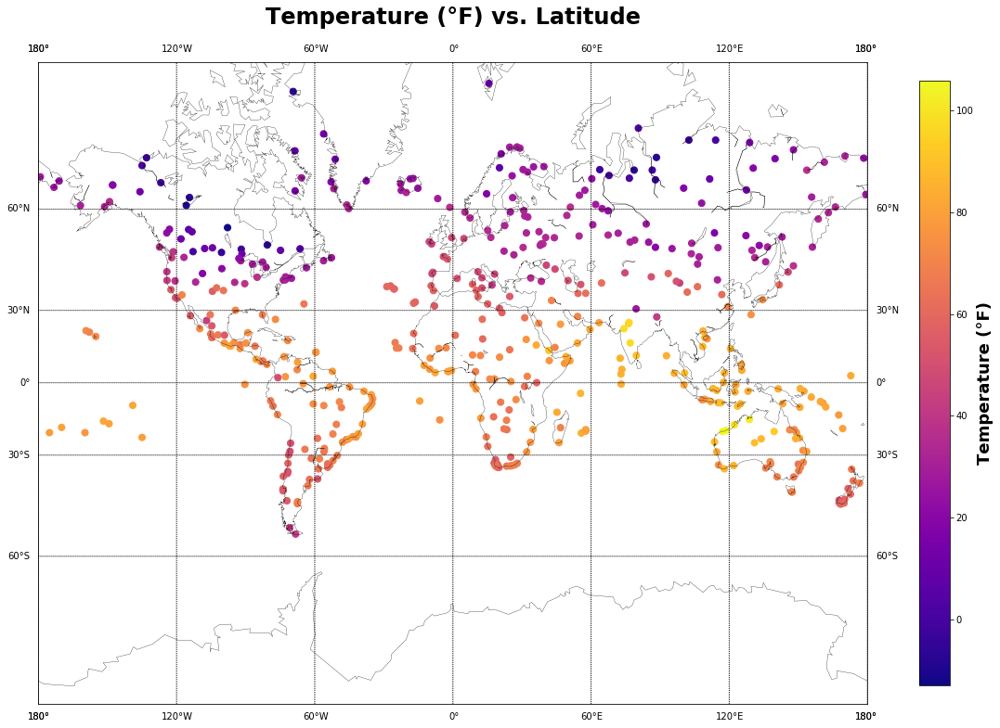
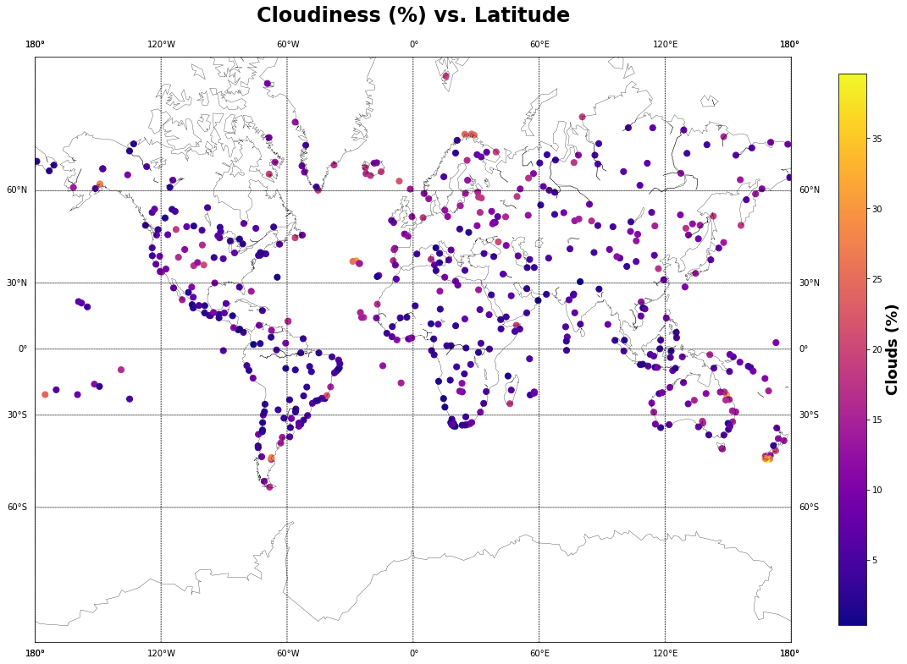
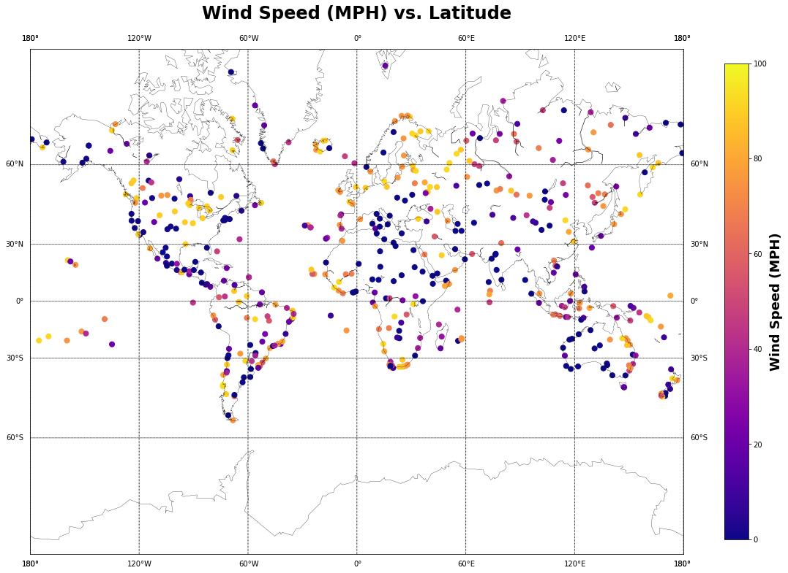

## Unit 6 | Assignment - What's the Weather Like?

## Background

Whether financial, political, or social -- data's true power lies in its ability to answer questions definitively. So let's take what you've learned about Python requests, APIs, and JSON traversals to answer a fundamental question: "What's the weather like as we approach the equator?"

Now, we know what you may be thinking: _"Duh. It gets hotter..."_ 

But, if pressed, how would you **prove** it? 


## WeatherPy

In this example, you'll be creating a Python script to visualize the weather of 500+ cities across the world of varying distance from the equator. To accomplish this, you'll be utilizing a [simple Python library](https://pypi.python.org/pypi/citipy), the [OpenWeatherMap API](https://openweathermap.org/api), and a little common sense to create a representative model of weather across world cities.

Your objective is to build a series of scatter plots to showcase the following relationships:

* Temperature (F) vs. Latitude
* Humidity (%) vs. Latitude
* Cloudiness (%) vs. Latitude
* Wind Speed (mph) vs. Latitude

Your final notebook must:

* Randomly select **at least** 500 unique (non-repeat) cities based on latitude and longitude.
* Perform a weather check on each of the cities using a series of successive API calls. 
* Include a print log of each city as it's being processed with the city number, city name, and requested URL.
* Save both a CSV of all data retrieved and png images for each scatter plot.

As final considerations:

* You must use the Matplotlib and Seaborn libraries.
* You must include a written description of three observable trends based on the data. 
* You must use proper labeling of your plots, including aspects like: Plot Titles (with date of analysis) and Axes Labels.
* You must include an exported markdown version of your Notebook called  `README.md` in your GitHub repository.  
* See [Example Solution](WeatherPy_Example.pdf) for a reference on expected format. 


```python
#dependencies
import random
from mpl_toolkits.basemap import Basemap, cm
import numpy as np
import matplotlib.pyplot as plt
import pandas as pd
from config import *
import requests
from pprint import pprint
from citipy import citipy
import matplotlib as mpl
```


```python
#generate cities list
#longitude (-180,180), latitude (-90,90)
def city_gen(cities, countries):
    '''
    Returns a list of randomly generated lat, lng coordinates and closest city
    '''
    lat, lng = random.uniform(-90, 90), random.uniform(-180, 180)
    city = citipy.nearest_city(lat, lng)
    
    city_name = city.city_name.title()
    country = city.country_code.upper()
    
    if city_name in cities and country in countries:
        #print(f'Found duplicate: {city_name},{country}')
        city_marker = city_gen(cities, countries)[2]
    else:
        city_marker = city_name+','+country
        #print(f'returning {city_marker}')
    return [lat, lng, city_marker]
```


```python
#request current weather
# Save config information.
url = "http://api.openweathermap.org/data/2.5/weather?"
units = "imperial"

# Build partial query URL
query_url = f"{url}appid={api_key}&units={units}&q="

#set up number of cities to query
iterator = 1
number_of_cities = 500

#set up lists for storing results
lat = []
lng = []
temp = []
cities = []
countries = []
humidity = []
cloudiness = []
windspeed =[]

#set up text formatting
bold = "\033[1m"
reset = "\033[0;0m"

while iterator <= number_of_cities:
    print(bold + f'Requesting weather for city # {iterator}' + reset)
    #generate random city
    city_g = city_gen(cities, countries)
    
    r = requests.get(query_url + city_g[2])
    print(f'   requested URL: {r.url}')
    
    if r.status_code == 200:
        response = r.json()
        #pprint(response)
        try:
            city = response['name']
            country = response['sys']['country']
            #make sure city is unique
            if  city in cities and country in countries:
                print(f'   {city}, {country} has already been added, retrying with different city...\n')
            else:
                print('   recording weather for ' + bold + f'{city}, {country}' + reset + '\n')
                temp.append(response['main']['temp'])
                lat.append(response['coord']['lat'])
                lng.append(response['coord']['lon'])
                humidity.append(response['main']['humidity'])
                cloudiness.append(response['wind']['speed'])
                windspeed.append(response['clouds']['all'])
                cities.append(city)
                countries.append(country)
                iterator += 1
        except KeyError:
            print('Key is not found')
    elif r.status_code == 404:
        print('   city not found, retrying with different city... \n')
        
print(bold + f'Recorded weather for {len(cities)} cities.' + reset)
```

    Requesting weather for city # 1
       requested URL: http://api.openweathermap.org/data/2.5/weather?appid=25bc90a1196e6f153eece0bc0b0fc9eb&units=imperial&q=Ushuaia,AR
       recording weather for Ushuaia, AR
    
    Requesting weather for city # 2
       requested URL: http://api.openweathermap.org/data/2.5/weather?appid=25bc90a1196e6f153eece0bc0b0fc9eb&units=imperial&q=Illoqqortoormiut,GL
       city not found, retrying with different city... 
    
    Requesting weather for city # 2
       requested URL: http://api.openweathermap.org/data/2.5/weather?appid=25bc90a1196e6f153eece0bc0b0fc9eb&units=imperial&q=Mataura,PF
       city not found, retrying with different city... 
    
    Requesting weather for city # 2
       requested URL: http://api.openweathermap.org/data/2.5/weather?appid=25bc90a1196e6f153eece0bc0b0fc9eb&units=imperial&q=Praia,CV
       recording weather for Praia, CV
    
    Requesting weather for city # 3
       requested URL: http://api.openweathermap.org/data/2.5/weather?appid=25bc90a1196e6f153eece0bc0b0fc9eb&units=imperial&q=Saint-Philippe,RE
       recording weather for Saint-Philippe, RE
    
    Requesting weather for city # 4
       requested URL: http://api.openweathermap.org/data/2.5/weather?appid=25bc90a1196e6f153eece0bc0b0fc9eb&units=imperial&q=Longyearbyen,SJ
       recording weather for Longyearbyen, SJ
    
    Requesting weather for city # 5
       requested URL: http://api.openweathermap.org/data/2.5/weather?appid=25bc90a1196e6f153eece0bc0b0fc9eb&units=imperial&q=Jamestown,SH
       recording weather for Jamestown, SH
    
    Requesting weather for city # 6
       requested URL: http://api.openweathermap.org/data/2.5/weather?appid=25bc90a1196e6f153eece0bc0b0fc9eb&units=imperial&q=Cidreira,BR
       recording weather for Cidreira, BR
    
    Requesting weather for city # 7
       requested URL: http://api.openweathermap.org/data/2.5/weather?appid=25bc90a1196e6f153eece0bc0b0fc9eb&units=imperial&q=Rikitea,PF
       recording weather for Rikitea, PF
    
    Requesting weather for city # 8
       requested URL: http://api.openweathermap.org/data/2.5/weather?appid=25bc90a1196e6f153eece0bc0b0fc9eb&units=imperial&q=Tuktoyaktuk,CA
       recording weather for Tuktoyaktuk, CA
    
    Requesting weather for city # 9
       requested URL: http://api.openweathermap.org/data/2.5/weather?appid=25bc90a1196e6f153eece0bc0b0fc9eb&units=imperial&q=Christchurch,NZ
       recording weather for Christchurch, NZ
    
    Requesting weather for city # 10
       requested URL: http://api.openweathermap.org/data/2.5/weather?appid=25bc90a1196e6f153eece0bc0b0fc9eb&units=imperial&q=Ranfurly,NZ
       recording weather for Ranfurly, NZ
    
    Requesting weather for city # 11
       requested URL: http://api.openweathermap.org/data/2.5/weather?appid=25bc90a1196e6f153eece0bc0b0fc9eb&units=imperial&q=Punta%20Alta,AR
       recording weather for Punta Alta, AR
    
    Requesting weather for city # 12
       requested URL: http://api.openweathermap.org/data/2.5/weather?appid=25bc90a1196e6f153eece0bc0b0fc9eb&units=imperial&q=Souillac,MU
       recording weather for Souillac, MU
    
    Requesting weather for city # 13
       requested URL: http://api.openweathermap.org/data/2.5/weather?appid=25bc90a1196e6f153eece0bc0b0fc9eb&units=imperial&q=Te%20Anau,NZ
       recording weather for Te Anau, NZ
    
    Requesting weather for city # 14
       requested URL: http://api.openweathermap.org/data/2.5/weather?appid=25bc90a1196e6f153eece0bc0b0fc9eb&units=imperial&q=Vila%20Velha,BR
       recording weather for Vila Velha, BR
    
    Requesting weather for city # 15
       requested URL: http://api.openweathermap.org/data/2.5/weather?appid=25bc90a1196e6f153eece0bc0b0fc9eb&units=imperial&q=Cananeia,BR
       recording weather for Cananeia, BR
    
    Requesting weather for city # 16
       requested URL: http://api.openweathermap.org/data/2.5/weather?appid=25bc90a1196e6f153eece0bc0b0fc9eb&units=imperial&q=La%20Argentina,CO
       recording weather for La Argentina, CO
    
    Requesting weather for city # 17
       requested URL: http://api.openweathermap.org/data/2.5/weather?appid=25bc90a1196e6f153eece0bc0b0fc9eb&units=imperial&q=Qaanaaq,GL
       recording weather for Qaanaaq, GL
    
    Requesting weather for city # 18
       requested URL: http://api.openweathermap.org/data/2.5/weather?appid=25bc90a1196e6f153eece0bc0b0fc9eb&units=imperial&q=Hilo,US
       recording weather for Hilo, US
    
    Requesting weather for city # 19
       requested URL: http://api.openweathermap.org/data/2.5/weather?appid=25bc90a1196e6f153eece0bc0b0fc9eb&units=imperial&q=Victoria,SC
       recording weather for Victoria, SC
    
    Requesting weather for city # 20
       requested URL: http://api.openweathermap.org/data/2.5/weather?appid=25bc90a1196e6f153eece0bc0b0fc9eb&units=imperial&q=Sioux%20Lookout,CA
       recording weather for Sioux Lookout, CA
    
    Requesting weather for city # 21
       requested URL: http://api.openweathermap.org/data/2.5/weather?appid=25bc90a1196e6f153eece0bc0b0fc9eb&units=imperial&q=Cape%20Town,ZA
       recording weather for Cape Town, ZA
    
    Requesting weather for city # 22
       requested URL: http://api.openweathermap.org/data/2.5/weather?appid=25bc90a1196e6f153eece0bc0b0fc9eb&units=imperial&q=Atuona,PF
       recording weather for Atuona, PF
    
    Requesting weather for city # 23
       requested URL: http://api.openweathermap.org/data/2.5/weather?appid=25bc90a1196e6f153eece0bc0b0fc9eb&units=imperial&q=Havoysund,NO
       recording weather for Havoysund, NO
    
    Requesting weather for city # 24
       requested URL: http://api.openweathermap.org/data/2.5/weather?appid=25bc90a1196e6f153eece0bc0b0fc9eb&units=imperial&q=Hermanus,ZA
       recording weather for Hermanus, ZA
    
    Requesting weather for city # 25
       requested URL: http://api.openweathermap.org/data/2.5/weather?appid=25bc90a1196e6f153eece0bc0b0fc9eb&units=imperial&q=Piacabucu,BR
       recording weather for Piacabucu, BR
    
    Requesting weather for city # 26
       requested URL: http://api.openweathermap.org/data/2.5/weather?appid=25bc90a1196e6f153eece0bc0b0fc9eb&units=imperial&q=Nelson%20Bay,AU
       recording weather for Nelson Bay, AU
    
    Requesting weather for city # 27
       requested URL: http://api.openweathermap.org/data/2.5/weather?appid=25bc90a1196e6f153eece0bc0b0fc9eb&units=imperial&q=Lumut,MY
       recording weather for Lumut, MY
    
    Requesting weather for city # 28
       requested URL: http://api.openweathermap.org/data/2.5/weather?appid=25bc90a1196e6f153eece0bc0b0fc9eb&units=imperial&q=Talnakh,RU
       recording weather for Talnakh, RU
    
    Requesting weather for city # 29
       requested URL: http://api.openweathermap.org/data/2.5/weather?appid=25bc90a1196e6f153eece0bc0b0fc9eb&units=imperial&q=Pedernales,DO
       recording weather for Pedernales, DO
    
    Requesting weather for city # 30
       requested URL: http://api.openweathermap.org/data/2.5/weather?appid=25bc90a1196e6f153eece0bc0b0fc9eb&units=imperial&q=Cabo%20San%20Lucas,MX
       recording weather for Cabo San Lucas, MX
    
    Requesting weather for city # 31
       requested URL: http://api.openweathermap.org/data/2.5/weather?appid=25bc90a1196e6f153eece0bc0b0fc9eb&units=imperial&q=Aksu,KZ
       recording weather for Aksu, KZ
    
    Requesting weather for city # 32
       requested URL: http://api.openweathermap.org/data/2.5/weather?appid=25bc90a1196e6f153eece0bc0b0fc9eb&units=imperial&q=Saint%20George,BM
       recording weather for Saint George, BM
    
    Requesting weather for city # 33
       requested URL: http://api.openweathermap.org/data/2.5/weather?appid=25bc90a1196e6f153eece0bc0b0fc9eb&units=imperial&q=Vaini,TO
       recording weather for Vaini, TO
    
    Requesting weather for city # 34
       requested URL: http://api.openweathermap.org/data/2.5/weather?appid=25bc90a1196e6f153eece0bc0b0fc9eb&units=imperial&q=Mataura,PF
       city not found, retrying with different city... 
    
    Requesting weather for city # 34
       requested URL: http://api.openweathermap.org/data/2.5/weather?appid=25bc90a1196e6f153eece0bc0b0fc9eb&units=imperial&q=Puerto%20Ayora,EC
       recording weather for Puerto Ayora, EC
    
    Requesting weather for city # 35
       requested URL: http://api.openweathermap.org/data/2.5/weather?appid=25bc90a1196e6f153eece0bc0b0fc9eb&units=imperial&q=Hobart,AU
       recording weather for Hobart, AU
    
    Requesting weather for city # 36
       requested URL: http://api.openweathermap.org/data/2.5/weather?appid=25bc90a1196e6f153eece0bc0b0fc9eb&units=imperial&q=Kisangani,CD
       recording weather for Kisangani, CD
    
    Requesting weather for city # 37
       requested URL: http://api.openweathermap.org/data/2.5/weather?appid=25bc90a1196e6f153eece0bc0b0fc9eb&units=imperial&q=Kapaa,US
       recording weather for Kapaa, US
    
    Requesting weather for city # 38
       requested URL: http://api.openweathermap.org/data/2.5/weather?appid=25bc90a1196e6f153eece0bc0b0fc9eb&units=imperial&q=Albany,AU
       recording weather for Albany, AU
    
    Requesting weather for city # 39
       requested URL: http://api.openweathermap.org/data/2.5/weather?appid=25bc90a1196e6f153eece0bc0b0fc9eb&units=imperial&q=Denpasar,ID
       recording weather for Denpasar, ID
    
    Requesting weather for city # 40
       requested URL: http://api.openweathermap.org/data/2.5/weather?appid=25bc90a1196e6f153eece0bc0b0fc9eb&units=imperial&q=Den%20Helder,NL
       recording weather for Den Helder, NL
    
    Requesting weather for city # 41
       requested URL: http://api.openweathermap.org/data/2.5/weather?appid=25bc90a1196e6f153eece0bc0b0fc9eb&units=imperial&q=Nizhniy%20Tsasuchey,RU
       recording weather for Nizhniy Tsasuchey, RU
    
    Requesting weather for city # 42
       requested URL: http://api.openweathermap.org/data/2.5/weather?appid=25bc90a1196e6f153eece0bc0b0fc9eb&units=imperial&q=Husavik,IS
       recording weather for Husavik, IS
    
    Requesting weather for city # 43
       requested URL: http://api.openweathermap.org/data/2.5/weather?appid=25bc90a1196e6f153eece0bc0b0fc9eb&units=imperial&q=Nguiu,AU
       city not found, retrying with different city... 
    
    Requesting weather for city # 43
       requested URL: http://api.openweathermap.org/data/2.5/weather?appid=25bc90a1196e6f153eece0bc0b0fc9eb&units=imperial&q=Santa%20Helena%20De%20Goias,BR
       recording weather for Santa Helena de Goias, BR
    
    Requesting weather for city # 44
       requested URL: http://api.openweathermap.org/data/2.5/weather?appid=25bc90a1196e6f153eece0bc0b0fc9eb&units=imperial&q=Ocu,PA
       recording weather for Ocu, PA
    
    Requesting weather for city # 45
       requested URL: http://api.openweathermap.org/data/2.5/weather?appid=25bc90a1196e6f153eece0bc0b0fc9eb&units=imperial&q=Bathsheba,BB
       recording weather for Bathsheba, BB
    
    Requesting weather for city # 46
       requested URL: http://api.openweathermap.org/data/2.5/weather?appid=25bc90a1196e6f153eece0bc0b0fc9eb&units=imperial&q=Maceio,BR
       recording weather for Maceio, BR
    
    Requesting weather for city # 47
       requested URL: http://api.openweathermap.org/data/2.5/weather?appid=25bc90a1196e6f153eece0bc0b0fc9eb&units=imperial&q=Nanortalik,GL
       recording weather for Nanortalik, GL
    
    Requesting weather for city # 48
       requested URL: http://api.openweathermap.org/data/2.5/weather?appid=25bc90a1196e6f153eece0bc0b0fc9eb&units=imperial&q=Barentsburg,SJ
       city not found, retrying with different city... 
    
    Requesting weather for city # 48
       requested URL: http://api.openweathermap.org/data/2.5/weather?appid=25bc90a1196e6f153eece0bc0b0fc9eb&units=imperial&q=Bambous%20Virieux,MU
       recording weather for Bambous Virieux, MU
    
    Requesting weather for city # 49
       requested URL: http://api.openweathermap.org/data/2.5/weather?appid=25bc90a1196e6f153eece0bc0b0fc9eb&units=imperial&q=Busselton,AU
       recording weather for Busselton, AU
    
    Requesting weather for city # 50
       requested URL: http://api.openweathermap.org/data/2.5/weather?appid=25bc90a1196e6f153eece0bc0b0fc9eb&units=imperial&q=Mataura,PF
       city not found, retrying with different city... 
    
    Requesting weather for city # 50
       requested URL: http://api.openweathermap.org/data/2.5/weather?appid=25bc90a1196e6f153eece0bc0b0fc9eb&units=imperial&q=Sobolevo,RU
       recording weather for Sobolevo, RU
    
    Requesting weather for city # 51
       requested URL: http://api.openweathermap.org/data/2.5/weather?appid=25bc90a1196e6f153eece0bc0b0fc9eb&units=imperial&q=Mys%20Shmidta,RU
       city not found, retrying with different city... 
    
    Requesting weather for city # 51
       requested URL: http://api.openweathermap.org/data/2.5/weather?appid=25bc90a1196e6f153eece0bc0b0fc9eb&units=imperial&q=Hithadhoo,MV
       recording weather for Hithadhoo, MV
    
    Requesting weather for city # 52
       requested URL: http://api.openweathermap.org/data/2.5/weather?appid=25bc90a1196e6f153eece0bc0b0fc9eb&units=imperial&q=Mataura,PF
       city not found, retrying with different city... 
    
    Requesting weather for city # 52
       requested URL: http://api.openweathermap.org/data/2.5/weather?appid=25bc90a1196e6f153eece0bc0b0fc9eb&units=imperial&q=Butaritari,KI
       recording weather for Butaritari, KI
    
    Requesting weather for city # 53
       requested URL: http://api.openweathermap.org/data/2.5/weather?appid=25bc90a1196e6f153eece0bc0b0fc9eb&units=imperial&q=Vredendal,ZA
       recording weather for Vredendal, ZA
    
    Requesting weather for city # 54
       requested URL: http://api.openweathermap.org/data/2.5/weather?appid=25bc90a1196e6f153eece0bc0b0fc9eb&units=imperial&q=Ningyang,CN
       recording weather for Ningyang, CN
    
    Requesting weather for city # 55
       requested URL: http://api.openweathermap.org/data/2.5/weather?appid=25bc90a1196e6f153eece0bc0b0fc9eb&units=imperial&q=Thompson,CA
       recording weather for Thompson, CA
    
    Requesting weather for city # 56
       requested URL: http://api.openweathermap.org/data/2.5/weather?appid=25bc90a1196e6f153eece0bc0b0fc9eb&units=imperial&q=New%20Norfolk,AU
       recording weather for New Norfolk, AU
    
    Requesting weather for city # 57
       requested URL: http://api.openweathermap.org/data/2.5/weather?appid=25bc90a1196e6f153eece0bc0b0fc9eb&units=imperial&q=Barentsburg,SJ
       city not found, retrying with different city... 
    
    Requesting weather for city # 57
       requested URL: http://api.openweathermap.org/data/2.5/weather?appid=25bc90a1196e6f153eece0bc0b0fc9eb&units=imperial&q=Manadhoo,MV
       recording weather for Manadhoo, MV
    
    Requesting weather for city # 58
       requested URL: http://api.openweathermap.org/data/2.5/weather?appid=25bc90a1196e6f153eece0bc0b0fc9eb&units=imperial&q=Kaitangata,NZ
       recording weather for Kaitangata, NZ
    
    Requesting weather for city # 59
       requested URL: http://api.openweathermap.org/data/2.5/weather?appid=25bc90a1196e6f153eece0bc0b0fc9eb&units=imperial&q=Ilulissat,GL
       recording weather for Ilulissat, GL
    
    Requesting weather for city # 60
       requested URL: http://api.openweathermap.org/data/2.5/weather?appid=25bc90a1196e6f153eece0bc0b0fc9eb&units=imperial&q=Bluff,NZ
       recording weather for Bluff, NZ
    
    Requesting weather for city # 61
       requested URL: http://api.openweathermap.org/data/2.5/weather?appid=25bc90a1196e6f153eece0bc0b0fc9eb&units=imperial&q=Ancud,CL
       recording weather for Ancud, CL
    
    Requesting weather for city # 62
       requested URL: http://api.openweathermap.org/data/2.5/weather?appid=25bc90a1196e6f153eece0bc0b0fc9eb&units=imperial&q=Nikolskoye,RU
       recording weather for Nikolskoye, RU
    
    Requesting weather for city # 63
       requested URL: http://api.openweathermap.org/data/2.5/weather?appid=25bc90a1196e6f153eece0bc0b0fc9eb&units=imperial&q=Damghan,IR
       recording weather for Damghan, IR
    
    Requesting weather for city # 64
       requested URL: http://api.openweathermap.org/data/2.5/weather?appid=25bc90a1196e6f153eece0bc0b0fc9eb&units=imperial&q=Mastic%20Beach,US
       recording weather for Mastic Beach, US
    
    Requesting weather for city # 65
       requested URL: http://api.openweathermap.org/data/2.5/weather?appid=25bc90a1196e6f153eece0bc0b0fc9eb&units=imperial&q=Port%20Elizabeth,ZA
       recording weather for Port Elizabeth, ZA
    
    Requesting weather for city # 66
       requested URL: http://api.openweathermap.org/data/2.5/weather?appid=25bc90a1196e6f153eece0bc0b0fc9eb&units=imperial&q=Mataura,PF
       city not found, retrying with different city... 
    
    Requesting weather for city # 66
       requested URL: http://api.openweathermap.org/data/2.5/weather?appid=25bc90a1196e6f153eece0bc0b0fc9eb&units=imperial&q=Awbari,LY
       recording weather for Awbari, LY
    
    Requesting weather for city # 67
       requested URL: http://api.openweathermap.org/data/2.5/weather?appid=25bc90a1196e6f153eece0bc0b0fc9eb&units=imperial&q=Manono,CD
       recording weather for Manono, CD
    
    Requesting weather for city # 68
       requested URL: http://api.openweathermap.org/data/2.5/weather?appid=25bc90a1196e6f153eece0bc0b0fc9eb&units=imperial&q=Colares,PT
       recording weather for Colares, PT
    
    Requesting weather for city # 69
       requested URL: http://api.openweathermap.org/data/2.5/weather?appid=25bc90a1196e6f153eece0bc0b0fc9eb&units=imperial&q=Grindavik,IS
       recording weather for Grindavik, IS
    
    Requesting weather for city # 70
       requested URL: http://api.openweathermap.org/data/2.5/weather?appid=25bc90a1196e6f153eece0bc0b0fc9eb&units=imperial&q=Carnarvon,AU
       recording weather for Carnarvon, AU
    
    Requesting weather for city # 71
       requested URL: http://api.openweathermap.org/data/2.5/weather?appid=25bc90a1196e6f153eece0bc0b0fc9eb&units=imperial&q=Upernavik,GL
       recording weather for Upernavik, GL
    
    Requesting weather for city # 72
       requested URL: http://api.openweathermap.org/data/2.5/weather?appid=25bc90a1196e6f153eece0bc0b0fc9eb&units=imperial&q=Sitka,US
       recording weather for Sitka, US
    
    Requesting weather for city # 73
       requested URL: http://api.openweathermap.org/data/2.5/weather?appid=25bc90a1196e6f153eece0bc0b0fc9eb&units=imperial&q=Grand%20River%20South%20East,MU
       city not found, retrying with different city... 
    
    Requesting weather for city # 73
       requested URL: http://api.openweathermap.org/data/2.5/weather?appid=25bc90a1196e6f153eece0bc0b0fc9eb&units=imperial&q=Punta%20Arenas,CL
       recording weather for Punta Arenas, CL
    
    Requesting weather for city # 74
       requested URL: http://api.openweathermap.org/data/2.5/weather?appid=25bc90a1196e6f153eece0bc0b0fc9eb&units=imperial&q=Amderma,RU
       city not found, retrying with different city... 
    
    Requesting weather for city # 74
       requested URL: http://api.openweathermap.org/data/2.5/weather?appid=25bc90a1196e6f153eece0bc0b0fc9eb&units=imperial&q=Sakakah,SA
       city not found, retrying with different city... 
    
    Requesting weather for city # 74
       requested URL: http://api.openweathermap.org/data/2.5/weather?appid=25bc90a1196e6f153eece0bc0b0fc9eb&units=imperial&q=Sangod,IN
       recording weather for Sangod, IN
    
    Requesting weather for city # 75
       requested URL: http://api.openweathermap.org/data/2.5/weather?appid=25bc90a1196e6f153eece0bc0b0fc9eb&units=imperial&q=Puerto%20Escondido,MX
       recording weather for Puerto Escondido, MX
    
    Requesting weather for city # 76
       requested URL: http://api.openweathermap.org/data/2.5/weather?appid=25bc90a1196e6f153eece0bc0b0fc9eb&units=imperial&q=Taolanaro,MG
       city not found, retrying with different city... 
    
    Requesting weather for city # 76
       requested URL: http://api.openweathermap.org/data/2.5/weather?appid=25bc90a1196e6f153eece0bc0b0fc9eb&units=imperial&q=Khatanga,RU
       recording weather for Khatanga, RU
    
    Requesting weather for city # 77
       requested URL: http://api.openweathermap.org/data/2.5/weather?appid=25bc90a1196e6f153eece0bc0b0fc9eb&units=imperial&q=Rafraf,TN
       recording weather for Rafraf, TN
    
    Requesting weather for city # 78
       requested URL: http://api.openweathermap.org/data/2.5/weather?appid=25bc90a1196e6f153eece0bc0b0fc9eb&units=imperial&q=Illoqqortoormiut,GL
       city not found, retrying with different city... 
    
    Requesting weather for city # 78
       requested URL: http://api.openweathermap.org/data/2.5/weather?appid=25bc90a1196e6f153eece0bc0b0fc9eb&units=imperial&q=Belushya%20Guba,RU
       city not found, retrying with different city... 
    
    Requesting weather for city # 78
       requested URL: http://api.openweathermap.org/data/2.5/weather?appid=25bc90a1196e6f153eece0bc0b0fc9eb&units=imperial&q=Illoqqortoormiut,GL
       city not found, retrying with different city... 
    
    Requesting weather for city # 78
       requested URL: http://api.openweathermap.org/data/2.5/weather?appid=25bc90a1196e6f153eece0bc0b0fc9eb&units=imperial&q=Grand%20River%20South%20East,MU
       city not found, retrying with different city... 
    
    Requesting weather for city # 78
       requested URL: http://api.openweathermap.org/data/2.5/weather?appid=25bc90a1196e6f153eece0bc0b0fc9eb&units=imperial&q=Coquimbo,CL
       recording weather for Coquimbo, CL
    
    Requesting weather for city # 79
       requested URL: http://api.openweathermap.org/data/2.5/weather?appid=25bc90a1196e6f153eece0bc0b0fc9eb&units=imperial&q=Waipawa,NZ
       recording weather for Waipawa, NZ
    
    Requesting weather for city # 80
       requested URL: http://api.openweathermap.org/data/2.5/weather?appid=25bc90a1196e6f153eece0bc0b0fc9eb&units=imperial&q=Mar%20Del%20Plata,AR
       recording weather for Mar del Plata, AR
    
    Requesting weather for city # 81
       requested URL: http://api.openweathermap.org/data/2.5/weather?appid=25bc90a1196e6f153eece0bc0b0fc9eb&units=imperial&q=Guadalupe%20Y%20Calvo,MX
       recording weather for Guadalupe y Calvo, MX
    
    Requesting weather for city # 82
       requested URL: http://api.openweathermap.org/data/2.5/weather?appid=25bc90a1196e6f153eece0bc0b0fc9eb&units=imperial&q=Bredasdorp,ZA
       recording weather for Bredasdorp, ZA
    
    Requesting weather for city # 83
       requested URL: http://api.openweathermap.org/data/2.5/weather?appid=25bc90a1196e6f153eece0bc0b0fc9eb&units=imperial&q=Taolanaro,MG
       city not found, retrying with different city... 
    
    Requesting weather for city # 83
       requested URL: http://api.openweathermap.org/data/2.5/weather?appid=25bc90a1196e6f153eece0bc0b0fc9eb&units=imperial&q=Tasiilaq,GL
       recording weather for Tasiilaq, GL
    
    Requesting weather for city # 84
       requested URL: http://api.openweathermap.org/data/2.5/weather?appid=25bc90a1196e6f153eece0bc0b0fc9eb&units=imperial&q=Ostrovnoy,RU
       recording weather for Ostrovnoy, RU
    
    Requesting weather for city # 85
       requested URL: http://api.openweathermap.org/data/2.5/weather?appid=25bc90a1196e6f153eece0bc0b0fc9eb&units=imperial&q=Sarangani,PH
       recording weather for Sarangani, PH
    
    Requesting weather for city # 86
       requested URL: http://api.openweathermap.org/data/2.5/weather?appid=25bc90a1196e6f153eece0bc0b0fc9eb&units=imperial&q=Illoqqortoormiut,GL
       city not found, retrying with different city... 
    
    Requesting weather for city # 86
       requested URL: http://api.openweathermap.org/data/2.5/weather?appid=25bc90a1196e6f153eece0bc0b0fc9eb&units=imperial&q=Axim,GH
       recording weather for Axim, GH
    
    Requesting weather for city # 87
       requested URL: http://api.openweathermap.org/data/2.5/weather?appid=25bc90a1196e6f153eece0bc0b0fc9eb&units=imperial&q=Shilovo,RU
       recording weather for Shilovo, RU
    
    Requesting weather for city # 88
       requested URL: http://api.openweathermap.org/data/2.5/weather?appid=25bc90a1196e6f153eece0bc0b0fc9eb&units=imperial&q=Grand%20Gaube,MU
       recording weather for Grand Gaube, MU
    
    Requesting weather for city # 89
       requested URL: http://api.openweathermap.org/data/2.5/weather?appid=25bc90a1196e6f153eece0bc0b0fc9eb&units=imperial&q=Berlevag,NO
       recording weather for Berlevag, NO
    
    Requesting weather for city # 90
       requested URL: http://api.openweathermap.org/data/2.5/weather?appid=25bc90a1196e6f153eece0bc0b0fc9eb&units=imperial&q=Castro,CL
       recording weather for Castro, CL
    
    Requesting weather for city # 91
       requested URL: http://api.openweathermap.org/data/2.5/weather?appid=25bc90a1196e6f153eece0bc0b0fc9eb&units=imperial&q=Amderma,RU
       city not found, retrying with different city... 
    
    Requesting weather for city # 91
       requested URL: http://api.openweathermap.org/data/2.5/weather?appid=25bc90a1196e6f153eece0bc0b0fc9eb&units=imperial&q=Ouesso,CG
       recording weather for Ouesso, CG
    
    Requesting weather for city # 92
       requested URL: http://api.openweathermap.org/data/2.5/weather?appid=25bc90a1196e6f153eece0bc0b0fc9eb&units=imperial&q=Mar%20Del%20Plata,AR
       Mar del Plata, AR has already been added, retrying with different city...
    
    Requesting weather for city # 92
       requested URL: http://api.openweathermap.org/data/2.5/weather?appid=25bc90a1196e6f153eece0bc0b0fc9eb&units=imperial&q=Nemuro,JP
       recording weather for Nemuro, JP
    
    Requesting weather for city # 93
       requested URL: http://api.openweathermap.org/data/2.5/weather?appid=25bc90a1196e6f153eece0bc0b0fc9eb&units=imperial&q=Erzin,RU
       recording weather for Erzin, RU
    
    Requesting weather for city # 94
       requested URL: http://api.openweathermap.org/data/2.5/weather?appid=25bc90a1196e6f153eece0bc0b0fc9eb&units=imperial&q=Alofi,NU
       recording weather for Alofi, NU
    
    Requesting weather for city # 95
       requested URL: http://api.openweathermap.org/data/2.5/weather?appid=25bc90a1196e6f153eece0bc0b0fc9eb&units=imperial&q=Beringovskiy,RU
       recording weather for Beringovskiy, RU
    
    Requesting weather for city # 96
       requested URL: http://api.openweathermap.org/data/2.5/weather?appid=25bc90a1196e6f153eece0bc0b0fc9eb&units=imperial&q=Rovaniemi,FI
       recording weather for Rovaniemi, FI
    
    Requesting weather for city # 97
       requested URL: http://api.openweathermap.org/data/2.5/weather?appid=25bc90a1196e6f153eece0bc0b0fc9eb&units=imperial&q=Kuche,CN
       city not found, retrying with different city... 
    
    Requesting weather for city # 97
       requested URL: http://api.openweathermap.org/data/2.5/weather?appid=25bc90a1196e6f153eece0bc0b0fc9eb&units=imperial&q=Richards%20Bay,ZA
       recording weather for Richards Bay, ZA
    
    Requesting weather for city # 98
       requested URL: http://api.openweathermap.org/data/2.5/weather?appid=25bc90a1196e6f153eece0bc0b0fc9eb&units=imperial&q=Lasa,CN
       city not found, retrying with different city... 
    
    Requesting weather for city # 98
       requested URL: http://api.openweathermap.org/data/2.5/weather?appid=25bc90a1196e6f153eece0bc0b0fc9eb&units=imperial&q=Belushya%20Guba,RU
       city not found, retrying with different city... 
    
    Requesting weather for city # 98
       requested URL: http://api.openweathermap.org/data/2.5/weather?appid=25bc90a1196e6f153eece0bc0b0fc9eb&units=imperial&q=Am%20Timan,TD
       recording weather for Am Timan, TD
    
    Requesting weather for city # 99
       requested URL: http://api.openweathermap.org/data/2.5/weather?appid=25bc90a1196e6f153eece0bc0b0fc9eb&units=imperial&q=Mandalgovi,MN
       recording weather for Mandalgovi, MN
    
    Requesting weather for city # 100
       requested URL: http://api.openweathermap.org/data/2.5/weather?appid=25bc90a1196e6f153eece0bc0b0fc9eb&units=imperial&q=Lander,US
       recording weather for Lander, US
    
    Requesting weather for city # 101
       requested URL: http://api.openweathermap.org/data/2.5/weather?appid=25bc90a1196e6f153eece0bc0b0fc9eb&units=imperial&q=Dikson,RU
       recording weather for Dikson, RU
    
    Requesting weather for city # 102
       requested URL: http://api.openweathermap.org/data/2.5/weather?appid=25bc90a1196e6f153eece0bc0b0fc9eb&units=imperial&q=Arraial%20Do%20Cabo,BR
       recording weather for Arraial do Cabo, BR
    
    Requesting weather for city # 103
       requested URL: http://api.openweathermap.org/data/2.5/weather?appid=25bc90a1196e6f153eece0bc0b0fc9eb&units=imperial&q=Yaan,CN
       city not found, retrying with different city... 
    
    Requesting weather for city # 103
       requested URL: http://api.openweathermap.org/data/2.5/weather?appid=25bc90a1196e6f153eece0bc0b0fc9eb&units=imperial&q=Mataura,PF
       city not found, retrying with different city... 
    
    Requesting weather for city # 103
       requested URL: http://api.openweathermap.org/data/2.5/weather?appid=25bc90a1196e6f153eece0bc0b0fc9eb&units=imperial&q=Yellowknife,CA
       recording weather for Yellowknife, CA
    
    Requesting weather for city # 104
       requested URL: http://api.openweathermap.org/data/2.5/weather?appid=25bc90a1196e6f153eece0bc0b0fc9eb&units=imperial&q=Angola,US
       recording weather for Angola, US
    
    Requesting weather for city # 105
       requested URL: http://api.openweathermap.org/data/2.5/weather?appid=25bc90a1196e6f153eece0bc0b0fc9eb&units=imperial&q=Kropotkin,RU
       recording weather for Kropotkin, RU
    
    Requesting weather for city # 106
       requested URL: http://api.openweathermap.org/data/2.5/weather?appid=25bc90a1196e6f153eece0bc0b0fc9eb&units=imperial&q=Kostino,RU
       recording weather for Kostino, RU
    
    Requesting weather for city # 107
       requested URL: http://api.openweathermap.org/data/2.5/weather?appid=25bc90a1196e6f153eece0bc0b0fc9eb&units=imperial&q=Bengkulu,ID
       city not found, retrying with different city... 
    
    Requesting weather for city # 107
       requested URL: http://api.openweathermap.org/data/2.5/weather?appid=25bc90a1196e6f153eece0bc0b0fc9eb&units=imperial&q=Saleaula,WS
       city not found, retrying with different city... 
    
    Requesting weather for city # 107
       requested URL: http://api.openweathermap.org/data/2.5/weather?appid=25bc90a1196e6f153eece0bc0b0fc9eb&units=imperial&q=Buchanan,LR
       recording weather for Buchanan, LR
    
    Requesting weather for city # 108
       requested URL: http://api.openweathermap.org/data/2.5/weather?appid=25bc90a1196e6f153eece0bc0b0fc9eb&units=imperial&q=Gerash,IR
       recording weather for Gerash, IR
    
    Requesting weather for city # 109
       requested URL: http://api.openweathermap.org/data/2.5/weather?appid=25bc90a1196e6f153eece0bc0b0fc9eb&units=imperial&q=Buenos%20Aires,CR
       recording weather for Buenos Aires, CR
    
    Requesting weather for city # 110
       requested URL: http://api.openweathermap.org/data/2.5/weather?appid=25bc90a1196e6f153eece0bc0b0fc9eb&units=imperial&q=Vyshhorod,UA
       recording weather for Vyshhorod, UA
    
    Requesting weather for city # 111
       requested URL: http://api.openweathermap.org/data/2.5/weather?appid=25bc90a1196e6f153eece0bc0b0fc9eb&units=imperial&q=Escanaba,US
       recording weather for Escanaba, US
    
    Requesting weather for city # 112
       requested URL: http://api.openweathermap.org/data/2.5/weather?appid=25bc90a1196e6f153eece0bc0b0fc9eb&units=imperial&q=Narsaq,GL
       recording weather for Narsaq, GL
    
    Requesting weather for city # 113
       requested URL: http://api.openweathermap.org/data/2.5/weather?appid=25bc90a1196e6f153eece0bc0b0fc9eb&units=imperial&q=Halifax,CA
       recording weather for Halifax, CA
    
    Requesting weather for city # 114
       requested URL: http://api.openweathermap.org/data/2.5/weather?appid=25bc90a1196e6f153eece0bc0b0fc9eb&units=imperial&q=Tiksi,RU
       recording weather for Tiksi, RU
    
    Requesting weather for city # 115
       requested URL: http://api.openweathermap.org/data/2.5/weather?appid=25bc90a1196e6f153eece0bc0b0fc9eb&units=imperial&q=Port%20Alfred,ZA
       recording weather for Port Alfred, ZA
    
    Requesting weather for city # 116
       requested URL: http://api.openweathermap.org/data/2.5/weather?appid=25bc90a1196e6f153eece0bc0b0fc9eb&units=imperial&q=Severo-Kurilsk,RU
       recording weather for Severo-Kurilsk, RU
    
    Requesting weather for city # 117
       requested URL: http://api.openweathermap.org/data/2.5/weather?appid=25bc90a1196e6f153eece0bc0b0fc9eb&units=imperial&q=Gazanjyk,TM
       recording weather for Gazanjyk, TM
    
    Requesting weather for city # 118
       requested URL: http://api.openweathermap.org/data/2.5/weather?appid=25bc90a1196e6f153eece0bc0b0fc9eb&units=imperial&q=Salto,UY
       recording weather for Salto, UY
    
    Requesting weather for city # 119
       requested URL: http://api.openweathermap.org/data/2.5/weather?appid=25bc90a1196e6f153eece0bc0b0fc9eb&units=imperial&q=Skjervoy,NO
       recording weather for Skjervoy, NO
    
    Requesting weather for city # 120
       requested URL: http://api.openweathermap.org/data/2.5/weather?appid=25bc90a1196e6f153eece0bc0b0fc9eb&units=imperial&q=Acuitzio,MX
       recording weather for Acuitzio, MX
    
    Requesting weather for city # 121
       requested URL: http://api.openweathermap.org/data/2.5/weather?appid=25bc90a1196e6f153eece0bc0b0fc9eb&units=imperial&q=Kenai,US
       recording weather for Kenai, US
    
    Requesting weather for city # 122
       requested URL: http://api.openweathermap.org/data/2.5/weather?appid=25bc90a1196e6f153eece0bc0b0fc9eb&units=imperial&q=Moose%20Factory,CA
       recording weather for Moose Factory, CA
    
    Requesting weather for city # 123
       requested URL: http://api.openweathermap.org/data/2.5/weather?appid=25bc90a1196e6f153eece0bc0b0fc9eb&units=imperial&q=Sayyan,YE
       recording weather for Sayyan, YE
    
    Requesting weather for city # 124
       requested URL: http://api.openweathermap.org/data/2.5/weather?appid=25bc90a1196e6f153eece0bc0b0fc9eb&units=imperial&q=Mys%20Shmidta,RU
       city not found, retrying with different city... 
    
    Requesting weather for city # 124
       requested URL: http://api.openweathermap.org/data/2.5/weather?appid=25bc90a1196e6f153eece0bc0b0fc9eb&units=imperial&q=Umm%20Lajj,SA
       recording weather for Umm Lajj, SA
    
    Requesting weather for city # 125
       requested URL: http://api.openweathermap.org/data/2.5/weather?appid=25bc90a1196e6f153eece0bc0b0fc9eb&units=imperial&q=Ulagan,RU
       recording weather for Ulagan, RU
    
    Requesting weather for city # 126
       requested URL: http://api.openweathermap.org/data/2.5/weather?appid=25bc90a1196e6f153eece0bc0b0fc9eb&units=imperial&q=Tam%20Ky,VN
       recording weather for Tam Ky, VN
    
    Requesting weather for city # 127
       requested URL: http://api.openweathermap.org/data/2.5/weather?appid=25bc90a1196e6f153eece0bc0b0fc9eb&units=imperial&q=Ajdabiya,LY
       recording weather for Ajdabiya, LY
    
    Requesting weather for city # 128
       requested URL: http://api.openweathermap.org/data/2.5/weather?appid=25bc90a1196e6f153eece0bc0b0fc9eb&units=imperial&q=Xining,CN
       recording weather for Xining, CN
    
    Requesting weather for city # 129
       requested URL: http://api.openweathermap.org/data/2.5/weather?appid=25bc90a1196e6f153eece0bc0b0fc9eb&units=imperial&q=Chagda,RU
       city not found, retrying with different city... 
    
    Requesting weather for city # 129
       requested URL: http://api.openweathermap.org/data/2.5/weather?appid=25bc90a1196e6f153eece0bc0b0fc9eb&units=imperial&q=Yerbogachen,RU
       recording weather for Yerbogachen, RU
    
    Requesting weather for city # 130
       requested URL: http://api.openweathermap.org/data/2.5/weather?appid=25bc90a1196e6f153eece0bc0b0fc9eb&units=imperial&q=Olafsvik,IS
       city not found, retrying with different city... 
    
    Requesting weather for city # 130
       requested URL: http://api.openweathermap.org/data/2.5/weather?appid=25bc90a1196e6f153eece0bc0b0fc9eb&units=imperial&q=Longavi,CL
       recording weather for Longavi, CL
    
    Requesting weather for city # 131
       requested URL: http://api.openweathermap.org/data/2.5/weather?appid=25bc90a1196e6f153eece0bc0b0fc9eb&units=imperial&q=Puerto%20Cortes,HN
       city not found, retrying with different city... 
    
    Requesting weather for city # 131
       requested URL: http://api.openweathermap.org/data/2.5/weather?appid=25bc90a1196e6f153eece0bc0b0fc9eb&units=imperial&q=Mount%20Isa,AU
       recording weather for Mount Isa, AU
    
    Requesting weather for city # 132
       requested URL: http://api.openweathermap.org/data/2.5/weather?appid=25bc90a1196e6f153eece0bc0b0fc9eb&units=imperial&q=Norman%20Wells,CA
       recording weather for Norman Wells, CA
    
    Requesting weather for city # 133
       requested URL: http://api.openweathermap.org/data/2.5/weather?appid=25bc90a1196e6f153eece0bc0b0fc9eb&units=imperial&q=Mount%20Gambier,AU
       recording weather for Mount Gambier, AU
    
    Requesting weather for city # 134
       requested URL: http://api.openweathermap.org/data/2.5/weather?appid=25bc90a1196e6f153eece0bc0b0fc9eb&units=imperial&q=Yulara,AU
       recording weather for Yulara, AU
    
    Requesting weather for city # 135
       requested URL: http://api.openweathermap.org/data/2.5/weather?appid=25bc90a1196e6f153eece0bc0b0fc9eb&units=imperial&q=Senanga,ZM
       recording weather for Senanga, ZM
    
    Requesting weather for city # 136
       requested URL: http://api.openweathermap.org/data/2.5/weather?appid=25bc90a1196e6f153eece0bc0b0fc9eb&units=imperial&q=Illoqqortoormiut,GL
       city not found, retrying with different city... 
    
    Requesting weather for city # 136
       requested URL: http://api.openweathermap.org/data/2.5/weather?appid=25bc90a1196e6f153eece0bc0b0fc9eb&units=imperial&q=Lebu,CL
       recording weather for Lebu, CL
    
    Requesting weather for city # 137
       requested URL: http://api.openweathermap.org/data/2.5/weather?appid=25bc90a1196e6f153eece0bc0b0fc9eb&units=imperial&q=Kano,NG
       recording weather for Kano, NG
    
    Requesting weather for city # 138
       requested URL: http://api.openweathermap.org/data/2.5/weather?appid=25bc90a1196e6f153eece0bc0b0fc9eb&units=imperial&q=Ahipara,NZ
       recording weather for Ahipara, NZ
    
    Requesting weather for city # 139
       requested URL: http://api.openweathermap.org/data/2.5/weather?appid=25bc90a1196e6f153eece0bc0b0fc9eb&units=imperial&q=Prainha,BR
       recording weather for Prainha, BR
    
    Requesting weather for city # 140
       requested URL: http://api.openweathermap.org/data/2.5/weather?appid=25bc90a1196e6f153eece0bc0b0fc9eb&units=imperial&q=Portland,AU
       recording weather for Portland, AU
    
    Requesting weather for city # 141
       requested URL: http://api.openweathermap.org/data/2.5/weather?appid=25bc90a1196e6f153eece0bc0b0fc9eb&units=imperial&q=Mataura,PF
       city not found, retrying with different city... 
    
    Requesting weather for city # 141
       requested URL: http://api.openweathermap.org/data/2.5/weather?appid=25bc90a1196e6f153eece0bc0b0fc9eb&units=imperial&q=Camacha,PT
       recording weather for Camacha, PT
    
    Requesting weather for city # 142
       requested URL: http://api.openweathermap.org/data/2.5/weather?appid=25bc90a1196e6f153eece0bc0b0fc9eb&units=imperial&q=Novyy%20Urengoy,RU
       recording weather for Novyy Urengoy, RU
    
    Requesting weather for city # 143
       requested URL: http://api.openweathermap.org/data/2.5/weather?appid=25bc90a1196e6f153eece0bc0b0fc9eb&units=imperial&q=Pousat,KH
       city not found, retrying with different city... 
    
    Requesting weather for city # 143
       requested URL: http://api.openweathermap.org/data/2.5/weather?appid=25bc90a1196e6f153eece0bc0b0fc9eb&units=imperial&q=Quatre%20Cocos,MU
       recording weather for Quatre Cocos, MU
    
    Requesting weather for city # 144
       requested URL: http://api.openweathermap.org/data/2.5/weather?appid=25bc90a1196e6f153eece0bc0b0fc9eb&units=imperial&q=Douentza,ML
       recording weather for Douentza, ML
    
    Requesting weather for city # 145
       requested URL: http://api.openweathermap.org/data/2.5/weather?appid=25bc90a1196e6f153eece0bc0b0fc9eb&units=imperial&q=Illoqqortoormiut,GL
       city not found, retrying with different city... 
    
    Requesting weather for city # 145
       requested URL: http://api.openweathermap.org/data/2.5/weather?appid=25bc90a1196e6f153eece0bc0b0fc9eb&units=imperial&q=Mar%20Del%20Plata,AR
       Mar del Plata, AR has already been added, retrying with different city...
    
    Requesting weather for city # 145
       requested URL: http://api.openweathermap.org/data/2.5/weather?appid=25bc90a1196e6f153eece0bc0b0fc9eb&units=imperial&q=Barrow,US
       recording weather for Barrow, US
    
    Requesting weather for city # 146
       requested URL: http://api.openweathermap.org/data/2.5/weather?appid=25bc90a1196e6f153eece0bc0b0fc9eb&units=imperial&q=Burica,PA
       city not found, retrying with different city... 
    
    Requesting weather for city # 146
       requested URL: http://api.openweathermap.org/data/2.5/weather?appid=25bc90a1196e6f153eece0bc0b0fc9eb&units=imperial&q=Sentyabrskiy,RU
       city not found, retrying with different city... 
    
    Requesting weather for city # 146
       requested URL: http://api.openweathermap.org/data/2.5/weather?appid=25bc90a1196e6f153eece0bc0b0fc9eb&units=imperial&q=Isangel,VU
       recording weather for Isangel, VU
    
    Requesting weather for city # 147
       requested URL: http://api.openweathermap.org/data/2.5/weather?appid=25bc90a1196e6f153eece0bc0b0fc9eb&units=imperial&q=Vestmannaeyjar,IS
       recording weather for Vestmannaeyjar, IS
    
    Requesting weather for city # 148
       requested URL: http://api.openweathermap.org/data/2.5/weather?appid=25bc90a1196e6f153eece0bc0b0fc9eb&units=imperial&q=Taolanaro,MG
       city not found, retrying with different city... 
    
    Requesting weather for city # 148
       requested URL: http://api.openweathermap.org/data/2.5/weather?appid=25bc90a1196e6f153eece0bc0b0fc9eb&units=imperial&q=Nioro,ML
       city not found, retrying with different city... 
    
    Requesting weather for city # 148
       requested URL: http://api.openweathermap.org/data/2.5/weather?appid=25bc90a1196e6f153eece0bc0b0fc9eb&units=imperial&q=Tazovskiy,RU
       recording weather for Tazovskiy, RU
    
    Requesting weather for city # 149
       requested URL: http://api.openweathermap.org/data/2.5/weather?appid=25bc90a1196e6f153eece0bc0b0fc9eb&units=imperial&q=Meyungs,PW
       city not found, retrying with different city... 
    
    Requesting weather for city # 149
       requested URL: http://api.openweathermap.org/data/2.5/weather?appid=25bc90a1196e6f153eece0bc0b0fc9eb&units=imperial&q=Duluth,US
       recording weather for Duluth, US
    
    Requesting weather for city # 150
       requested URL: http://api.openweathermap.org/data/2.5/weather?appid=25bc90a1196e6f153eece0bc0b0fc9eb&units=imperial&q=Mataura,PF
       city not found, retrying with different city... 
    
    Requesting weather for city # 150
       requested URL: http://api.openweathermap.org/data/2.5/weather?appid=25bc90a1196e6f153eece0bc0b0fc9eb&units=imperial&q=Hit,IQ
       recording weather for Hit, IQ
    
    Requesting weather for city # 151
       requested URL: http://api.openweathermap.org/data/2.5/weather?appid=25bc90a1196e6f153eece0bc0b0fc9eb&units=imperial&q=Avarua,CK
       recording weather for Avarua, CK
    
    Requesting weather for city # 152
       requested URL: http://api.openweathermap.org/data/2.5/weather?appid=25bc90a1196e6f153eece0bc0b0fc9eb&units=imperial&q=Mar%20Del%20Plata,AR
       Mar del Plata, AR has already been added, retrying with different city...
    
    Requesting weather for city # 152
       requested URL: http://api.openweathermap.org/data/2.5/weather?appid=25bc90a1196e6f153eece0bc0b0fc9eb&units=imperial&q=Kavaratti,IN
       recording weather for Kavaratti, IN
    
    Requesting weather for city # 153
       requested URL: http://api.openweathermap.org/data/2.5/weather?appid=25bc90a1196e6f153eece0bc0b0fc9eb&units=imperial&q=Dakar,SN
       recording weather for Dakar, SN
    
    Requesting weather for city # 154
       requested URL: http://api.openweathermap.org/data/2.5/weather?appid=25bc90a1196e6f153eece0bc0b0fc9eb&units=imperial&q=Necochea,AR
       recording weather for Necochea, AR
    
    Requesting weather for city # 155
       requested URL: http://api.openweathermap.org/data/2.5/weather?appid=25bc90a1196e6f153eece0bc0b0fc9eb&units=imperial&q=Sao%20Filipe,CV
       recording weather for Sao Filipe, CV
    
    Requesting weather for city # 156
       requested URL: http://api.openweathermap.org/data/2.5/weather?appid=25bc90a1196e6f153eece0bc0b0fc9eb&units=imperial&q=Pasni,PK
       recording weather for Pasni, PK
    
    Requesting weather for city # 157
       requested URL: http://api.openweathermap.org/data/2.5/weather?appid=25bc90a1196e6f153eece0bc0b0fc9eb&units=imperial&q=Nam%20Tha,LA
       city not found, retrying with different city... 
    
    Requesting weather for city # 157
       requested URL: http://api.openweathermap.org/data/2.5/weather?appid=25bc90a1196e6f153eece0bc0b0fc9eb&units=imperial&q=Nuuk,GL
       recording weather for Nuuk, GL
    
    Requesting weather for city # 158
       requested URL: http://api.openweathermap.org/data/2.5/weather?appid=25bc90a1196e6f153eece0bc0b0fc9eb&units=imperial&q=Mys%20Shmidta,RU
       city not found, retrying with different city... 
    
    Requesting weather for city # 158
       requested URL: http://api.openweathermap.org/data/2.5/weather?appid=25bc90a1196e6f153eece0bc0b0fc9eb&units=imperial&q=Garden%20City,US
       recording weather for Garden City, US
    
    Requesting weather for city # 159
       requested URL: http://api.openweathermap.org/data/2.5/weather?appid=25bc90a1196e6f153eece0bc0b0fc9eb&units=imperial&q=Porto%20Nacional,BR
       recording weather for Porto Nacional, BR
    
    Requesting weather for city # 160
       requested URL: http://api.openweathermap.org/data/2.5/weather?appid=25bc90a1196e6f153eece0bc0b0fc9eb&units=imperial&q=Tuatapere,NZ
       recording weather for Tuatapere, NZ
    
    Requesting weather for city # 161
       requested URL: http://api.openweathermap.org/data/2.5/weather?appid=25bc90a1196e6f153eece0bc0b0fc9eb&units=imperial&q=Pilar,PH
       recording weather for Pilar, PH
    
    Requesting weather for city # 162
       requested URL: http://api.openweathermap.org/data/2.5/weather?appid=25bc90a1196e6f153eece0bc0b0fc9eb&units=imperial&q=Namatanai,PG
       recording weather for Namatanai, PG
    
    Requesting weather for city # 163
       requested URL: http://api.openweathermap.org/data/2.5/weather?appid=25bc90a1196e6f153eece0bc0b0fc9eb&units=imperial&q=Auki,SB
       recording weather for Auki, SB
    
    Requesting weather for city # 164
       requested URL: http://api.openweathermap.org/data/2.5/weather?appid=25bc90a1196e6f153eece0bc0b0fc9eb&units=imperial&q=Santa%20Barbara,US
       recording weather for Santa Barbara, US
    
    Requesting weather for city # 165
       requested URL: http://api.openweathermap.org/data/2.5/weather?appid=25bc90a1196e6f153eece0bc0b0fc9eb&units=imperial&q=Taolanaro,MG
       city not found, retrying with different city... 
    
    Requesting weather for city # 165
       requested URL: http://api.openweathermap.org/data/2.5/weather?appid=25bc90a1196e6f153eece0bc0b0fc9eb&units=imperial&q=Buala,SB
       recording weather for Buala, SB
    
    Requesting weather for city # 166
       requested URL: http://api.openweathermap.org/data/2.5/weather?appid=25bc90a1196e6f153eece0bc0b0fc9eb&units=imperial&q=Faanui,PF
       recording weather for Faanui, PF
    
    Requesting weather for city # 167
       requested URL: http://api.openweathermap.org/data/2.5/weather?appid=25bc90a1196e6f153eece0bc0b0fc9eb&units=imperial&q=Pemangkat,ID
       city not found, retrying with different city... 
    
    Requesting weather for city # 167
       requested URL: http://api.openweathermap.org/data/2.5/weather?appid=25bc90a1196e6f153eece0bc0b0fc9eb&units=imperial&q=Port%20Pirie,AU
       recording weather for Port Pirie, AU
    
    Requesting weather for city # 168
       requested URL: http://api.openweathermap.org/data/2.5/weather?appid=25bc90a1196e6f153eece0bc0b0fc9eb&units=imperial&q=Korla,CN
       recording weather for Korla, CN
    
    Requesting weather for city # 169
       requested URL: http://api.openweathermap.org/data/2.5/weather?appid=25bc90a1196e6f153eece0bc0b0fc9eb&units=imperial&q=Praia%20Da%20Vitoria,PT
       recording weather for Praia da Vitoria, PT
    
    Requesting weather for city # 170
       requested URL: http://api.openweathermap.org/data/2.5/weather?appid=25bc90a1196e6f153eece0bc0b0fc9eb&units=imperial&q=Cagayan%20De%20Tawi-Tawi,PH
       city not found, retrying with different city... 
    
    Requesting weather for city # 170
       requested URL: http://api.openweathermap.org/data/2.5/weather?appid=25bc90a1196e6f153eece0bc0b0fc9eb&units=imperial&q=Georgetown,SH
       recording weather for Georgetown, SH
    
    Requesting weather for city # 171
       requested URL: http://api.openweathermap.org/data/2.5/weather?appid=25bc90a1196e6f153eece0bc0b0fc9eb&units=imperial&q=Port%20Hardy,CA
       recording weather for Port Hardy, CA
    
    Requesting weather for city # 172
       requested URL: http://api.openweathermap.org/data/2.5/weather?appid=25bc90a1196e6f153eece0bc0b0fc9eb&units=imperial&q=Samusu,WS
       city not found, retrying with different city... 
    
    Requesting weather for city # 172
       requested URL: http://api.openweathermap.org/data/2.5/weather?appid=25bc90a1196e6f153eece0bc0b0fc9eb&units=imperial&q=Barentsburg,SJ
       city not found, retrying with different city... 
    
    Requesting weather for city # 172
       requested URL: http://api.openweathermap.org/data/2.5/weather?appid=25bc90a1196e6f153eece0bc0b0fc9eb&units=imperial&q=Palabuhanratu,ID
       city not found, retrying with different city... 
    
    Requesting weather for city # 172
       requested URL: http://api.openweathermap.org/data/2.5/weather?appid=25bc90a1196e6f153eece0bc0b0fc9eb&units=imperial&q=Mrirt,MA
       city not found, retrying with different city... 
    
    Requesting weather for city # 172
       requested URL: http://api.openweathermap.org/data/2.5/weather?appid=25bc90a1196e6f153eece0bc0b0fc9eb&units=imperial&q=Poltavka,RU
       recording weather for Poltavka, RU
    
    Requesting weather for city # 173
       requested URL: http://api.openweathermap.org/data/2.5/weather?appid=25bc90a1196e6f153eece0bc0b0fc9eb&units=imperial&q=Marawi,SD
       recording weather for Marawi, SD
    
    Requesting weather for city # 174
       requested URL: http://api.openweathermap.org/data/2.5/weather?appid=25bc90a1196e6f153eece0bc0b0fc9eb&units=imperial&q=Taolanaro,MG
       city not found, retrying with different city... 
    
    Requesting weather for city # 174
       requested URL: http://api.openweathermap.org/data/2.5/weather?appid=25bc90a1196e6f153eece0bc0b0fc9eb&units=imperial&q=Saldanha,ZA
       recording weather for Saldanha, ZA
    
    Requesting weather for city # 175
       requested URL: http://api.openweathermap.org/data/2.5/weather?appid=25bc90a1196e6f153eece0bc0b0fc9eb&units=imperial&q=Egvekinot,RU
       recording weather for Egvekinot, RU
    
    Requesting weather for city # 176
       requested URL: http://api.openweathermap.org/data/2.5/weather?appid=25bc90a1196e6f153eece0bc0b0fc9eb&units=imperial&q=Ossora,RU
       recording weather for Ossora, RU
    
    Requesting weather for city # 177
       requested URL: http://api.openweathermap.org/data/2.5/weather?appid=25bc90a1196e6f153eece0bc0b0fc9eb&units=imperial&q=Uray,RU
       recording weather for Uray, RU
    
    Requesting weather for city # 178
       requested URL: http://api.openweathermap.org/data/2.5/weather?appid=25bc90a1196e6f153eece0bc0b0fc9eb&units=imperial&q=Attawapiskat,CA
       city not found, retrying with different city... 
    
    Requesting weather for city # 178
       requested URL: http://api.openweathermap.org/data/2.5/weather?appid=25bc90a1196e6f153eece0bc0b0fc9eb&units=imperial&q=Dahod,IN
       recording weather for Dahod, IN
    
    Requesting weather for city # 179
       requested URL: http://api.openweathermap.org/data/2.5/weather?appid=25bc90a1196e6f153eece0bc0b0fc9eb&units=imperial&q=Kutum,SD
       recording weather for Kutum, SD
    
    Requesting weather for city # 180
       requested URL: http://api.openweathermap.org/data/2.5/weather?appid=25bc90a1196e6f153eece0bc0b0fc9eb&units=imperial&q=Kargala,RU
       recording weather for Kargala, RU
    
    Requesting weather for city # 181
       requested URL: http://api.openweathermap.org/data/2.5/weather?appid=25bc90a1196e6f153eece0bc0b0fc9eb&units=imperial&q=Mataura,PF
       city not found, retrying with different city... 
    
    Requesting weather for city # 181
       requested URL: http://api.openweathermap.org/data/2.5/weather?appid=25bc90a1196e6f153eece0bc0b0fc9eb&units=imperial&q=Kodiak,US
       recording weather for Kodiak, US
    
    Requesting weather for city # 182
       requested URL: http://api.openweathermap.org/data/2.5/weather?appid=25bc90a1196e6f153eece0bc0b0fc9eb&units=imperial&q=Katsuura,JP
       recording weather for Katsuura, JP
    
    Requesting weather for city # 183
       requested URL: http://api.openweathermap.org/data/2.5/weather?appid=25bc90a1196e6f153eece0bc0b0fc9eb&units=imperial&q=Taolanaro,MG
       city not found, retrying with different city... 
    
    Requesting weather for city # 183
       requested URL: http://api.openweathermap.org/data/2.5/weather?appid=25bc90a1196e6f153eece0bc0b0fc9eb&units=imperial&q=Mandal,NO
       recording weather for Mandal, NO
    
    Requesting weather for city # 184
       requested URL: http://api.openweathermap.org/data/2.5/weather?appid=25bc90a1196e6f153eece0bc0b0fc9eb&units=imperial&q=Mayo,CA
       recording weather for Mayo, CA
    
    Requesting weather for city # 185
       requested URL: http://api.openweathermap.org/data/2.5/weather?appid=25bc90a1196e6f153eece0bc0b0fc9eb&units=imperial&q=Saskylakh,RU
       recording weather for Saskylakh, RU
    
    Requesting weather for city # 186
       requested URL: http://api.openweathermap.org/data/2.5/weather?appid=25bc90a1196e6f153eece0bc0b0fc9eb&units=imperial&q=Nardaran,AZ
       recording weather for Nardaran, AZ
    
    Requesting weather for city # 187
       requested URL: http://api.openweathermap.org/data/2.5/weather?appid=25bc90a1196e6f153eece0bc0b0fc9eb&units=imperial&q=Mataura,PF
       city not found, retrying with different city... 
    
    Requesting weather for city # 187
       requested URL: http://api.openweathermap.org/data/2.5/weather?appid=25bc90a1196e6f153eece0bc0b0fc9eb&units=imperial&q=Koygorodok,RU
       recording weather for Koygorodok, RU
    
    Requesting weather for city # 188
       requested URL: http://api.openweathermap.org/data/2.5/weather?appid=25bc90a1196e6f153eece0bc0b0fc9eb&units=imperial&q=Mataura,PF
       city not found, retrying with different city... 
    
    Requesting weather for city # 188
       requested URL: http://api.openweathermap.org/data/2.5/weather?appid=25bc90a1196e6f153eece0bc0b0fc9eb&units=imperial&q=Puerto%20Madero,MX
       recording weather for Puerto Madero, MX
    
    Requesting weather for city # 189
       requested URL: http://api.openweathermap.org/data/2.5/weather?appid=25bc90a1196e6f153eece0bc0b0fc9eb&units=imperial&q=Mar%20Del%20Plata,AR
       Mar del Plata, AR has already been added, retrying with different city...
    
    Requesting weather for city # 189
       requested URL: http://api.openweathermap.org/data/2.5/weather?appid=25bc90a1196e6f153eece0bc0b0fc9eb&units=imperial&q=Sanok,PL
       recording weather for Sanok, PL
    
    Requesting weather for city # 190
       requested URL: http://api.openweathermap.org/data/2.5/weather?appid=25bc90a1196e6f153eece0bc0b0fc9eb&units=imperial&q=Guaruja,BR
       recording weather for Guaruja, BR
    
    Requesting weather for city # 191
       requested URL: http://api.openweathermap.org/data/2.5/weather?appid=25bc90a1196e6f153eece0bc0b0fc9eb&units=imperial&q=Lata,SB
       city not found, retrying with different city... 
    
    Requesting weather for city # 191
       requested URL: http://api.openweathermap.org/data/2.5/weather?appid=25bc90a1196e6f153eece0bc0b0fc9eb&units=imperial&q=Kulunda,RU
       recording weather for Kulunda, RU
    
    Requesting weather for city # 192
       requested URL: http://api.openweathermap.org/data/2.5/weather?appid=25bc90a1196e6f153eece0bc0b0fc9eb&units=imperial&q=Chokurdakh,RU
       recording weather for Chokurdakh, RU
    
    Requesting weather for city # 193
       requested URL: http://api.openweathermap.org/data/2.5/weather?appid=25bc90a1196e6f153eece0bc0b0fc9eb&units=imperial&q=Taolanaro,MG
       city not found, retrying with different city... 
    
    Requesting weather for city # 193
       requested URL: http://api.openweathermap.org/data/2.5/weather?appid=25bc90a1196e6f153eece0bc0b0fc9eb&units=imperial&q=Iqaluit,CA
       recording weather for Iqaluit, CA
    
    Requesting weather for city # 194
       requested URL: http://api.openweathermap.org/data/2.5/weather?appid=25bc90a1196e6f153eece0bc0b0fc9eb&units=imperial&q=Belokurikha,RU
       recording weather for Belokurikha, RU
    
    Requesting weather for city # 195
       requested URL: http://api.openweathermap.org/data/2.5/weather?appid=25bc90a1196e6f153eece0bc0b0fc9eb&units=imperial&q=Volterra,IT
       recording weather for Volterra, IT
    
    Requesting weather for city # 196
       requested URL: http://api.openweathermap.org/data/2.5/weather?appid=25bc90a1196e6f153eece0bc0b0fc9eb&units=imperial&q=Lakes%20Entrance,AU
       recording weather for Lakes Entrance, AU
    
    Requesting weather for city # 197
       requested URL: http://api.openweathermap.org/data/2.5/weather?appid=25bc90a1196e6f153eece0bc0b0fc9eb&units=imperial&q=Ponta%20Do%20Sol,CV
       recording weather for Ponta do Sol, CV
    
    Requesting weather for city # 198
       requested URL: http://api.openweathermap.org/data/2.5/weather?appid=25bc90a1196e6f153eece0bc0b0fc9eb&units=imperial&q=Batagay-Alyta,RU
       recording weather for Batagay-Alyta, RU
    
    Requesting weather for city # 199
       requested URL: http://api.openweathermap.org/data/2.5/weather?appid=25bc90a1196e6f153eece0bc0b0fc9eb&units=imperial&q=Tecoanapa,MX
       recording weather for Tecoanapa, MX
    
    Requesting weather for city # 200
       requested URL: http://api.openweathermap.org/data/2.5/weather?appid=25bc90a1196e6f153eece0bc0b0fc9eb&units=imperial&q=Pisco,PE
       recording weather for Pisco, PE
    
    Requesting weather for city # 201
       requested URL: http://api.openweathermap.org/data/2.5/weather?appid=25bc90a1196e6f153eece0bc0b0fc9eb&units=imperial&q=Half%20Moon%20Bay,US
       recording weather for Half Moon Bay, US
    
    Requesting weather for city # 202
       requested URL: http://api.openweathermap.org/data/2.5/weather?appid=25bc90a1196e6f153eece0bc0b0fc9eb&units=imperial&q=Omsukchan,RU
       recording weather for Omsukchan, RU
    
    Requesting weather for city # 203
       requested URL: http://api.openweathermap.org/data/2.5/weather?appid=25bc90a1196e6f153eece0bc0b0fc9eb&units=imperial&q=Torbay,CA
       recording weather for Torbay, CA
    
    Requesting weather for city # 204
       requested URL: http://api.openweathermap.org/data/2.5/weather?appid=25bc90a1196e6f153eece0bc0b0fc9eb&units=imperial&q=Santiago%20Del%20Estero,AR
       recording weather for Santiago del Estero, AR
    
    Requesting weather for city # 205
       requested URL: http://api.openweathermap.org/data/2.5/weather?appid=25bc90a1196e6f153eece0bc0b0fc9eb&units=imperial&q=Orgun,AF
       city not found, retrying with different city... 
    
    Requesting weather for city # 205
       requested URL: http://api.openweathermap.org/data/2.5/weather?appid=25bc90a1196e6f153eece0bc0b0fc9eb&units=imperial&q=Sao%20Joao%20Da%20Barra,BR
       recording weather for Sao Joao da Barra, BR
    
    Requesting weather for city # 206
       requested URL: http://api.openweathermap.org/data/2.5/weather?appid=25bc90a1196e6f153eece0bc0b0fc9eb&units=imperial&q=Bilma,NE
       recording weather for Bilma, NE
    
    Requesting weather for city # 207
       requested URL: http://api.openweathermap.org/data/2.5/weather?appid=25bc90a1196e6f153eece0bc0b0fc9eb&units=imperial&q=Taolanaro,MG
       city not found, retrying with different city... 
    
    Requesting weather for city # 207
       requested URL: http://api.openweathermap.org/data/2.5/weather?appid=25bc90a1196e6f153eece0bc0b0fc9eb&units=imperial&q=Las%20Rosas,MX
       recording weather for Las Rosas, MX
    
    Requesting weather for city # 208
       requested URL: http://api.openweathermap.org/data/2.5/weather?appid=25bc90a1196e6f153eece0bc0b0fc9eb&units=imperial&q=Pevek,RU
       recording weather for Pevek, RU
    
    Requesting weather for city # 209
       requested URL: http://api.openweathermap.org/data/2.5/weather?appid=25bc90a1196e6f153eece0bc0b0fc9eb&units=imperial&q=Clyde%20River,CA
       recording weather for Clyde River, CA
    
    Requesting weather for city # 210
       requested URL: http://api.openweathermap.org/data/2.5/weather?appid=25bc90a1196e6f153eece0bc0b0fc9eb&units=imperial&q=Codrington,AG
       city not found, retrying with different city... 
    
    Requesting weather for city # 210
       requested URL: http://api.openweathermap.org/data/2.5/weather?appid=25bc90a1196e6f153eece0bc0b0fc9eb&units=imperial&q=Quimper,FR
       recording weather for Quimper, FR
    
    Requesting weather for city # 211
       requested URL: http://api.openweathermap.org/data/2.5/weather?appid=25bc90a1196e6f153eece0bc0b0fc9eb&units=imperial&q=Taolanaro,MG
       city not found, retrying with different city... 
    
    Requesting weather for city # 211
       requested URL: http://api.openweathermap.org/data/2.5/weather?appid=25bc90a1196e6f153eece0bc0b0fc9eb&units=imperial&q=Salalah,OM
       recording weather for Salalah, OM
    
    Requesting weather for city # 212
       requested URL: http://api.openweathermap.org/data/2.5/weather?appid=25bc90a1196e6f153eece0bc0b0fc9eb&units=imperial&q=Soavinandriana,MG
       recording weather for Soavinandriana, MG
    
    Requesting weather for city # 213
       requested URL: http://api.openweathermap.org/data/2.5/weather?appid=25bc90a1196e6f153eece0bc0b0fc9eb&units=imperial&q=Batemans%20Bay,AU
       recording weather for Batemans Bay, AU
    
    Requesting weather for city # 214
       requested URL: http://api.openweathermap.org/data/2.5/weather?appid=25bc90a1196e6f153eece0bc0b0fc9eb&units=imperial&q=Burica,PA
       city not found, retrying with different city... 
    
    Requesting weather for city # 214
       requested URL: http://api.openweathermap.org/data/2.5/weather?appid=25bc90a1196e6f153eece0bc0b0fc9eb&units=imperial&q=Srednekolymsk,RU
       recording weather for Srednekolymsk, RU
    
    Requesting weather for city # 215
       requested URL: http://api.openweathermap.org/data/2.5/weather?appid=25bc90a1196e6f153eece0bc0b0fc9eb&units=imperial&q=Kavieng,PG
       recording weather for Kavieng, PG
    
    Requesting weather for city # 216
       requested URL: http://api.openweathermap.org/data/2.5/weather?appid=25bc90a1196e6f153eece0bc0b0fc9eb&units=imperial&q=Aklavik,CA
       recording weather for Aklavik, CA
    
    Requesting weather for city # 217
       requested URL: http://api.openweathermap.org/data/2.5/weather?appid=25bc90a1196e6f153eece0bc0b0fc9eb&units=imperial&q=Mataura,PF
       city not found, retrying with different city... 
    
    Requesting weather for city # 217
       requested URL: http://api.openweathermap.org/data/2.5/weather?appid=25bc90a1196e6f153eece0bc0b0fc9eb&units=imperial&q=Cherskiy,RU
       recording weather for Cherskiy, RU
    
    Requesting weather for city # 218
       requested URL: http://api.openweathermap.org/data/2.5/weather?appid=25bc90a1196e6f153eece0bc0b0fc9eb&units=imperial&q=Puerto%20Ayacucho,VE
       recording weather for Puerto Ayacucho, VE
    
    Requesting weather for city # 219
       requested URL: http://api.openweathermap.org/data/2.5/weather?appid=25bc90a1196e6f153eece0bc0b0fc9eb&units=imperial&q=Port%20Blair,IN
       recording weather for Port Blair, IN
    
    Requesting weather for city # 220
       requested URL: http://api.openweathermap.org/data/2.5/weather?appid=25bc90a1196e6f153eece0bc0b0fc9eb&units=imperial&q=Port%20Augusta,AU
       recording weather for Port Augusta, AU
    
    Requesting weather for city # 221
       requested URL: http://api.openweathermap.org/data/2.5/weather?appid=25bc90a1196e6f153eece0bc0b0fc9eb&units=imperial&q=Constitucion,MX
       recording weather for Constitucion, MX
    
    Requesting weather for city # 222
       requested URL: http://api.openweathermap.org/data/2.5/weather?appid=25bc90a1196e6f153eece0bc0b0fc9eb&units=imperial&q=Ayer%20Itam,MY
       city not found, retrying with different city... 
    
    Requesting weather for city # 222
       requested URL: http://api.openweathermap.org/data/2.5/weather?appid=25bc90a1196e6f153eece0bc0b0fc9eb&units=imperial&q=Boa%20Vista,BR
       recording weather for Boa Vista, BR
    
    Requesting weather for city # 223
       requested URL: http://api.openweathermap.org/data/2.5/weather?appid=25bc90a1196e6f153eece0bc0b0fc9eb&units=imperial&q=Cumaribo,CO
       city not found, retrying with different city... 
    
    Requesting weather for city # 223
       requested URL: http://api.openweathermap.org/data/2.5/weather?appid=25bc90a1196e6f153eece0bc0b0fc9eb&units=imperial&q=Haibowan,CN
       city not found, retrying with different city... 
    
    Requesting weather for city # 223
       requested URL: http://api.openweathermap.org/data/2.5/weather?appid=25bc90a1196e6f153eece0bc0b0fc9eb&units=imperial&q=Palabuhanratu,ID
       city not found, retrying with different city... 
    
    Requesting weather for city # 223
       requested URL: http://api.openweathermap.org/data/2.5/weather?appid=25bc90a1196e6f153eece0bc0b0fc9eb&units=imperial&q=Taujica,HN
       recording weather for Taujica, HN
    
    Requesting weather for city # 224
       requested URL: http://api.openweathermap.org/data/2.5/weather?appid=25bc90a1196e6f153eece0bc0b0fc9eb&units=imperial&q=Plettenberg%20Bay,ZA
       recording weather for Plettenberg Bay, ZA
    
    Requesting weather for city # 225
       requested URL: http://api.openweathermap.org/data/2.5/weather?appid=25bc90a1196e6f153eece0bc0b0fc9eb&units=imperial&q=Warwick,AU
       recording weather for Warwick, AU
    
    Requesting weather for city # 226
       requested URL: http://api.openweathermap.org/data/2.5/weather?appid=25bc90a1196e6f153eece0bc0b0fc9eb&units=imperial&q=Codrington,AG
       city not found, retrying with different city... 
    
    Requesting weather for city # 226
       requested URL: http://api.openweathermap.org/data/2.5/weather?appid=25bc90a1196e6f153eece0bc0b0fc9eb&units=imperial&q=Belushya%20Guba,RU
       city not found, retrying with different city... 
    
    Requesting weather for city # 226
       requested URL: http://api.openweathermap.org/data/2.5/weather?appid=25bc90a1196e6f153eece0bc0b0fc9eb&units=imperial&q=Lasa,CN
       city not found, retrying with different city... 
    
    Requesting weather for city # 226
       requested URL: http://api.openweathermap.org/data/2.5/weather?appid=25bc90a1196e6f153eece0bc0b0fc9eb&units=imperial&q=Lincoln,GB
       recording weather for Lincoln, GB
    
    Requesting weather for city # 227
       requested URL: http://api.openweathermap.org/data/2.5/weather?appid=25bc90a1196e6f153eece0bc0b0fc9eb&units=imperial&q=Impfondo,CG
       recording weather for Impfondo, CG
    
    Requesting weather for city # 228
       requested URL: http://api.openweathermap.org/data/2.5/weather?appid=25bc90a1196e6f153eece0bc0b0fc9eb&units=imperial&q=Paradwip,IN
       city not found, retrying with different city... 
    
    Requesting weather for city # 228
       requested URL: http://api.openweathermap.org/data/2.5/weather?appid=25bc90a1196e6f153eece0bc0b0fc9eb&units=imperial&q=Lolua,TV
       city not found, retrying with different city... 
    
    Requesting weather for city # 228
       requested URL: http://api.openweathermap.org/data/2.5/weather?appid=25bc90a1196e6f153eece0bc0b0fc9eb&units=imperial&q=Kieta,PG
       recording weather for Kieta, PG
    
    Requesting weather for city # 229
       requested URL: http://api.openweathermap.org/data/2.5/weather?appid=25bc90a1196e6f153eece0bc0b0fc9eb&units=imperial&q=Dingle,IE
       recording weather for Dingle, IE
    
    Requesting weather for city # 230
       requested URL: http://api.openweathermap.org/data/2.5/weather?appid=25bc90a1196e6f153eece0bc0b0fc9eb&units=imperial&q=Roebourne,AU
       recording weather for Roebourne, AU
    
    Requesting weather for city # 231
       requested URL: http://api.openweathermap.org/data/2.5/weather?appid=25bc90a1196e6f153eece0bc0b0fc9eb&units=imperial&q=Vaitupu,WF
       city not found, retrying with different city... 
    
    Requesting weather for city # 231
       requested URL: http://api.openweathermap.org/data/2.5/weather?appid=25bc90a1196e6f153eece0bc0b0fc9eb&units=imperial&q=Taolanaro,MG
       city not found, retrying with different city... 
    
    Requesting weather for city # 231
       requested URL: http://api.openweathermap.org/data/2.5/weather?appid=25bc90a1196e6f153eece0bc0b0fc9eb&units=imperial&q=Mataura,PF
       city not found, retrying with different city... 
    
    Requesting weather for city # 231
       requested URL: http://api.openweathermap.org/data/2.5/weather?appid=25bc90a1196e6f153eece0bc0b0fc9eb&units=imperial&q=Conceicao%20Do%20Araguaia,BR
       recording weather for Conceicao do Araguaia, BR
    
    Requesting weather for city # 232
       requested URL: http://api.openweathermap.org/data/2.5/weather?appid=25bc90a1196e6f153eece0bc0b0fc9eb&units=imperial&q=Vostok,RU
       recording weather for Vostok, RU
    
    Requesting weather for city # 233
       requested URL: http://api.openweathermap.org/data/2.5/weather?appid=25bc90a1196e6f153eece0bc0b0fc9eb&units=imperial&q=Huarmey,PE
       recording weather for Huarmey, PE
    
    Requesting weather for city # 234
       requested URL: http://api.openweathermap.org/data/2.5/weather?appid=25bc90a1196e6f153eece0bc0b0fc9eb&units=imperial&q=Guerrero%20Negro,MX
       recording weather for Guerrero Negro, MX
    
    Requesting weather for city # 235
       requested URL: http://api.openweathermap.org/data/2.5/weather?appid=25bc90a1196e6f153eece0bc0b0fc9eb&units=imperial&q=Kirgiz-Miyaki,RU
       recording weather for Kirgiz-Miyaki, RU
    
    Requesting weather for city # 236
       requested URL: http://api.openweathermap.org/data/2.5/weather?appid=25bc90a1196e6f153eece0bc0b0fc9eb&units=imperial&q=Comodoro%20Rivadavia,AR
       recording weather for Comodoro Rivadavia, AR
    
    Requesting weather for city # 237
       requested URL: http://api.openweathermap.org/data/2.5/weather?appid=25bc90a1196e6f153eece0bc0b0fc9eb&units=imperial&q=Klaksvik,FO
       recording weather for Klaksvik, FO
    
    Requesting weather for city # 238
       requested URL: http://api.openweathermap.org/data/2.5/weather?appid=25bc90a1196e6f153eece0bc0b0fc9eb&units=imperial&q=Grand%20Centre,CA
       city not found, retrying with different city... 
    
    Requesting weather for city # 238
       requested URL: http://api.openweathermap.org/data/2.5/weather?appid=25bc90a1196e6f153eece0bc0b0fc9eb&units=imperial&q=Kondinskoye,RU
       recording weather for Kondinskoye, RU
    
    Requesting weather for city # 239
       requested URL: http://api.openweathermap.org/data/2.5/weather?appid=25bc90a1196e6f153eece0bc0b0fc9eb&units=imperial&q=Kouroussa,GN
       recording weather for Kouroussa, GN
    
    Requesting weather for city # 240
       requested URL: http://api.openweathermap.org/data/2.5/weather?appid=25bc90a1196e6f153eece0bc0b0fc9eb&units=imperial&q=Airai,PW
       city not found, retrying with different city... 
    
    Requesting weather for city # 240
       requested URL: http://api.openweathermap.org/data/2.5/weather?appid=25bc90a1196e6f153eece0bc0b0fc9eb&units=imperial&q=Colesberg,ZA
       recording weather for Colesberg, ZA
    
    Requesting weather for city # 241
       requested URL: http://api.openweathermap.org/data/2.5/weather?appid=25bc90a1196e6f153eece0bc0b0fc9eb&units=imperial&q=Arraial%20Do%20Cabo,BR
       Arraial do Cabo, BR has already been added, retrying with different city...
    
    Requesting weather for city # 241
       requested URL: http://api.openweathermap.org/data/2.5/weather?appid=25bc90a1196e6f153eece0bc0b0fc9eb&units=imperial&q=Samusu,WS
       city not found, retrying with different city... 
    
    Requesting weather for city # 241
       requested URL: http://api.openweathermap.org/data/2.5/weather?appid=25bc90a1196e6f153eece0bc0b0fc9eb&units=imperial&q=Dzidzantun,MX
       recording weather for Dzidzantun, MX
    
    Requesting weather for city # 242
       requested URL: http://api.openweathermap.org/data/2.5/weather?appid=25bc90a1196e6f153eece0bc0b0fc9eb&units=imperial&q=Bahia%20Blanca,AR
       recording weather for Bahia Blanca, AR
    
    Requesting weather for city # 243
       requested URL: http://api.openweathermap.org/data/2.5/weather?appid=25bc90a1196e6f153eece0bc0b0fc9eb&units=imperial&q=Verkhnyaya%20Inta,RU
       recording weather for Verkhnyaya Inta, RU
    
    Requesting weather for city # 244
       requested URL: http://api.openweathermap.org/data/2.5/weather?appid=25bc90a1196e6f153eece0bc0b0fc9eb&units=imperial&q=Mataura,PF
       city not found, retrying with different city... 
    
    Requesting weather for city # 244
       requested URL: http://api.openweathermap.org/data/2.5/weather?appid=25bc90a1196e6f153eece0bc0b0fc9eb&units=imperial&q=Saint-Pierre,PM
       recording weather for Saint-Pierre, PM
    
    Requesting weather for city # 245
       requested URL: http://api.openweathermap.org/data/2.5/weather?appid=25bc90a1196e6f153eece0bc0b0fc9eb&units=imperial&q=Palmer,US
       recording weather for Palmer, US
    
    Requesting weather for city # 246
       requested URL: http://api.openweathermap.org/data/2.5/weather?appid=25bc90a1196e6f153eece0bc0b0fc9eb&units=imperial&q=Kuytun,CN
       city not found, retrying with different city... 
    
    Requesting weather for city # 246
       requested URL: http://api.openweathermap.org/data/2.5/weather?appid=25bc90a1196e6f153eece0bc0b0fc9eb&units=imperial&q=Walcz,PL
       recording weather for Walcz, PL
    
    Requesting weather for city # 247
       requested URL: http://api.openweathermap.org/data/2.5/weather?appid=25bc90a1196e6f153eece0bc0b0fc9eb&units=imperial&q=Sabzevar,IR
       recording weather for Sabzevar, IR
    
    Requesting weather for city # 248
       requested URL: http://api.openweathermap.org/data/2.5/weather?appid=25bc90a1196e6f153eece0bc0b0fc9eb&units=imperial&q=Bonthe,SL
       recording weather for Bonthe, SL
    
    Requesting weather for city # 249
       requested URL: http://api.openweathermap.org/data/2.5/weather?appid=25bc90a1196e6f153eece0bc0b0fc9eb&units=imperial&q=Coihueco,CL
       recording weather for Coihueco, CL
    
    Requesting weather for city # 250
       requested URL: http://api.openweathermap.org/data/2.5/weather?appid=25bc90a1196e6f153eece0bc0b0fc9eb&units=imperial&q=Pelym,RU
       recording weather for Pelym, RU
    
    Requesting weather for city # 251
       requested URL: http://api.openweathermap.org/data/2.5/weather?appid=25bc90a1196e6f153eece0bc0b0fc9eb&units=imperial&q=Hartford,US
       recording weather for Hartford, US
    
    Requesting weather for city # 252
       requested URL: http://api.openweathermap.org/data/2.5/weather?appid=25bc90a1196e6f153eece0bc0b0fc9eb&units=imperial&q=Mar%20Del%20Plata,AR
       Mar del Plata, AR has already been added, retrying with different city...
    
    Requesting weather for city # 252
       requested URL: http://api.openweathermap.org/data/2.5/weather?appid=25bc90a1196e6f153eece0bc0b0fc9eb&units=imperial&q=Hofn,IS
       recording weather for Hofn, IS
    
    Requesting weather for city # 253
       requested URL: http://api.openweathermap.org/data/2.5/weather?appid=25bc90a1196e6f153eece0bc0b0fc9eb&units=imperial&q=Sebinkarahisar,TR
       recording weather for Sebinkarahisar, TR
    
    Requesting weather for city # 254
       requested URL: http://api.openweathermap.org/data/2.5/weather?appid=25bc90a1196e6f153eece0bc0b0fc9eb&units=imperial&q=Vallenar,CL
       recording weather for Vallenar, CL
    
    Requesting weather for city # 255
       requested URL: http://api.openweathermap.org/data/2.5/weather?appid=25bc90a1196e6f153eece0bc0b0fc9eb&units=imperial&q=Zhoucheng,CN
       recording weather for Zhoucheng, CN
    
    Requesting weather for city # 256
       requested URL: http://api.openweathermap.org/data/2.5/weather?appid=25bc90a1196e6f153eece0bc0b0fc9eb&units=imperial&q=Port-Gentil,GA
       recording weather for Port-Gentil, GA
    
    Requesting weather for city # 257
       requested URL: http://api.openweathermap.org/data/2.5/weather?appid=25bc90a1196e6f153eece0bc0b0fc9eb&units=imperial&q=Nizhneyansk,RU
       city not found, retrying with different city... 
    
    Requesting weather for city # 257
       requested URL: http://api.openweathermap.org/data/2.5/weather?appid=25bc90a1196e6f153eece0bc0b0fc9eb&units=imperial&q=Payson,US
       recording weather for Payson, US
    
    Requesting weather for city # 258
       requested URL: http://api.openweathermap.org/data/2.5/weather?appid=25bc90a1196e6f153eece0bc0b0fc9eb&units=imperial&q=Sitges,ES
       recording weather for Sitges, ES
    
    Requesting weather for city # 259
       requested URL: http://api.openweathermap.org/data/2.5/weather?appid=25bc90a1196e6f153eece0bc0b0fc9eb&units=imperial&q=Ambovombe,MG
       recording weather for Ambovombe, MG
    
    Requesting weather for city # 260
       requested URL: http://api.openweathermap.org/data/2.5/weather?appid=25bc90a1196e6f153eece0bc0b0fc9eb&units=imperial&q=Vila%20Franca%20Do%20Campo,PT
       recording weather for Vila Franca do Campo, PT
    
    Requesting weather for city # 261
       requested URL: http://api.openweathermap.org/data/2.5/weather?appid=25bc90a1196e6f153eece0bc0b0fc9eb&units=imperial&q=Pankovka,RU
       recording weather for Pankovka, RU
    
    Requesting weather for city # 262
       requested URL: http://api.openweathermap.org/data/2.5/weather?appid=25bc90a1196e6f153eece0bc0b0fc9eb&units=imperial&q=Leningradskiy,RU
       recording weather for Leningradskiy, RU
    
    Requesting weather for city # 263
       requested URL: http://api.openweathermap.org/data/2.5/weather?appid=25bc90a1196e6f153eece0bc0b0fc9eb&units=imperial&q=Atikokan,CA
       recording weather for Atikokan, CA
    
    Requesting weather for city # 264
       requested URL: http://api.openweathermap.org/data/2.5/weather?appid=25bc90a1196e6f153eece0bc0b0fc9eb&units=imperial&q=Bayonet%20Point,US
       recording weather for Bayonet Point, US
    
    Requesting weather for city # 265
       requested URL: http://api.openweathermap.org/data/2.5/weather?appid=25bc90a1196e6f153eece0bc0b0fc9eb&units=imperial&q=Samusu,WS
       city not found, retrying with different city... 
    
    Requesting weather for city # 265
       requested URL: http://api.openweathermap.org/data/2.5/weather?appid=25bc90a1196e6f153eece0bc0b0fc9eb&units=imperial&q=Xai-Xai,MZ
       recording weather for Xai-Xai, MZ
    
    Requesting weather for city # 266
       requested URL: http://api.openweathermap.org/data/2.5/weather?appid=25bc90a1196e6f153eece0bc0b0fc9eb&units=imperial&q=Ceres,ZA
       recording weather for Ceres, ZA
    
    Requesting weather for city # 267
       requested URL: http://api.openweathermap.org/data/2.5/weather?appid=25bc90a1196e6f153eece0bc0b0fc9eb&units=imperial&q=Damaturu,NG
       recording weather for Damaturu, NG
    
    Requesting weather for city # 268
       requested URL: http://api.openweathermap.org/data/2.5/weather?appid=25bc90a1196e6f153eece0bc0b0fc9eb&units=imperial&q=Mataura,PF
       city not found, retrying with different city... 
    
    Requesting weather for city # 268
       requested URL: http://api.openweathermap.org/data/2.5/weather?appid=25bc90a1196e6f153eece0bc0b0fc9eb&units=imperial&q=Anzio,IT
       recording weather for Anzio, IT
    
    Requesting weather for city # 269
       requested URL: http://api.openweathermap.org/data/2.5/weather?appid=25bc90a1196e6f153eece0bc0b0fc9eb&units=imperial&q=Ponta%20Do%20Sol,PT
       Ponta do Sol, PT has already been added, retrying with different city...
    
    Requesting weather for city # 269
       requested URL: http://api.openweathermap.org/data/2.5/weather?appid=25bc90a1196e6f153eece0bc0b0fc9eb&units=imperial&q=Lavrentiya,RU
       recording weather for Lavrentiya, RU
    
    Requesting weather for city # 270
       requested URL: http://api.openweathermap.org/data/2.5/weather?appid=25bc90a1196e6f153eece0bc0b0fc9eb&units=imperial&q=Ulaanbaatar,MN
       recording weather for Ulaanbaatar, MN
    
    Requesting weather for city # 271
       requested URL: http://api.openweathermap.org/data/2.5/weather?appid=25bc90a1196e6f153eece0bc0b0fc9eb&units=imperial&q=Nyakahanga,TZ
       recording weather for Nyakahanga, TZ
    
    Requesting weather for city # 272
       requested URL: http://api.openweathermap.org/data/2.5/weather?appid=25bc90a1196e6f153eece0bc0b0fc9eb&units=imperial&q=Boyolangu,ID
       recording weather for Boyolangu, ID
    
    Requesting weather for city # 273
       requested URL: http://api.openweathermap.org/data/2.5/weather?appid=25bc90a1196e6f153eece0bc0b0fc9eb&units=imperial&q=Flinders,AU
       recording weather for Flinders, AU
    
    Requesting weather for city # 274
       requested URL: http://api.openweathermap.org/data/2.5/weather?appid=25bc90a1196e6f153eece0bc0b0fc9eb&units=imperial&q=Elliot%20Lake,CA
       recording weather for Elliot Lake, CA
    
    Requesting weather for city # 275
       requested URL: http://api.openweathermap.org/data/2.5/weather?appid=25bc90a1196e6f153eece0bc0b0fc9eb&units=imperial&q=East%20London,ZA
       recording weather for East London, ZA
    
    Requesting weather for city # 276
       requested URL: http://api.openweathermap.org/data/2.5/weather?appid=25bc90a1196e6f153eece0bc0b0fc9eb&units=imperial&q=Tawau,MY
       recording weather for Tawau, MY
    
    Requesting weather for city # 277
       requested URL: http://api.openweathermap.org/data/2.5/weather?appid=25bc90a1196e6f153eece0bc0b0fc9eb&units=imperial&q=Fort%20Saint%20James,CA
       recording weather for Fort Saint James, CA
    
    Requesting weather for city # 278
       requested URL: http://api.openweathermap.org/data/2.5/weather?appid=25bc90a1196e6f153eece0bc0b0fc9eb&units=imperial&q=Pangnirtung,CA
       recording weather for Pangnirtung, CA
    
    Requesting weather for city # 279
       requested URL: http://api.openweathermap.org/data/2.5/weather?appid=25bc90a1196e6f153eece0bc0b0fc9eb&units=imperial&q=Susanville,US
       recording weather for Susanville, US
    
    Requesting weather for city # 280
       requested URL: http://api.openweathermap.org/data/2.5/weather?appid=25bc90a1196e6f153eece0bc0b0fc9eb&units=imperial&q=Bulgan,MN
       recording weather for Bulgan, MN
    
    Requesting weather for city # 281
       requested URL: http://api.openweathermap.org/data/2.5/weather?appid=25bc90a1196e6f153eece0bc0b0fc9eb&units=imperial&q=Mataura,PF
       city not found, retrying with different city... 
    
    Requesting weather for city # 281
       requested URL: http://api.openweathermap.org/data/2.5/weather?appid=25bc90a1196e6f153eece0bc0b0fc9eb&units=imperial&q=Edd,ER
       recording weather for Edd, ER
    
    Requesting weather for city # 282
       requested URL: http://api.openweathermap.org/data/2.5/weather?appid=25bc90a1196e6f153eece0bc0b0fc9eb&units=imperial&q=Belushya%20Guba,RU
       city not found, retrying with different city... 
    
    Requesting weather for city # 282
       requested URL: http://api.openweathermap.org/data/2.5/weather?appid=25bc90a1196e6f153eece0bc0b0fc9eb&units=imperial&q=Lolua,TV
       city not found, retrying with different city... 
    
    Requesting weather for city # 282
       requested URL: http://api.openweathermap.org/data/2.5/weather?appid=25bc90a1196e6f153eece0bc0b0fc9eb&units=imperial&q=Esperance,AU
       recording weather for Esperance, AU
    
    Requesting weather for city # 283
       requested URL: http://api.openweathermap.org/data/2.5/weather?appid=25bc90a1196e6f153eece0bc0b0fc9eb&units=imperial&q=Kupang,ID
       recording weather for Kupang, ID
    
    Requesting weather for city # 284
       requested URL: http://api.openweathermap.org/data/2.5/weather?appid=25bc90a1196e6f153eece0bc0b0fc9eb&units=imperial&q=Manjo,CM
       recording weather for Manjo, CM
    
    Requesting weather for city # 285
       requested URL: http://api.openweathermap.org/data/2.5/weather?appid=25bc90a1196e6f153eece0bc0b0fc9eb&units=imperial&q=Tungor,RU
       recording weather for Tungor, RU
    
    Requesting weather for city # 286
       requested URL: http://api.openweathermap.org/data/2.5/weather?appid=25bc90a1196e6f153eece0bc0b0fc9eb&units=imperial&q=Mataura,PF
       city not found, retrying with different city... 
    
    Requesting weather for city # 286
       requested URL: http://api.openweathermap.org/data/2.5/weather?appid=25bc90a1196e6f153eece0bc0b0fc9eb&units=imperial&q=Goderich,SL
       city not found, retrying with different city... 
    
    Requesting weather for city # 286
       requested URL: http://api.openweathermap.org/data/2.5/weather?appid=25bc90a1196e6f153eece0bc0b0fc9eb&units=imperial&q=Nicoya,CR
       recording weather for Nicoya, CR
    
    Requesting weather for city # 287
       requested URL: http://api.openweathermap.org/data/2.5/weather?appid=25bc90a1196e6f153eece0bc0b0fc9eb&units=imperial&q=Mackay,AU
       recording weather for Mackay, AU
    
    Requesting weather for city # 288
       requested URL: http://api.openweathermap.org/data/2.5/weather?appid=25bc90a1196e6f153eece0bc0b0fc9eb&units=imperial&q=Nizhnedevitsk,RU
       recording weather for Nizhnedevitsk, RU
    
    Requesting weather for city # 289
       requested URL: http://api.openweathermap.org/data/2.5/weather?appid=25bc90a1196e6f153eece0bc0b0fc9eb&units=imperial&q=Kamenskoye,RU
       city not found, retrying with different city... 
    
    Requesting weather for city # 289
       requested URL: http://api.openweathermap.org/data/2.5/weather?appid=25bc90a1196e6f153eece0bc0b0fc9eb&units=imperial&q=Zaokskiy,RU
       recording weather for Zaokskiy, RU
    
    Requesting weather for city # 290
       requested URL: http://api.openweathermap.org/data/2.5/weather?appid=25bc90a1196e6f153eece0bc0b0fc9eb&units=imperial&q=Mataura,PF
       city not found, retrying with different city... 
    
    Requesting weather for city # 290
       requested URL: http://api.openweathermap.org/data/2.5/weather?appid=25bc90a1196e6f153eece0bc0b0fc9eb&units=imperial&q=Hay%20River,CA
       recording weather for Hay River, CA
    
    Requesting weather for city # 291
       requested URL: http://api.openweathermap.org/data/2.5/weather?appid=25bc90a1196e6f153eece0bc0b0fc9eb&units=imperial&q=Ponta%20Do%20Sol,CV
       Ponta do Sol, CV has already been added, retrying with different city...
    
    Requesting weather for city # 291
       requested URL: http://api.openweathermap.org/data/2.5/weather?appid=25bc90a1196e6f153eece0bc0b0fc9eb&units=imperial&q=Pilot%20Butte,CA
       recording weather for Pilot Butte, CA
    
    Requesting weather for city # 292
       requested URL: http://api.openweathermap.org/data/2.5/weather?appid=25bc90a1196e6f153eece0bc0b0fc9eb&units=imperial&q=Hami,CN
       recording weather for Hami, CN
    
    Requesting weather for city # 293
       requested URL: http://api.openweathermap.org/data/2.5/weather?appid=25bc90a1196e6f153eece0bc0b0fc9eb&units=imperial&q=Viedma,AR
       recording weather for Viedma, AR
    
    Requesting weather for city # 294
       requested URL: http://api.openweathermap.org/data/2.5/weather?appid=25bc90a1196e6f153eece0bc0b0fc9eb&units=imperial&q=Illoqqortoormiut,GL
       city not found, retrying with different city... 
    
    Requesting weather for city # 294
       requested URL: http://api.openweathermap.org/data/2.5/weather?appid=25bc90a1196e6f153eece0bc0b0fc9eb&units=imperial&q=Taolanaro,MG
       city not found, retrying with different city... 
    
    Requesting weather for city # 294
       requested URL: http://api.openweathermap.org/data/2.5/weather?appid=25bc90a1196e6f153eece0bc0b0fc9eb&units=imperial&q=Takoradi,GH
       recording weather for Takoradi, GH
    
    Requesting weather for city # 295
       requested URL: http://api.openweathermap.org/data/2.5/weather?appid=25bc90a1196e6f153eece0bc0b0fc9eb&units=imperial&q=Nguiu,AU
       city not found, retrying with different city... 
    
    Requesting weather for city # 295
       requested URL: http://api.openweathermap.org/data/2.5/weather?appid=25bc90a1196e6f153eece0bc0b0fc9eb&units=imperial&q=Jasper,CA
       recording weather for Jasper, CA
    
    Requesting weather for city # 296
       requested URL: http://api.openweathermap.org/data/2.5/weather?appid=25bc90a1196e6f153eece0bc0b0fc9eb&units=imperial&q=Lompoc,US
       recording weather for Lompoc, US
    
    Requesting weather for city # 297
       requested URL: http://api.openweathermap.org/data/2.5/weather?appid=25bc90a1196e6f153eece0bc0b0fc9eb&units=imperial&q=Voyvozh,RU
       recording weather for Voyvozh, RU
    
    Requesting weather for city # 298
       requested URL: http://api.openweathermap.org/data/2.5/weather?appid=25bc90a1196e6f153eece0bc0b0fc9eb&units=imperial&q=Belushya%20Guba,RU
       city not found, retrying with different city... 
    
    Requesting weather for city # 298
       requested URL: http://api.openweathermap.org/data/2.5/weather?appid=25bc90a1196e6f153eece0bc0b0fc9eb&units=imperial&q=Kandalaksha,RU
       recording weather for Kandalaksha, RU
    
    Requesting weather for city # 299
       requested URL: http://api.openweathermap.org/data/2.5/weather?appid=25bc90a1196e6f153eece0bc0b0fc9eb&units=imperial&q=Caravelas,BR
       recording weather for Caravelas, BR
    
    Requesting weather for city # 300
       requested URL: http://api.openweathermap.org/data/2.5/weather?appid=25bc90a1196e6f153eece0bc0b0fc9eb&units=imperial&q=Sur,OM
       recording weather for Sur, OM
    
    Requesting weather for city # 301
       requested URL: http://api.openweathermap.org/data/2.5/weather?appid=25bc90a1196e6f153eece0bc0b0fc9eb&units=imperial&q=Grand%20River%20South%20East,MU
       city not found, retrying with different city... 
    
    Requesting weather for city # 301
       requested URL: http://api.openweathermap.org/data/2.5/weather?appid=25bc90a1196e6f153eece0bc0b0fc9eb&units=imperial&q=Arraial%20Do%20Cabo,BR
       Arraial do Cabo, BR has already been added, retrying with different city...
    
    Requesting weather for city # 301
       requested URL: http://api.openweathermap.org/data/2.5/weather?appid=25bc90a1196e6f153eece0bc0b0fc9eb&units=imperial&q=Ambon,ID
       recording weather for Ambon, ID
    
    Requesting weather for city # 302
       requested URL: http://api.openweathermap.org/data/2.5/weather?appid=25bc90a1196e6f153eece0bc0b0fc9eb&units=imperial&q=Mataura,PF
       city not found, retrying with different city... 
    
    Requesting weather for city # 302
       requested URL: http://api.openweathermap.org/data/2.5/weather?appid=25bc90a1196e6f153eece0bc0b0fc9eb&units=imperial&q=Marsh%20Harbour,BS
       recording weather for Marsh Harbour, BS
    
    Requesting weather for city # 303
       requested URL: http://api.openweathermap.org/data/2.5/weather?appid=25bc90a1196e6f153eece0bc0b0fc9eb&units=imperial&q=Touros,BR
       recording weather for Touros, BR
    
    Requesting weather for city # 304
       requested URL: http://api.openweathermap.org/data/2.5/weather?appid=25bc90a1196e6f153eece0bc0b0fc9eb&units=imperial&q=Barentsburg,SJ
       city not found, retrying with different city... 
    
    Requesting weather for city # 304
       requested URL: http://api.openweathermap.org/data/2.5/weather?appid=25bc90a1196e6f153eece0bc0b0fc9eb&units=imperial&q=Coihaique,CL
       recording weather for Coihaique, CL
    
    Requesting weather for city # 305
       requested URL: http://api.openweathermap.org/data/2.5/weather?appid=25bc90a1196e6f153eece0bc0b0fc9eb&units=imperial&q=Nyahururu,KE
       recording weather for Nyahururu, KE
    
    Requesting weather for city # 306
       requested URL: http://api.openweathermap.org/data/2.5/weather?appid=25bc90a1196e6f153eece0bc0b0fc9eb&units=imperial&q=Pochutla,MX
       recording weather for Pochutla, MX
    
    Requesting weather for city # 307
       requested URL: http://api.openweathermap.org/data/2.5/weather?appid=25bc90a1196e6f153eece0bc0b0fc9eb&units=imperial&q=Alta%20Floresta,BR
       recording weather for Alta Floresta, BR
    
    Requesting weather for city # 308
       requested URL: http://api.openweathermap.org/data/2.5/weather?appid=25bc90a1196e6f153eece0bc0b0fc9eb&units=imperial&q=Calabozo,VE
       recording weather for Calabozo, VE
    
    Requesting weather for city # 309
       requested URL: http://api.openweathermap.org/data/2.5/weather?appid=25bc90a1196e6f153eece0bc0b0fc9eb&units=imperial&q=Gulu,UG
       recording weather for Gulu, UG
    
    Requesting weather for city # 310
       requested URL: http://api.openweathermap.org/data/2.5/weather?appid=25bc90a1196e6f153eece0bc0b0fc9eb&units=imperial&q=Atlantis,ZA
       recording weather for Atlantis, ZA
    
    Requesting weather for city # 311
       requested URL: http://api.openweathermap.org/data/2.5/weather?appid=25bc90a1196e6f153eece0bc0b0fc9eb&units=imperial&q=Barentsburg,SJ
       city not found, retrying with different city... 
    
    Requesting weather for city # 311
       requested URL: http://api.openweathermap.org/data/2.5/weather?appid=25bc90a1196e6f153eece0bc0b0fc9eb&units=imperial&q=La%20Baule-Escoublac,FR
       recording weather for La Baule-Escoublac, FR
    
    Requesting weather for city # 312
       requested URL: http://api.openweathermap.org/data/2.5/weather?appid=25bc90a1196e6f153eece0bc0b0fc9eb&units=imperial&q=Senmonorom,KH
       city not found, retrying with different city... 
    
    Requesting weather for city # 312
       requested URL: http://api.openweathermap.org/data/2.5/weather?appid=25bc90a1196e6f153eece0bc0b0fc9eb&units=imperial&q=Ayiasos,GR
       city not found, retrying with different city... 
    
    Requesting weather for city # 312
       requested URL: http://api.openweathermap.org/data/2.5/weather?appid=25bc90a1196e6f153eece0bc0b0fc9eb&units=imperial&q=Slave%20Lake,CA
       recording weather for Slave Lake, CA
    
    Requesting weather for city # 313
       requested URL: http://api.openweathermap.org/data/2.5/weather?appid=25bc90a1196e6f153eece0bc0b0fc9eb&units=imperial&q=Illoqqortoormiut,GL
       city not found, retrying with different city... 
    
    Requesting weather for city # 313
       requested URL: http://api.openweathermap.org/data/2.5/weather?appid=25bc90a1196e6f153eece0bc0b0fc9eb&units=imperial&q=Walvis%20Bay,NA
       recording weather for Walvis Bay, NA
    
    Requesting weather for city # 314
       requested URL: http://api.openweathermap.org/data/2.5/weather?appid=25bc90a1196e6f153eece0bc0b0fc9eb&units=imperial&q=Tabiauea,KI
       city not found, retrying with different city... 
    
    Requesting weather for city # 314
       requested URL: http://api.openweathermap.org/data/2.5/weather?appid=25bc90a1196e6f153eece0bc0b0fc9eb&units=imperial&q=Pozo%20Colorado,PY
       recording weather for Pozo Colorado, PY
    
    Requesting weather for city # 315
       requested URL: http://api.openweathermap.org/data/2.5/weather?appid=25bc90a1196e6f153eece0bc0b0fc9eb&units=imperial&q=Sola,VU
       recording weather for Sola, VU
    
    Requesting weather for city # 316
       requested URL: http://api.openweathermap.org/data/2.5/weather?appid=25bc90a1196e6f153eece0bc0b0fc9eb&units=imperial&q=Provideniya,RU
       recording weather for Provideniya, RU
    
    Requesting weather for city # 317
       requested URL: http://api.openweathermap.org/data/2.5/weather?appid=25bc90a1196e6f153eece0bc0b0fc9eb&units=imperial&q=Daru,PG
       recording weather for Daru, PG
    
    Requesting weather for city # 318
       requested URL: http://api.openweathermap.org/data/2.5/weather?appid=25bc90a1196e6f153eece0bc0b0fc9eb&units=imperial&q=Chuy,UY
       recording weather for Chuy, UY
    
    Requesting weather for city # 319
       requested URL: http://api.openweathermap.org/data/2.5/weather?appid=25bc90a1196e6f153eece0bc0b0fc9eb&units=imperial&q=Ponta%20Do%20Sol,PT
       Ponta do Sol, PT has already been added, retrying with different city...
    
    Requesting weather for city # 319
       requested URL: http://api.openweathermap.org/data/2.5/weather?appid=25bc90a1196e6f153eece0bc0b0fc9eb&units=imperial&q=Andevoranto,MG
       city not found, retrying with different city... 
    
    Requesting weather for city # 319
       requested URL: http://api.openweathermap.org/data/2.5/weather?appid=25bc90a1196e6f153eece0bc0b0fc9eb&units=imperial&q=Hayden,US
       recording weather for Hayden, US
    
    Requesting weather for city # 320
       requested URL: http://api.openweathermap.org/data/2.5/weather?appid=25bc90a1196e6f153eece0bc0b0fc9eb&units=imperial&q=Mataura,PF
       city not found, retrying with different city... 
    
    Requesting weather for city # 320
       requested URL: http://api.openweathermap.org/data/2.5/weather?appid=25bc90a1196e6f153eece0bc0b0fc9eb&units=imperial&q=Okato,NZ
       recording weather for Okato, NZ
    
    Requesting weather for city # 321
       requested URL: http://api.openweathermap.org/data/2.5/weather?appid=25bc90a1196e6f153eece0bc0b0fc9eb&units=imperial&q=Port%20Lincoln,AU
       recording weather for Port Lincoln, AU
    
    Requesting weather for city # 322
       requested URL: http://api.openweathermap.org/data/2.5/weather?appid=25bc90a1196e6f153eece0bc0b0fc9eb&units=imperial&q=Rio%20Grande,BR
       recording weather for Rio Grande, BR
    
    Requesting weather for city # 323
       requested URL: http://api.openweathermap.org/data/2.5/weather?appid=25bc90a1196e6f153eece0bc0b0fc9eb&units=imperial&q=Gambissara,GM
       city not found, retrying with different city... 
    
    Requesting weather for city # 323
       requested URL: http://api.openweathermap.org/data/2.5/weather?appid=25bc90a1196e6f153eece0bc0b0fc9eb&units=imperial&q=Broome,AU
       recording weather for Broome, AU
    
    Requesting weather for city # 324
       requested URL: http://api.openweathermap.org/data/2.5/weather?appid=25bc90a1196e6f153eece0bc0b0fc9eb&units=imperial&q=Ribeira%20Brava,PT
       recording weather for Ribeira Brava, PT
    
    Requesting weather for city # 325
       requested URL: http://api.openweathermap.org/data/2.5/weather?appid=25bc90a1196e6f153eece0bc0b0fc9eb&units=imperial&q=Solnechnyy,RU
       recording weather for Solnechnyy, RU
    
    Requesting weather for city # 326
       requested URL: http://api.openweathermap.org/data/2.5/weather?appid=25bc90a1196e6f153eece0bc0b0fc9eb&units=imperial&q=Babanusah,SD
       city not found, retrying with different city... 
    
    Requesting weather for city # 326
       requested URL: http://api.openweathermap.org/data/2.5/weather?appid=25bc90a1196e6f153eece0bc0b0fc9eb&units=imperial&q=Solomenskoye,RU
       recording weather for Solomenskoye, RU
    
    Requesting weather for city # 327
       requested URL: http://api.openweathermap.org/data/2.5/weather?appid=25bc90a1196e6f153eece0bc0b0fc9eb&units=imperial&q=Wagar,SD
       recording weather for Wagar, SD
    
    Requesting weather for city # 328
       requested URL: http://api.openweathermap.org/data/2.5/weather?appid=25bc90a1196e6f153eece0bc0b0fc9eb&units=imperial&q=Dalvik,IS
       recording weather for Dalvik, IS
    
    Requesting weather for city # 329
       requested URL: http://api.openweathermap.org/data/2.5/weather?appid=25bc90a1196e6f153eece0bc0b0fc9eb&units=imperial&q=Mataura,PF
       city not found, retrying with different city... 
    
    Requesting weather for city # 329
       requested URL: http://api.openweathermap.org/data/2.5/weather?appid=25bc90a1196e6f153eece0bc0b0fc9eb&units=imperial&q=Nouadhibou,MR
       recording weather for Nouadhibou, MR
    
    Requesting weather for city # 330
       requested URL: http://api.openweathermap.org/data/2.5/weather?appid=25bc90a1196e6f153eece0bc0b0fc9eb&units=imperial&q=Nizhneyansk,RU
       city not found, retrying with different city... 
    
    Requesting weather for city # 330
       requested URL: http://api.openweathermap.org/data/2.5/weather?appid=25bc90a1196e6f153eece0bc0b0fc9eb&units=imperial&q=Mahebourg,MU
       recording weather for Mahebourg, MU
    
    Requesting weather for city # 331
       requested URL: http://api.openweathermap.org/data/2.5/weather?appid=25bc90a1196e6f153eece0bc0b0fc9eb&units=imperial&q=Wiarton,CA
       recording weather for Wiarton, CA
    
    Requesting weather for city # 332
       requested URL: http://api.openweathermap.org/data/2.5/weather?appid=25bc90a1196e6f153eece0bc0b0fc9eb&units=imperial&q=Taolanaro,MG
       city not found, retrying with different city... 
    
    Requesting weather for city # 332
       requested URL: http://api.openweathermap.org/data/2.5/weather?appid=25bc90a1196e6f153eece0bc0b0fc9eb&units=imperial&q=Bosaso,SO
       recording weather for Bosaso, SO
    
    Requesting weather for city # 333
       requested URL: http://api.openweathermap.org/data/2.5/weather?appid=25bc90a1196e6f153eece0bc0b0fc9eb&units=imperial&q=Dibulla,CO
       recording weather for Dibulla, CO
    
    Requesting weather for city # 334
       requested URL: http://api.openweathermap.org/data/2.5/weather?appid=25bc90a1196e6f153eece0bc0b0fc9eb&units=imperial&q=Meulaboh,ID
       recording weather for Meulaboh, ID
    
    Requesting weather for city # 335
       requested URL: http://api.openweathermap.org/data/2.5/weather?appid=25bc90a1196e6f153eece0bc0b0fc9eb&units=imperial&q=Estancia,BR
       recording weather for Estancia, BR
    
    Requesting weather for city # 336
       requested URL: http://api.openweathermap.org/data/2.5/weather?appid=25bc90a1196e6f153eece0bc0b0fc9eb&units=imperial&q=Iglesias,IT
       recording weather for Iglesias, IT
    
    Requesting weather for city # 337
       requested URL: http://api.openweathermap.org/data/2.5/weather?appid=25bc90a1196e6f153eece0bc0b0fc9eb&units=imperial&q=Wadi,IN
       recording weather for Wadi, IN
    
    Requesting weather for city # 338
       requested URL: http://api.openweathermap.org/data/2.5/weather?appid=25bc90a1196e6f153eece0bc0b0fc9eb&units=imperial&q=Mangan,IN
       recording weather for Mangan, IN
    
    Requesting weather for city # 339
       requested URL: http://api.openweathermap.org/data/2.5/weather?appid=25bc90a1196e6f153eece0bc0b0fc9eb&units=imperial&q=Kirakira,SB
       recording weather for Kirakira, SB
    
    Requesting weather for city # 340
       requested URL: http://api.openweathermap.org/data/2.5/weather?appid=25bc90a1196e6f153eece0bc0b0fc9eb&units=imperial&q=Ofunato,JP
       recording weather for Ofunato, JP
    
    Requesting weather for city # 341
       requested URL: http://api.openweathermap.org/data/2.5/weather?appid=25bc90a1196e6f153eece0bc0b0fc9eb&units=imperial&q=Mataura,PF
       city not found, retrying with different city... 
    
    Requesting weather for city # 341
       requested URL: http://api.openweathermap.org/data/2.5/weather?appid=25bc90a1196e6f153eece0bc0b0fc9eb&units=imperial&q=Kogon,UZ
       recording weather for Kogon, UZ
    
    Requesting weather for city # 342
       requested URL: http://api.openweathermap.org/data/2.5/weather?appid=25bc90a1196e6f153eece0bc0b0fc9eb&units=imperial&q=Samusu,WS
       city not found, retrying with different city... 
    
    Requesting weather for city # 342
       requested URL: http://api.openweathermap.org/data/2.5/weather?appid=25bc90a1196e6f153eece0bc0b0fc9eb&units=imperial&q=Bagdarin,RU
       recording weather for Bagdarin, RU
    
    Requesting weather for city # 343
       requested URL: http://api.openweathermap.org/data/2.5/weather?appid=25bc90a1196e6f153eece0bc0b0fc9eb&units=imperial&q=Mar%20Del%20Plata,AR
       Mar del Plata, AR has already been added, retrying with different city...
    
    Requesting weather for city # 343
       requested URL: http://api.openweathermap.org/data/2.5/weather?appid=25bc90a1196e6f153eece0bc0b0fc9eb&units=imperial&q=Kresttsy,RU
       recording weather for Kresttsy, RU
    
    Requesting weather for city # 344
       requested URL: http://api.openweathermap.org/data/2.5/weather?appid=25bc90a1196e6f153eece0bc0b0fc9eb&units=imperial&q=Mataura,PF
       city not found, retrying with different city... 
    
    Requesting weather for city # 344
       requested URL: http://api.openweathermap.org/data/2.5/weather?appid=25bc90a1196e6f153eece0bc0b0fc9eb&units=imperial&q=Qinzhou,CN
       recording weather for Qinzhou, CN
    
    Requesting weather for city # 345
       requested URL: http://api.openweathermap.org/data/2.5/weather?appid=25bc90a1196e6f153eece0bc0b0fc9eb&units=imperial&q=Pervomayskiy,RU
       recording weather for Pervomayskiy, RU
    
    Requesting weather for city # 346
       requested URL: http://api.openweathermap.org/data/2.5/weather?appid=25bc90a1196e6f153eece0bc0b0fc9eb&units=imperial&q=Laguna,BR
       city not found, retrying with different city... 
    
    Requesting weather for city # 346
       requested URL: http://api.openweathermap.org/data/2.5/weather?appid=25bc90a1196e6f153eece0bc0b0fc9eb&units=imperial&q=Sampit,ID
       recording weather for Sampit, ID
    
    Requesting weather for city # 347
       requested URL: http://api.openweathermap.org/data/2.5/weather?appid=25bc90a1196e6f153eece0bc0b0fc9eb&units=imperial&q=Pierre,US
       recording weather for Pierre, US
    
    Requesting weather for city # 348
       requested URL: http://api.openweathermap.org/data/2.5/weather?appid=25bc90a1196e6f153eece0bc0b0fc9eb&units=imperial&q=Kruisfontein,ZA
       recording weather for Kruisfontein, ZA
    
    Requesting weather for city # 349
       requested URL: http://api.openweathermap.org/data/2.5/weather?appid=25bc90a1196e6f153eece0bc0b0fc9eb&units=imperial&q=Ribeira%20Grande,PT
       recording weather for Ribeira Grande, PT
    
    Requesting weather for city # 350
       requested URL: http://api.openweathermap.org/data/2.5/weather?appid=25bc90a1196e6f153eece0bc0b0fc9eb&units=imperial&q=Menongue,AO
       recording weather for Menongue, AO
    
    Requesting weather for city # 351
       requested URL: http://api.openweathermap.org/data/2.5/weather?appid=25bc90a1196e6f153eece0bc0b0fc9eb&units=imperial&q=Joshimath,IN
       recording weather for Joshimath, IN
    
    Requesting weather for city # 352
       requested URL: http://api.openweathermap.org/data/2.5/weather?appid=25bc90a1196e6f153eece0bc0b0fc9eb&units=imperial&q=Codrington,AG
       city not found, retrying with different city... 
    
    Requesting weather for city # 352
       requested URL: http://api.openweathermap.org/data/2.5/weather?appid=25bc90a1196e6f153eece0bc0b0fc9eb&units=imperial&q=Mangrol,IN
       recording weather for Mangrol, IN
    
    Requesting weather for city # 353
       requested URL: http://api.openweathermap.org/data/2.5/weather?appid=25bc90a1196e6f153eece0bc0b0fc9eb&units=imperial&q=Athabasca,CA
       recording weather for Athabasca, CA
    
    Requesting weather for city # 354
       requested URL: http://api.openweathermap.org/data/2.5/weather?appid=25bc90a1196e6f153eece0bc0b0fc9eb&units=imperial&q=Ixtapa,MX
       recording weather for Ixtapa, MX
    
    Requesting weather for city # 355
       requested URL: http://api.openweathermap.org/data/2.5/weather?appid=25bc90a1196e6f153eece0bc0b0fc9eb&units=imperial&q=Garowe,SO
       recording weather for Garowe, SO
    
    Requesting weather for city # 356
       requested URL: http://api.openweathermap.org/data/2.5/weather?appid=25bc90a1196e6f153eece0bc0b0fc9eb&units=imperial&q=Wahran,DZ
       city not found, retrying with different city... 
    
    Requesting weather for city # 356
       requested URL: http://api.openweathermap.org/data/2.5/weather?appid=25bc90a1196e6f153eece0bc0b0fc9eb&units=imperial&q=Harper,LR
       recording weather for Harper, LR
    
    Requesting weather for city # 357
       requested URL: http://api.openweathermap.org/data/2.5/weather?appid=25bc90a1196e6f153eece0bc0b0fc9eb&units=imperial&q=Maniitsoq,GL
       recording weather for Maniitsoq, GL
    
    Requesting weather for city # 358
       requested URL: http://api.openweathermap.org/data/2.5/weather?appid=25bc90a1196e6f153eece0bc0b0fc9eb&units=imperial&q=Kultuk,RU
       recording weather for Kultuk, RU
    
    Requesting weather for city # 359
       requested URL: http://api.openweathermap.org/data/2.5/weather?appid=25bc90a1196e6f153eece0bc0b0fc9eb&units=imperial&q=Bethel,US
       recording weather for Bethel, US
    
    Requesting weather for city # 360
       requested URL: http://api.openweathermap.org/data/2.5/weather?appid=25bc90a1196e6f153eece0bc0b0fc9eb&units=imperial&q=Codrington,AG
       city not found, retrying with different city... 
    
    Requesting weather for city # 360
       requested URL: http://api.openweathermap.org/data/2.5/weather?appid=25bc90a1196e6f153eece0bc0b0fc9eb&units=imperial&q=Mar%20Del%20Plata,AR
       Mar del Plata, AR has already been added, retrying with different city...
    
    Requesting weather for city # 360
       requested URL: http://api.openweathermap.org/data/2.5/weather?appid=25bc90a1196e6f153eece0bc0b0fc9eb&units=imperial&q=Lovozero,RU
       recording weather for Lovozero, RU
    
    Requesting weather for city # 361
       requested URL: http://api.openweathermap.org/data/2.5/weather?appid=25bc90a1196e6f153eece0bc0b0fc9eb&units=imperial&q=Zhangjiakou,CN
       recording weather for Zhangjiakou, CN
    
    Requesting weather for city # 362
       requested URL: http://api.openweathermap.org/data/2.5/weather?appid=25bc90a1196e6f153eece0bc0b0fc9eb&units=imperial&q=Sentyabrskiy,RU
       city not found, retrying with different city... 
    
    Requesting weather for city # 362
       requested URL: http://api.openweathermap.org/data/2.5/weather?appid=25bc90a1196e6f153eece0bc0b0fc9eb&units=imperial&q=Tura,RU
       recording weather for Tura, RU
    
    Requesting weather for city # 363
       requested URL: http://api.openweathermap.org/data/2.5/weather?appid=25bc90a1196e6f153eece0bc0b0fc9eb&units=imperial&q=Byron%20Bay,AU
       recording weather for Byron Bay, AU
    
    Requesting weather for city # 364
       requested URL: http://api.openweathermap.org/data/2.5/weather?appid=25bc90a1196e6f153eece0bc0b0fc9eb&units=imperial&q=Bontang,ID
       recording weather for Bontang, ID
    
    Requesting weather for city # 365
       requested URL: http://api.openweathermap.org/data/2.5/weather?appid=25bc90a1196e6f153eece0bc0b0fc9eb&units=imperial&q=Nexo,DK
       recording weather for Nexo, DK
    
    Requesting weather for city # 366
       requested URL: http://api.openweathermap.org/data/2.5/weather?appid=25bc90a1196e6f153eece0bc0b0fc9eb&units=imperial&q=Tawnat,MA
       city not found, retrying with different city... 
    
    Requesting weather for city # 366
       requested URL: http://api.openweathermap.org/data/2.5/weather?appid=25bc90a1196e6f153eece0bc0b0fc9eb&units=imperial&q=Valparaiso,CL
       recording weather for Valparaiso, CL
    
    Requesting weather for city # 367
       requested URL: http://api.openweathermap.org/data/2.5/weather?appid=25bc90a1196e6f153eece0bc0b0fc9eb&units=imperial&q=Mataura,PF
       city not found, retrying with different city... 
    
    Requesting weather for city # 367
       requested URL: http://api.openweathermap.org/data/2.5/weather?appid=25bc90a1196e6f153eece0bc0b0fc9eb&units=imperial&q=Da%20Nang,VN
       city not found, retrying with different city... 
    
    Requesting weather for city # 367
       requested URL: http://api.openweathermap.org/data/2.5/weather?appid=25bc90a1196e6f153eece0bc0b0fc9eb&units=imperial&q=Biak,ID
       recording weather for Biak, ID
    
    Requesting weather for city # 368
       requested URL: http://api.openweathermap.org/data/2.5/weather?appid=25bc90a1196e6f153eece0bc0b0fc9eb&units=imperial&q=Westport,NZ
       recording weather for Westport, NZ
    
    Requesting weather for city # 369
       requested URL: http://api.openweathermap.org/data/2.5/weather?appid=25bc90a1196e6f153eece0bc0b0fc9eb&units=imperial&q=Fortuna,US
       recording weather for Fortuna, US
    
    Requesting weather for city # 370
       requested URL: http://api.openweathermap.org/data/2.5/weather?appid=25bc90a1196e6f153eece0bc0b0fc9eb&units=imperial&q=Treinta%20Y%20Tres,UY
       recording weather for Treinta y Tres, UY
    
    Requesting weather for city # 371
       requested URL: http://api.openweathermap.org/data/2.5/weather?appid=25bc90a1196e6f153eece0bc0b0fc9eb&units=imperial&q=Winneba,GH
       recording weather for Winneba, GH
    
    Requesting weather for city # 372
       requested URL: http://api.openweathermap.org/data/2.5/weather?appid=25bc90a1196e6f153eece0bc0b0fc9eb&units=imperial&q=Kamenskoye,RU
       city not found, retrying with different city... 
    
    Requesting weather for city # 372
       requested URL: http://api.openweathermap.org/data/2.5/weather?appid=25bc90a1196e6f153eece0bc0b0fc9eb&units=imperial&q=Olinda,BR
       recording weather for Olinda, BR
    
    Requesting weather for city # 373
       requested URL: http://api.openweathermap.org/data/2.5/weather?appid=25bc90a1196e6f153eece0bc0b0fc9eb&units=imperial&q=Mataura,PF
       city not found, retrying with different city... 
    
    Requesting weather for city # 373
       requested URL: http://api.openweathermap.org/data/2.5/weather?appid=25bc90a1196e6f153eece0bc0b0fc9eb&units=imperial&q=Taolanaro,MG
       city not found, retrying with different city... 
    
    Requesting weather for city # 373
       requested URL: http://api.openweathermap.org/data/2.5/weather?appid=25bc90a1196e6f153eece0bc0b0fc9eb&units=imperial&q=Bandarbeyla,SO
       recording weather for Bandarbeyla, SO
    
    Requesting weather for city # 374
       requested URL: http://api.openweathermap.org/data/2.5/weather?appid=25bc90a1196e6f153eece0bc0b0fc9eb&units=imperial&q=Ponta%20Delgada,PT
       recording weather for Ponta Delgada, PT
    
    Requesting weather for city # 375
       requested URL: http://api.openweathermap.org/data/2.5/weather?appid=25bc90a1196e6f153eece0bc0b0fc9eb&units=imperial&q=Mar%20Del%20Plata,AR
       Mar del Plata, AR has already been added, retrying with different city...
    
    Requesting weather for city # 375
       requested URL: http://api.openweathermap.org/data/2.5/weather?appid=25bc90a1196e6f153eece0bc0b0fc9eb&units=imperial&q=Illoqqortoormiut,GL
       city not found, retrying with different city... 
    
    Requesting weather for city # 375
       requested URL: http://api.openweathermap.org/data/2.5/weather?appid=25bc90a1196e6f153eece0bc0b0fc9eb&units=imperial&q=College,US
       recording weather for College, US
    
    Requesting weather for city # 376
       requested URL: http://api.openweathermap.org/data/2.5/weather?appid=25bc90a1196e6f153eece0bc0b0fc9eb&units=imperial&q=Port%20Hedland,AU
       recording weather for Port Hedland, AU
    
    Requesting weather for city # 377
       requested URL: http://api.openweathermap.org/data/2.5/weather?appid=25bc90a1196e6f153eece0bc0b0fc9eb&units=imperial&q=Changuinola,PA
       recording weather for Changuinola, PA
    
    Requesting weather for city # 378
       requested URL: http://api.openweathermap.org/data/2.5/weather?appid=25bc90a1196e6f153eece0bc0b0fc9eb&units=imperial&q=Karla,EE
       recording weather for Karla, EE
    
    Requesting weather for city # 379
       requested URL: http://api.openweathermap.org/data/2.5/weather?appid=25bc90a1196e6f153eece0bc0b0fc9eb&units=imperial&q=Ostersund,SE
       recording weather for Ostersund, SE
    
    Requesting weather for city # 380
       requested URL: http://api.openweathermap.org/data/2.5/weather?appid=25bc90a1196e6f153eece0bc0b0fc9eb&units=imperial&q=Jiuquan,CN
       recording weather for Jiuquan, CN
    
    Requesting weather for city # 381
       requested URL: http://api.openweathermap.org/data/2.5/weather?appid=25bc90a1196e6f153eece0bc0b0fc9eb&units=imperial&q=Westerly,US
       recording weather for Westerly, US
    
    Requesting weather for city # 382
       requested URL: http://api.openweathermap.org/data/2.5/weather?appid=25bc90a1196e6f153eece0bc0b0fc9eb&units=imperial&q=Ridgecrest,US
       recording weather for Ridgecrest, US
    
    Requesting weather for city # 383
       requested URL: http://api.openweathermap.org/data/2.5/weather?appid=25bc90a1196e6f153eece0bc0b0fc9eb&units=imperial&q=Sao%20Jose%20Da%20Coroa%20Grande,BR
       recording weather for Sao Jose da Coroa Grande, BR
    
    Requesting weather for city # 384
       requested URL: http://api.openweathermap.org/data/2.5/weather?appid=25bc90a1196e6f153eece0bc0b0fc9eb&units=imperial&q=Aksarka,RU
       recording weather for Aksarka, RU
    
    Requesting weather for city # 385
       requested URL: http://api.openweathermap.org/data/2.5/weather?appid=25bc90a1196e6f153eece0bc0b0fc9eb&units=imperial&q=Igarka,RU
       recording weather for Igarka, RU
    
    Requesting weather for city # 386
       requested URL: http://api.openweathermap.org/data/2.5/weather?appid=25bc90a1196e6f153eece0bc0b0fc9eb&units=imperial&q=Misratah,LY
       recording weather for Misratah, LY
    
    Requesting weather for city # 387
       requested URL: http://api.openweathermap.org/data/2.5/weather?appid=25bc90a1196e6f153eece0bc0b0fc9eb&units=imperial&q=Skibbereen,IE
       recording weather for Skibbereen, IE
    
    Requesting weather for city # 388
       requested URL: http://api.openweathermap.org/data/2.5/weather?appid=25bc90a1196e6f153eece0bc0b0fc9eb&units=imperial&q=Luderitz,NA
       recording weather for Luderitz, NA
    
    Requesting weather for city # 389
       requested URL: http://api.openweathermap.org/data/2.5/weather?appid=25bc90a1196e6f153eece0bc0b0fc9eb&units=imperial&q=Mataura,PF
       city not found, retrying with different city... 
    
    Requesting weather for city # 389
       requested URL: http://api.openweathermap.org/data/2.5/weather?appid=25bc90a1196e6f153eece0bc0b0fc9eb&units=imperial&q=Grand%20River%20South%20East,MU
       city not found, retrying with different city... 
    
    Requesting weather for city # 389
       requested URL: http://api.openweathermap.org/data/2.5/weather?appid=25bc90a1196e6f153eece0bc0b0fc9eb&units=imperial&q=Aripuana,BR
       recording weather for Aripuana, BR
    
    Requesting weather for city # 390
       requested URL: http://api.openweathermap.org/data/2.5/weather?appid=25bc90a1196e6f153eece0bc0b0fc9eb&units=imperial&q=Georgiyevka,KZ
       recording weather for Georgiyevka, KZ
    
    Requesting weather for city # 391
       requested URL: http://api.openweathermap.org/data/2.5/weather?appid=25bc90a1196e6f153eece0bc0b0fc9eb&units=imperial&q=Stykkisholmur,IS
       recording weather for Stykkisholmur, IS
    
    Requesting weather for city # 392
       requested URL: http://api.openweathermap.org/data/2.5/weather?appid=25bc90a1196e6f153eece0bc0b0fc9eb&units=imperial&q=Mataura,PF
       city not found, retrying with different city... 
    
    Requesting weather for city # 392
       requested URL: http://api.openweathermap.org/data/2.5/weather?appid=25bc90a1196e6f153eece0bc0b0fc9eb&units=imperial&q=Baisha,CN
       recording weather for Baisha, CN
    
    Requesting weather for city # 393
       requested URL: http://api.openweathermap.org/data/2.5/weather?appid=25bc90a1196e6f153eece0bc0b0fc9eb&units=imperial&q=Camuy,US
       city not found, retrying with different city... 
    
    Requesting weather for city # 393
       requested URL: http://api.openweathermap.org/data/2.5/weather?appid=25bc90a1196e6f153eece0bc0b0fc9eb&units=imperial&q=Ayia%20Galini,GR
       recording weather for Ayia Galini, GR
    
    Requesting weather for city # 394
       requested URL: http://api.openweathermap.org/data/2.5/weather?appid=25bc90a1196e6f153eece0bc0b0fc9eb&units=imperial&q=Verkhnyaya%20Sysert,RU
       recording weather for Verkhnyaya Sysert, RU
    
    Requesting weather for city # 395
       requested URL: http://api.openweathermap.org/data/2.5/weather?appid=25bc90a1196e6f153eece0bc0b0fc9eb&units=imperial&q=Rocha,UY
       recording weather for Rocha, UY
    
    Requesting weather for city # 396
       requested URL: http://api.openweathermap.org/data/2.5/weather?appid=25bc90a1196e6f153eece0bc0b0fc9eb&units=imperial&q=North%20Bend,US
       recording weather for North Bend, US
    
    Requesting weather for city # 397
       requested URL: http://api.openweathermap.org/data/2.5/weather?appid=25bc90a1196e6f153eece0bc0b0fc9eb&units=imperial&q=Nellikkuppam,IN
       recording weather for Nellikkuppam, IN
    
    Requesting weather for city # 398
       requested URL: http://api.openweathermap.org/data/2.5/weather?appid=25bc90a1196e6f153eece0bc0b0fc9eb&units=imperial&q=Cutro,IT
       recording weather for Cutro, IT
    
    Requesting weather for city # 399
       requested URL: http://api.openweathermap.org/data/2.5/weather?appid=25bc90a1196e6f153eece0bc0b0fc9eb&units=imperial&q=Marzuq,LY
       city not found, retrying with different city... 
    
    Requesting weather for city # 399
       requested URL: http://api.openweathermap.org/data/2.5/weather?appid=25bc90a1196e6f153eece0bc0b0fc9eb&units=imperial&q=Ponta%20Do%20Sol,PT
       Ponta do Sol, PT has already been added, retrying with different city...
    
    Requesting weather for city # 399
       requested URL: http://api.openweathermap.org/data/2.5/weather?appid=25bc90a1196e6f153eece0bc0b0fc9eb&units=imperial&q=Grand%20River%20South%20East,MU
       city not found, retrying with different city... 
    
    Requesting weather for city # 399
       requested URL: http://api.openweathermap.org/data/2.5/weather?appid=25bc90a1196e6f153eece0bc0b0fc9eb&units=imperial&q=Namibe,AO
       recording weather for Namibe, AO
    
    Requesting weather for city # 400
       requested URL: http://api.openweathermap.org/data/2.5/weather?appid=25bc90a1196e6f153eece0bc0b0fc9eb&units=imperial&q=Kastamonu,TR
       recording weather for Kastamonu, TR
    
    Requesting weather for city # 401
       requested URL: http://api.openweathermap.org/data/2.5/weather?appid=25bc90a1196e6f153eece0bc0b0fc9eb&units=imperial&q=Mahon,ES
       city not found, retrying with different city... 
    
    Requesting weather for city # 401
       requested URL: http://api.openweathermap.org/data/2.5/weather?appid=25bc90a1196e6f153eece0bc0b0fc9eb&units=imperial&q=Tiarei,PF
       recording weather for Tiarei, PF
    
    Requesting weather for city # 402
       requested URL: http://api.openweathermap.org/data/2.5/weather?appid=25bc90a1196e6f153eece0bc0b0fc9eb&units=imperial&q=Praya,ID
       recording weather for Praya, ID
    
    Requesting weather for city # 403
       requested URL: http://api.openweathermap.org/data/2.5/weather?appid=25bc90a1196e6f153eece0bc0b0fc9eb&units=imperial&q=Erice,IT
       recording weather for Erice, IT
    
    Requesting weather for city # 404
       requested URL: http://api.openweathermap.org/data/2.5/weather?appid=25bc90a1196e6f153eece0bc0b0fc9eb&units=imperial&q=Jabinyanah,TN
       recording weather for Jabinyanah, TN
    
    Requesting weather for city # 405
       requested URL: http://api.openweathermap.org/data/2.5/weather?appid=25bc90a1196e6f153eece0bc0b0fc9eb&units=imperial&q=Lucapa,AO
       recording weather for Lucapa, AO
    
    Requesting weather for city # 406
       requested URL: http://api.openweathermap.org/data/2.5/weather?appid=25bc90a1196e6f153eece0bc0b0fc9eb&units=imperial&q=Nome,US
       recording weather for Nome, US
    
    Requesting weather for city # 407
       requested URL: http://api.openweathermap.org/data/2.5/weather?appid=25bc90a1196e6f153eece0bc0b0fc9eb&units=imperial&q=Banjarmasin,ID
       recording weather for Banjarmasin, ID
    
    Requesting weather for city # 408
       requested URL: http://api.openweathermap.org/data/2.5/weather?appid=25bc90a1196e6f153eece0bc0b0fc9eb&units=imperial&q=Bowen,AU
       recording weather for Bowen, AU
    
    Requesting weather for city # 409
       requested URL: http://api.openweathermap.org/data/2.5/weather?appid=25bc90a1196e6f153eece0bc0b0fc9eb&units=imperial&q=Magrath,CA
       recording weather for Magrath, CA
    
    Requesting weather for city # 410
       requested URL: http://api.openweathermap.org/data/2.5/weather?appid=25bc90a1196e6f153eece0bc0b0fc9eb&units=imperial&q=Masuri,IN
       city not found, retrying with different city... 
    
    Requesting weather for city # 410
       requested URL: http://api.openweathermap.org/data/2.5/weather?appid=25bc90a1196e6f153eece0bc0b0fc9eb&units=imperial&q=Dzhusaly,KZ
       city not found, retrying with different city... 
    
    Requesting weather for city # 410
       requested URL: http://api.openweathermap.org/data/2.5/weather?appid=25bc90a1196e6f153eece0bc0b0fc9eb&units=imperial&q=Maun,BW
       recording weather for Maun, BW
    
    Requesting weather for city # 411
       requested URL: http://api.openweathermap.org/data/2.5/weather?appid=25bc90a1196e6f153eece0bc0b0fc9eb&units=imperial&q=Momcilgrad,BG
       city not found, retrying with different city... 
    
    Requesting weather for city # 411
       requested URL: http://api.openweathermap.org/data/2.5/weather?appid=25bc90a1196e6f153eece0bc0b0fc9eb&units=imperial&q=Sangar,RU
       recording weather for Sangar, RU
    
    Requesting weather for city # 412
       requested URL: http://api.openweathermap.org/data/2.5/weather?appid=25bc90a1196e6f153eece0bc0b0fc9eb&units=imperial&q=Deputatskiy,RU
       recording weather for Deputatskiy, RU
    
    Requesting weather for city # 413
       requested URL: http://api.openweathermap.org/data/2.5/weather?appid=25bc90a1196e6f153eece0bc0b0fc9eb&units=imperial&q=Alice%20Springs,AU
       recording weather for Alice Springs, AU
    
    Requesting weather for city # 414
       requested URL: http://api.openweathermap.org/data/2.5/weather?appid=25bc90a1196e6f153eece0bc0b0fc9eb&units=imperial&q=Taolanaro,MG
       city not found, retrying with different city... 
    
    Requesting weather for city # 414
       requested URL: http://api.openweathermap.org/data/2.5/weather?appid=25bc90a1196e6f153eece0bc0b0fc9eb&units=imperial&q=Doha,KW
       city not found, retrying with different city... 
    
    Requesting weather for city # 414
       requested URL: http://api.openweathermap.org/data/2.5/weather?appid=25bc90a1196e6f153eece0bc0b0fc9eb&units=imperial&q=Chegdomyn,RU
       recording weather for Chegdomyn, RU
    
    Requesting weather for city # 415
       requested URL: http://api.openweathermap.org/data/2.5/weather?appid=25bc90a1196e6f153eece0bc0b0fc9eb&units=imperial&q=Mataura,PF
       city not found, retrying with different city... 
    
    Requesting weather for city # 415
       requested URL: http://api.openweathermap.org/data/2.5/weather?appid=25bc90a1196e6f153eece0bc0b0fc9eb&units=imperial&q=Gombong,ID
       recording weather for Gombong, ID
    
    Requesting weather for city # 416
       requested URL: http://api.openweathermap.org/data/2.5/weather?appid=25bc90a1196e6f153eece0bc0b0fc9eb&units=imperial&q=Faya,TD
       city not found, retrying with different city... 
    
    Requesting weather for city # 416
       requested URL: http://api.openweathermap.org/data/2.5/weather?appid=25bc90a1196e6f153eece0bc0b0fc9eb&units=imperial&q=Halapitan,PH
       recording weather for Halapitan, PH
    
    Requesting weather for city # 417
       requested URL: http://api.openweathermap.org/data/2.5/weather?appid=25bc90a1196e6f153eece0bc0b0fc9eb&units=imperial&q=Puerto%20Concordia,CO
       recording weather for Puerto Concordia, CO
    
    Requesting weather for city # 418
       requested URL: http://api.openweathermap.org/data/2.5/weather?appid=25bc90a1196e6f153eece0bc0b0fc9eb&units=imperial&q=Arraial%20Do%20Cabo,BR
       Arraial do Cabo, BR has already been added, retrying with different city...
    
    Requesting weather for city # 418
       requested URL: http://api.openweathermap.org/data/2.5/weather?appid=25bc90a1196e6f153eece0bc0b0fc9eb&units=imperial&q=Tessalit,ML
       recording weather for Tessalit, ML
    
    Requesting weather for city # 419
       requested URL: http://api.openweathermap.org/data/2.5/weather?appid=25bc90a1196e6f153eece0bc0b0fc9eb&units=imperial&q=Sao%20Borja,BR
       recording weather for Sao Borja, BR
    
    Requesting weather for city # 420
       requested URL: http://api.openweathermap.org/data/2.5/weather?appid=25bc90a1196e6f153eece0bc0b0fc9eb&units=imperial&q=Chapais,CA
       recording weather for Chapais, CA
    
    Requesting weather for city # 421
       requested URL: http://api.openweathermap.org/data/2.5/weather?appid=25bc90a1196e6f153eece0bc0b0fc9eb&units=imperial&q=Zeya,RU
       recording weather for Zeya, RU
    
    Requesting weather for city # 422
       requested URL: http://api.openweathermap.org/data/2.5/weather?appid=25bc90a1196e6f153eece0bc0b0fc9eb&units=imperial&q=Vieksniai,LT
       recording weather for Vieksniai, LT
    
    Requesting weather for city # 423
       requested URL: http://api.openweathermap.org/data/2.5/weather?appid=25bc90a1196e6f153eece0bc0b0fc9eb&units=imperial&q=Progreso,MX
       recording weather for Progreso, MX
    
    Requesting weather for city # 424
       requested URL: http://api.openweathermap.org/data/2.5/weather?appid=25bc90a1196e6f153eece0bc0b0fc9eb&units=imperial&q=Yinchuan,CN
       recording weather for Yinchuan, CN
    
    Requesting weather for city # 425
       requested URL: http://api.openweathermap.org/data/2.5/weather?appid=25bc90a1196e6f153eece0bc0b0fc9eb&units=imperial&q=Ondorhaan,MN
       city not found, retrying with different city... 
    
    Requesting weather for city # 425
       requested URL: http://api.openweathermap.org/data/2.5/weather?appid=25bc90a1196e6f153eece0bc0b0fc9eb&units=imperial&q=Raton,US
       recording weather for Raton, US
    
    Requesting weather for city # 426
       requested URL: http://api.openweathermap.org/data/2.5/weather?appid=25bc90a1196e6f153eece0bc0b0fc9eb&units=imperial&q=Lamar,US
       recording weather for Lamar, US
    
    Requesting weather for city # 427
       requested URL: http://api.openweathermap.org/data/2.5/weather?appid=25bc90a1196e6f153eece0bc0b0fc9eb&units=imperial&q=Awjilah,LY
       recording weather for Awjilah, LY
    
    Requesting weather for city # 428
       requested URL: http://api.openweathermap.org/data/2.5/weather?appid=25bc90a1196e6f153eece0bc0b0fc9eb&units=imperial&q=Mataura,PF
       city not found, retrying with different city... 
    
    Requesting weather for city # 428
       requested URL: http://api.openweathermap.org/data/2.5/weather?appid=25bc90a1196e6f153eece0bc0b0fc9eb&units=imperial&q=Turukhansk,RU
       recording weather for Turukhansk, RU
    
    Requesting weather for city # 429
       requested URL: http://api.openweathermap.org/data/2.5/weather?appid=25bc90a1196e6f153eece0bc0b0fc9eb&units=imperial&q=Chicama,PE
       recording weather for Chicama, PE
    
    Requesting weather for city # 430
       requested URL: http://api.openweathermap.org/data/2.5/weather?appid=25bc90a1196e6f153eece0bc0b0fc9eb&units=imperial&q=El%20Balyana,EG
       city not found, retrying with different city... 
    
    Requesting weather for city # 430
       requested URL: http://api.openweathermap.org/data/2.5/weather?appid=25bc90a1196e6f153eece0bc0b0fc9eb&units=imperial&q=Ponta%20Do%20Sol,CV
       Ponta do Sol, CV has already been added, retrying with different city...
    
    Requesting weather for city # 430
       requested URL: http://api.openweathermap.org/data/2.5/weather?appid=25bc90a1196e6f153eece0bc0b0fc9eb&units=imperial&q=Hope,CA
       recording weather for Hope, CA
    
    Requesting weather for city # 431
       requested URL: http://api.openweathermap.org/data/2.5/weather?appid=25bc90a1196e6f153eece0bc0b0fc9eb&units=imperial&q=San%20Jose,GT
       recording weather for San Jose, GT
    
    Requesting weather for city # 432
       requested URL: http://api.openweathermap.org/data/2.5/weather?appid=25bc90a1196e6f153eece0bc0b0fc9eb&units=imperial&q=Taolanaro,MG
       city not found, retrying with different city... 
    
    Requesting weather for city # 432
       requested URL: http://api.openweathermap.org/data/2.5/weather?appid=25bc90a1196e6f153eece0bc0b0fc9eb&units=imperial&q=Sergeyevka,KZ
       recording weather for Sergeyevka, KZ
    
    Requesting weather for city # 433
       requested URL: http://api.openweathermap.org/data/2.5/weather?appid=25bc90a1196e6f153eece0bc0b0fc9eb&units=imperial&q=Rafaela,AR
       recording weather for Rafaela, AR
    
    Requesting weather for city # 434
       requested URL: http://api.openweathermap.org/data/2.5/weather?appid=25bc90a1196e6f153eece0bc0b0fc9eb&units=imperial&q=Kawalu,ID
       recording weather for Kawalu, ID
    
    Requesting weather for city # 435
       requested URL: http://api.openweathermap.org/data/2.5/weather?appid=25bc90a1196e6f153eece0bc0b0fc9eb&units=imperial&q=Asyut,EG
       recording weather for Asyut, EG
    
    Requesting weather for city # 436
       requested URL: http://api.openweathermap.org/data/2.5/weather?appid=25bc90a1196e6f153eece0bc0b0fc9eb&units=imperial&q=Sokolo,ML
       recording weather for Sokolo, ML
    
    Requesting weather for city # 437
       requested URL: http://api.openweathermap.org/data/2.5/weather?appid=25bc90a1196e6f153eece0bc0b0fc9eb&units=imperial&q=Carballo,ES
       recording weather for Carballo, ES
    
    Requesting weather for city # 438
       requested URL: http://api.openweathermap.org/data/2.5/weather?appid=25bc90a1196e6f153eece0bc0b0fc9eb&units=imperial&q=Jimenez,MX
       recording weather for Jimenez, MX
    
    Requesting weather for city # 439
       requested URL: http://api.openweathermap.org/data/2.5/weather?appid=25bc90a1196e6f153eece0bc0b0fc9eb&units=imperial&q=Bababe,MR
       city not found, retrying with different city... 
    
    Requesting weather for city # 439
       requested URL: http://api.openweathermap.org/data/2.5/weather?appid=25bc90a1196e6f153eece0bc0b0fc9eb&units=imperial&q=Bajo%20Baudo,CO
       city not found, retrying with different city... 
    
    Requesting weather for city # 439
       requested URL: http://api.openweathermap.org/data/2.5/weather?appid=25bc90a1196e6f153eece0bc0b0fc9eb&units=imperial&q=Artyk,RU
       city not found, retrying with different city... 
    
    Requesting weather for city # 439
       requested URL: http://api.openweathermap.org/data/2.5/weather?appid=25bc90a1196e6f153eece0bc0b0fc9eb&units=imperial&q=Muros,ES
       recording weather for Muros, ES
    
    Requesting weather for city # 440
       requested URL: http://api.openweathermap.org/data/2.5/weather?appid=25bc90a1196e6f153eece0bc0b0fc9eb&units=imperial&q=Sentyabrskiy,RU
       city not found, retrying with different city... 
    
    Requesting weather for city # 440
       requested URL: http://api.openweathermap.org/data/2.5/weather?appid=25bc90a1196e6f153eece0bc0b0fc9eb&units=imperial&q=San%20Patricio,MX
       recording weather for San Patricio, MX
    
    Requesting weather for city # 441
       requested URL: http://api.openweathermap.org/data/2.5/weather?appid=25bc90a1196e6f153eece0bc0b0fc9eb&units=imperial&q=Illoqqortoormiut,GL
       city not found, retrying with different city... 
    
    Requesting weather for city # 441
       requested URL: http://api.openweathermap.org/data/2.5/weather?appid=25bc90a1196e6f153eece0bc0b0fc9eb&units=imperial&q=Mahibadhoo,MV
       recording weather for Mahibadhoo, MV
    
    Requesting weather for city # 442
       requested URL: http://api.openweathermap.org/data/2.5/weather?appid=25bc90a1196e6f153eece0bc0b0fc9eb&units=imperial&q=Rockhampton,AU
       recording weather for Rockhampton, AU
    
    Requesting weather for city # 443
       requested URL: http://api.openweathermap.org/data/2.5/weather?appid=25bc90a1196e6f153eece0bc0b0fc9eb&units=imperial&q=Mar%20Del%20Plata,AR
       Mar del Plata, AR has already been added, retrying with different city...
    
    Requesting weather for city # 443
       requested URL: http://api.openweathermap.org/data/2.5/weather?appid=25bc90a1196e6f153eece0bc0b0fc9eb&units=imperial&q=Yumen,CN
       recording weather for Yumen, CN
    
    Requesting weather for city # 444
       requested URL: http://api.openweathermap.org/data/2.5/weather?appid=25bc90a1196e6f153eece0bc0b0fc9eb&units=imperial&q=Samarai,PG
       recording weather for Samarai, PG
    
    Requesting weather for city # 445
       requested URL: http://api.openweathermap.org/data/2.5/weather?appid=25bc90a1196e6f153eece0bc0b0fc9eb&units=imperial&q=Taolanaro,MG
       city not found, retrying with different city... 
    
    Requesting weather for city # 445
       requested URL: http://api.openweathermap.org/data/2.5/weather?appid=25bc90a1196e6f153eece0bc0b0fc9eb&units=imperial&q=Geraldton,AU
       recording weather for Geraldton, AU
    
    Requesting weather for city # 446
       requested URL: http://api.openweathermap.org/data/2.5/weather?appid=25bc90a1196e6f153eece0bc0b0fc9eb&units=imperial&q=Beira,MZ
       recording weather for Beira, MZ
    
    Requesting weather for city # 447
       requested URL: http://api.openweathermap.org/data/2.5/weather?appid=25bc90a1196e6f153eece0bc0b0fc9eb&units=imperial&q=Nantucket,US
       recording weather for Nantucket, US
    
    Requesting weather for city # 448
       requested URL: http://api.openweathermap.org/data/2.5/weather?appid=25bc90a1196e6f153eece0bc0b0fc9eb&units=imperial&q=Mataura,PF
       city not found, retrying with different city... 
    
    Requesting weather for city # 448
       requested URL: http://api.openweathermap.org/data/2.5/weather?appid=25bc90a1196e6f153eece0bc0b0fc9eb&units=imperial&q=Komsomolskiy,RU
       recording weather for Komsomolskiy, RU
    
    Requesting weather for city # 449
       requested URL: http://api.openweathermap.org/data/2.5/weather?appid=25bc90a1196e6f153eece0bc0b0fc9eb&units=imperial&q=Illoqqortoormiut,GL
       city not found, retrying with different city... 
    
    Requesting weather for city # 449
       requested URL: http://api.openweathermap.org/data/2.5/weather?appid=25bc90a1196e6f153eece0bc0b0fc9eb&units=imperial&q=Mehamn,NO
       recording weather for Mehamn, NO
    
    Requesting weather for city # 450
       requested URL: http://api.openweathermap.org/data/2.5/weather?appid=25bc90a1196e6f153eece0bc0b0fc9eb&units=imperial&q=Kovdor,RU
       recording weather for Kovdor, RU
    
    Requesting weather for city # 451
       requested URL: http://api.openweathermap.org/data/2.5/weather?appid=25bc90a1196e6f153eece0bc0b0fc9eb&units=imperial&q=Dire%20Dawa,ET
       recording weather for Dire Dawa, ET
    
    Requesting weather for city # 452
       requested URL: http://api.openweathermap.org/data/2.5/weather?appid=25bc90a1196e6f153eece0bc0b0fc9eb&units=imperial&q=Amderma,RU
       city not found, retrying with different city... 
    
    Requesting weather for city # 452
       requested URL: http://api.openweathermap.org/data/2.5/weather?appid=25bc90a1196e6f153eece0bc0b0fc9eb&units=imperial&q=Cayenne,GF
       recording weather for Cayenne, GF
    
    Requesting weather for city # 453
       requested URL: http://api.openweathermap.org/data/2.5/weather?appid=25bc90a1196e6f153eece0bc0b0fc9eb&units=imperial&q=Blackwater,AU
       recording weather for Blackwater, AU
    
    Requesting weather for city # 454
       requested URL: http://api.openweathermap.org/data/2.5/weather?appid=25bc90a1196e6f153eece0bc0b0fc9eb&units=imperial&q=Taltal,CL
       recording weather for Taltal, CL
    
    Requesting weather for city # 455
       requested URL: http://api.openweathermap.org/data/2.5/weather?appid=25bc90a1196e6f153eece0bc0b0fc9eb&units=imperial&q=Samusu,WS
       city not found, retrying with different city... 
    
    Requesting weather for city # 455
       requested URL: http://api.openweathermap.org/data/2.5/weather?appid=25bc90a1196e6f153eece0bc0b0fc9eb&units=imperial&q=Cabedelo,BR
       recording weather for Cabedelo, BR
    
    Requesting weather for city # 456
       requested URL: http://api.openweathermap.org/data/2.5/weather?appid=25bc90a1196e6f153eece0bc0b0fc9eb&units=imperial&q=Mar%20Del%20Plata,AR
       Mar del Plata, AR has already been added, retrying with different city...
    
    Requesting weather for city # 456
       requested URL: http://api.openweathermap.org/data/2.5/weather?appid=25bc90a1196e6f153eece0bc0b0fc9eb&units=imperial&q=Nuevo%20Progreso,MX
       recording weather for Nuevo Progreso, MX
    
    Requesting weather for city # 457
       requested URL: http://api.openweathermap.org/data/2.5/weather?appid=25bc90a1196e6f153eece0bc0b0fc9eb&units=imperial&q=Brae,GB
       recording weather for Brae, GB
    
    Requesting weather for city # 458
       requested URL: http://api.openweathermap.org/data/2.5/weather?appid=25bc90a1196e6f153eece0bc0b0fc9eb&units=imperial&q=Swift%20Current,CA
       recording weather for Swift Current, CA
    
    Requesting weather for city # 459
       requested URL: http://api.openweathermap.org/data/2.5/weather?appid=25bc90a1196e6f153eece0bc0b0fc9eb&units=imperial&q=Mys%20Shmidta,RU
       city not found, retrying with different city... 
    
    Requesting weather for city # 459
       requested URL: http://api.openweathermap.org/data/2.5/weather?appid=25bc90a1196e6f153eece0bc0b0fc9eb&units=imperial&q=Galiwinku,AU
       city not found, retrying with different city... 
    
    Requesting weather for city # 459
       requested URL: http://api.openweathermap.org/data/2.5/weather?appid=25bc90a1196e6f153eece0bc0b0fc9eb&units=imperial&q=Amurzet,RU
       recording weather for Amurzet, RU
    
    Requesting weather for city # 460
       requested URL: http://api.openweathermap.org/data/2.5/weather?appid=25bc90a1196e6f153eece0bc0b0fc9eb&units=imperial&q=Kiruna,SE
       recording weather for Kiruna, SE
    
    Requesting weather for city # 461
       requested URL: http://api.openweathermap.org/data/2.5/weather?appid=25bc90a1196e6f153eece0bc0b0fc9eb&units=imperial&q=Fairbanks,US
       recording weather for Fairbanks, US
    
    Requesting weather for city # 462
       requested URL: http://api.openweathermap.org/data/2.5/weather?appid=25bc90a1196e6f153eece0bc0b0fc9eb&units=imperial&q=Belushya%20Guba,RU
       city not found, retrying with different city... 
    
    Requesting weather for city # 462
       requested URL: http://api.openweathermap.org/data/2.5/weather?appid=25bc90a1196e6f153eece0bc0b0fc9eb&units=imperial&q=Riyadh,SA
       recording weather for Riyadh, SA
    
    Requesting weather for city # 463
       requested URL: http://api.openweathermap.org/data/2.5/weather?appid=25bc90a1196e6f153eece0bc0b0fc9eb&units=imperial&q=Charters%20Towers,AU
       recording weather for Charters Towers, AU
    
    Requesting weather for city # 464
       requested URL: http://api.openweathermap.org/data/2.5/weather?appid=25bc90a1196e6f153eece0bc0b0fc9eb&units=imperial&q=Treinta%20Y%20Tres,UY
       Treinta y Tres, UY has already been added, retrying with different city...
    
    Requesting weather for city # 464
       requested URL: http://api.openweathermap.org/data/2.5/weather?appid=25bc90a1196e6f153eece0bc0b0fc9eb&units=imperial&q=Khotyn,UA
       recording weather for Khotyn, UA
    
    Requesting weather for city # 465
       requested URL: http://api.openweathermap.org/data/2.5/weather?appid=25bc90a1196e6f153eece0bc0b0fc9eb&units=imperial&q=Tigil,RU
       recording weather for Tigil, RU
    
    Requesting weather for city # 466
       requested URL: http://api.openweathermap.org/data/2.5/weather?appid=25bc90a1196e6f153eece0bc0b0fc9eb&units=imperial&q=San%20Vicente,AR
       recording weather for San Vicente, AR
    
    Requesting weather for city # 467
       requested URL: http://api.openweathermap.org/data/2.5/weather?appid=25bc90a1196e6f153eece0bc0b0fc9eb&units=imperial&q=Mataura,PF
       city not found, retrying with different city... 
    
    Requesting weather for city # 467
       requested URL: http://api.openweathermap.org/data/2.5/weather?appid=25bc90a1196e6f153eece0bc0b0fc9eb&units=imperial&q=Padang,ID
       recording weather for Padang, ID
    
    Requesting weather for city # 468
       requested URL: http://api.openweathermap.org/data/2.5/weather?appid=25bc90a1196e6f153eece0bc0b0fc9eb&units=imperial&q=Lata,SB
       city not found, retrying with different city... 
    
    Requesting weather for city # 468
       requested URL: http://api.openweathermap.org/data/2.5/weather?appid=25bc90a1196e6f153eece0bc0b0fc9eb&units=imperial&q=Mwinilunga,ZM
       recording weather for Mwinilunga, ZM
    
    Requesting weather for city # 469
       requested URL: http://api.openweathermap.org/data/2.5/weather?appid=25bc90a1196e6f153eece0bc0b0fc9eb&units=imperial&q=Presidente%20Epitacio,BR
       recording weather for Presidente Epitacio, BR
    
    Requesting weather for city # 470
       requested URL: http://api.openweathermap.org/data/2.5/weather?appid=25bc90a1196e6f153eece0bc0b0fc9eb&units=imperial&q=Gamba,GA
       recording weather for Gamba, GA
    
    Requesting weather for city # 471
       requested URL: http://api.openweathermap.org/data/2.5/weather?appid=25bc90a1196e6f153eece0bc0b0fc9eb&units=imperial&q=Tilichiki,RU
       recording weather for Tilichiki, RU
    
    Requesting weather for city # 472
       requested URL: http://api.openweathermap.org/data/2.5/weather?appid=25bc90a1196e6f153eece0bc0b0fc9eb&units=imperial&q=Mataura,PF
       city not found, retrying with different city... 
    
    Requesting weather for city # 472
       requested URL: http://api.openweathermap.org/data/2.5/weather?appid=25bc90a1196e6f153eece0bc0b0fc9eb&units=imperial&q=Wanning,CN
       recording weather for Wanning, CN
    
    Requesting weather for city # 473
       requested URL: http://api.openweathermap.org/data/2.5/weather?appid=25bc90a1196e6f153eece0bc0b0fc9eb&units=imperial&q=Ginda,ER
       city not found, retrying with different city... 
    
    Requesting weather for city # 473
       requested URL: http://api.openweathermap.org/data/2.5/weather?appid=25bc90a1196e6f153eece0bc0b0fc9eb&units=imperial&q=Kralendijk,AN
       city not found, retrying with different city... 
    
    Requesting weather for city # 473
       requested URL: http://api.openweathermap.org/data/2.5/weather?appid=25bc90a1196e6f153eece0bc0b0fc9eb&units=imperial&q=Nizhneyansk,RU
       city not found, retrying with different city... 
    
    Requesting weather for city # 473
       requested URL: http://api.openweathermap.org/data/2.5/weather?appid=25bc90a1196e6f153eece0bc0b0fc9eb&units=imperial&q=Ahuimanu,US
       recording weather for Ahuimanu, US
    
    Requesting weather for city # 474
       requested URL: http://api.openweathermap.org/data/2.5/weather?appid=25bc90a1196e6f153eece0bc0b0fc9eb&units=imperial&q=Viligili,MV
       city not found, retrying with different city... 
    
    Requesting weather for city # 474
       requested URL: http://api.openweathermap.org/data/2.5/weather?appid=25bc90a1196e6f153eece0bc0b0fc9eb&units=imperial&q=Redmond,US
       recording weather for Redmond, US
    
    Requesting weather for city # 475
       requested URL: http://api.openweathermap.org/data/2.5/weather?appid=25bc90a1196e6f153eece0bc0b0fc9eb&units=imperial&q=Visnes,NO
       recording weather for Visnes, NO
    
    Requesting weather for city # 476
       requested URL: http://api.openweathermap.org/data/2.5/weather?appid=25bc90a1196e6f153eece0bc0b0fc9eb&units=imperial&q=Illoqqortoormiut,GL
       city not found, retrying with different city... 
    
    Requesting weather for city # 476
       requested URL: http://api.openweathermap.org/data/2.5/weather?appid=25bc90a1196e6f153eece0bc0b0fc9eb&units=imperial&q=Aykhal,RU
       recording weather for Aykhal, RU
    
    Requesting weather for city # 477
       requested URL: http://api.openweathermap.org/data/2.5/weather?appid=25bc90a1196e6f153eece0bc0b0fc9eb&units=imperial&q=Sept-Iles,CA
       recording weather for Sept-Iles, CA
    
    Requesting weather for city # 478
       requested URL: http://api.openweathermap.org/data/2.5/weather?appid=25bc90a1196e6f153eece0bc0b0fc9eb&units=imperial&q=Mackenzie,CA
       recording weather for Mackenzie, CA
    
    Requesting weather for city # 479
       requested URL: http://api.openweathermap.org/data/2.5/weather?appid=25bc90a1196e6f153eece0bc0b0fc9eb&units=imperial&q=Novikovo,RU
       recording weather for Novikovo, RU
    
    Requesting weather for city # 480
       requested URL: http://api.openweathermap.org/data/2.5/weather?appid=25bc90a1196e6f153eece0bc0b0fc9eb&units=imperial&q=Tumannyy,RU
       city not found, retrying with different city... 
    
    Requesting weather for city # 480
       requested URL: http://api.openweathermap.org/data/2.5/weather?appid=25bc90a1196e6f153eece0bc0b0fc9eb&units=imperial&q=Ponta%20Do%20Sol,PT
       Ponta do Sol, PT has already been added, retrying with different city...
    
    Requesting weather for city # 480
       requested URL: http://api.openweathermap.org/data/2.5/weather?appid=25bc90a1196e6f153eece0bc0b0fc9eb&units=imperial&q=Marrakesh,MA
       recording weather for Marrakesh, MA
    
    Requesting weather for city # 481
       requested URL: http://api.openweathermap.org/data/2.5/weather?appid=25bc90a1196e6f153eece0bc0b0fc9eb&units=imperial&q=Samusu,WS
       city not found, retrying with different city... 
    
    Requesting weather for city # 481
       requested URL: http://api.openweathermap.org/data/2.5/weather?appid=25bc90a1196e6f153eece0bc0b0fc9eb&units=imperial&q=Vanimo,PG
       recording weather for Vanimo, PG
    
    Requesting weather for city # 482
       requested URL: http://api.openweathermap.org/data/2.5/weather?appid=25bc90a1196e6f153eece0bc0b0fc9eb&units=imperial&q=Lagoa,PT
       recording weather for Lagoa, PT
    
    Requesting weather for city # 483
       requested URL: http://api.openweathermap.org/data/2.5/weather?appid=25bc90a1196e6f153eece0bc0b0fc9eb&units=imperial&q=Laukaa,FI
       recording weather for Laukaa, FI
    
    Requesting weather for city # 484
       requested URL: http://api.openweathermap.org/data/2.5/weather?appid=25bc90a1196e6f153eece0bc0b0fc9eb&units=imperial&q=Belushya%20Guba,RU
       city not found, retrying with different city... 
    
    Requesting weather for city # 484
       requested URL: http://api.openweathermap.org/data/2.5/weather?appid=25bc90a1196e6f153eece0bc0b0fc9eb&units=imperial&q=Taolanaro,MG
       city not found, retrying with different city... 
    
    Requesting weather for city # 484
       requested URL: http://api.openweathermap.org/data/2.5/weather?appid=25bc90a1196e6f153eece0bc0b0fc9eb&units=imperial&q=Khonuu,RU
       city not found, retrying with different city... 
    
    Requesting weather for city # 484
       requested URL: http://api.openweathermap.org/data/2.5/weather?appid=25bc90a1196e6f153eece0bc0b0fc9eb&units=imperial&q=Cururupu,BR
       recording weather for Cururupu, BR
    
    Requesting weather for city # 485
       requested URL: http://api.openweathermap.org/data/2.5/weather?appid=25bc90a1196e6f153eece0bc0b0fc9eb&units=imperial&q=Amderma,RU
       city not found, retrying with different city... 
    
    Requesting weather for city # 485
       requested URL: http://api.openweathermap.org/data/2.5/weather?appid=25bc90a1196e6f153eece0bc0b0fc9eb&units=imperial&q=Dubrovnik,HR
       recording weather for Dubrovnik, HR
    
    Requesting weather for city # 486
       requested URL: http://api.openweathermap.org/data/2.5/weather?appid=25bc90a1196e6f153eece0bc0b0fc9eb&units=imperial&q=Vuktyl,RU
       recording weather for Vuktyl, RU
    
    Requesting weather for city # 487
       requested URL: http://api.openweathermap.org/data/2.5/weather?appid=25bc90a1196e6f153eece0bc0b0fc9eb&units=imperial&q=Santa%20Isabel%20Do%20Rio%20Negro,BR
       recording weather for Santa Isabel do Rio Negro, BR
    
    Requesting weather for city # 488
       requested URL: http://api.openweathermap.org/data/2.5/weather?appid=25bc90a1196e6f153eece0bc0b0fc9eb&units=imperial&q=Mys%20Shmidta,RU
       city not found, retrying with different city... 
    
    Requesting weather for city # 488
       requested URL: http://api.openweathermap.org/data/2.5/weather?appid=25bc90a1196e6f153eece0bc0b0fc9eb&units=imperial&q=Kurilsk,RU
       recording weather for Kurilsk, RU
    
    Requesting weather for city # 489
       requested URL: http://api.openweathermap.org/data/2.5/weather?appid=25bc90a1196e6f153eece0bc0b0fc9eb&units=imperial&q=Kamenka,RU
       recording weather for Kamenka, RU
    
    Requesting weather for city # 490
       requested URL: http://api.openweathermap.org/data/2.5/weather?appid=25bc90a1196e6f153eece0bc0b0fc9eb&units=imperial&q=Belushya%20Guba,RU
       city not found, retrying with different city... 
    
    Requesting weather for city # 490
       requested URL: http://api.openweathermap.org/data/2.5/weather?appid=25bc90a1196e6f153eece0bc0b0fc9eb&units=imperial&q=Akyab,MM
       city not found, retrying with different city... 
    
    Requesting weather for city # 490
       requested URL: http://api.openweathermap.org/data/2.5/weather?appid=25bc90a1196e6f153eece0bc0b0fc9eb&units=imperial&q=Nizhneyansk,RU
       city not found, retrying with different city... 
    
    Requesting weather for city # 490
       requested URL: http://api.openweathermap.org/data/2.5/weather?appid=25bc90a1196e6f153eece0bc0b0fc9eb&units=imperial&q=Naze,JP
       recording weather for Naze, JP
    
    Requesting weather for city # 491
       requested URL: http://api.openweathermap.org/data/2.5/weather?appid=25bc90a1196e6f153eece0bc0b0fc9eb&units=imperial&q=Sentyabrskiy,RU
       city not found, retrying with different city... 
    
    Requesting weather for city # 491
       requested URL: http://api.openweathermap.org/data/2.5/weather?appid=25bc90a1196e6f153eece0bc0b0fc9eb&units=imperial&q=Airai,PW
       city not found, retrying with different city... 
    
    Requesting weather for city # 491
       requested URL: http://api.openweathermap.org/data/2.5/weather?appid=25bc90a1196e6f153eece0bc0b0fc9eb&units=imperial&q=Ilhabela,BR
       recording weather for Ilhabela, BR
    
    Requesting weather for city # 492
       requested URL: http://api.openweathermap.org/data/2.5/weather?appid=25bc90a1196e6f153eece0bc0b0fc9eb&units=imperial&q=Kendari,ID
       recording weather for Kendari, ID
    
    Requesting weather for city # 493
       requested URL: http://api.openweathermap.org/data/2.5/weather?appid=25bc90a1196e6f153eece0bc0b0fc9eb&units=imperial&q=Ponta%20Do%20Sol,CV
       Ponta do Sol, CV has already been added, retrying with different city...
    
    Requesting weather for city # 493
       requested URL: http://api.openweathermap.org/data/2.5/weather?appid=25bc90a1196e6f153eece0bc0b0fc9eb&units=imperial&q=Hibbing,US
       recording weather for Hibbing, US
    
    Requesting weather for city # 494
       requested URL: http://api.openweathermap.org/data/2.5/weather?appid=25bc90a1196e6f153eece0bc0b0fc9eb&units=imperial&q=Kununurra,AU
       recording weather for Kununurra, AU
    
    Requesting weather for city # 495
       requested URL: http://api.openweathermap.org/data/2.5/weather?appid=25bc90a1196e6f153eece0bc0b0fc9eb&units=imperial&q=Nokaneng,BW
       recording weather for Nokaneng, BW
    
    Requesting weather for city # 496
       requested URL: http://api.openweathermap.org/data/2.5/weather?appid=25bc90a1196e6f153eece0bc0b0fc9eb&units=imperial&q=Sorvag,FO
       city not found, retrying with different city... 
    
    Requesting weather for city # 496
       requested URL: http://api.openweathermap.org/data/2.5/weather?appid=25bc90a1196e6f153eece0bc0b0fc9eb&units=imperial&q=Atambua,ID
       recording weather for Atambua, ID
    
    Requesting weather for city # 497
       requested URL: http://api.openweathermap.org/data/2.5/weather?appid=25bc90a1196e6f153eece0bc0b0fc9eb&units=imperial&q=Novobureyskiy,RU
       recording weather for Novobureyskiy, RU
    
    Requesting weather for city # 498
       requested URL: http://api.openweathermap.org/data/2.5/weather?appid=25bc90a1196e6f153eece0bc0b0fc9eb&units=imperial&q=Illoqqortoormiut,GL
       city not found, retrying with different city... 
    
    Requesting weather for city # 498
       requested URL: http://api.openweathermap.org/data/2.5/weather?appid=25bc90a1196e6f153eece0bc0b0fc9eb&units=imperial&q=Oistins,BB
       recording weather for Oistins, BB
    
    Requesting weather for city # 499
       requested URL: http://api.openweathermap.org/data/2.5/weather?appid=25bc90a1196e6f153eece0bc0b0fc9eb&units=imperial&q=Koungou,YT
       recording weather for Koungou, YT
    
    Requesting weather for city # 500
       requested URL: http://api.openweathermap.org/data/2.5/weather?appid=25bc90a1196e6f153eece0bc0b0fc9eb&units=imperial&q=Mataura,PF
       city not found, retrying with different city... 
    
    Requesting weather for city # 500
       requested URL: http://api.openweathermap.org/data/2.5/weather?appid=25bc90a1196e6f153eece0bc0b0fc9eb&units=imperial&q=Taolanaro,MG
       city not found, retrying with different city... 
    
    Requesting weather for city # 500
       requested URL: http://api.openweathermap.org/data/2.5/weather?appid=25bc90a1196e6f153eece0bc0b0fc9eb&units=imperial&q=Deloraine,CA
       recording weather for Deloraine, CA
    
    Recorded weather for 500 cities.


```python
#create df
cities_dict = {
    'City':cities,
    'Country':countries,
    'Latitude':lat,
    'Longitude':lng,
    'Temperature, '+units:temp,
    'Humidity':humidity,
    'Wind Speed MPH':windspeed,
    'Clouds':cloudiness
}
cities_df = pd.DataFrame(cities_dict)

#check if there are no duplicated cities
cities_df[cities_df.duplicated(subset='City', keep=False).values]
```


<div>
<style scoped>
    .dataframe tbody tr th:only-of-type {
        vertical-align: middle;
    }

    .dataframe tbody tr th {
        vertical-align: top;
    }

    .dataframe thead th {
        text-align: right;
    }
</style>
<table border="1" class="dataframe">
  <thead>
    <tr style="text-align: right;">
      <th></th>
      <th>City</th>
      <th>Clouds</th>
      <th>Country</th>
      <th>Humidity</th>
      <th>Latitude</th>
      <th>Longitude</th>
      <th>Temperature, imperial</th>
      <th>Wind Speed MPH</th>
    </tr>
  </thead>
  <tbody>
  </tbody>
</table>
</div>


```python
cities_df.head()
```


<div>
<style scoped>
    .dataframe tbody tr th:only-of-type {
        vertical-align: middle;
    }

    .dataframe tbody tr th {
        vertical-align: top;
    }

    .dataframe thead th {
        text-align: right;
    }
</style>
<table border="1" class="dataframe">
  <thead>
    <tr style="text-align: right;">
      <th></th>
      <th>City</th>
      <th>Clouds</th>
      <th>Country</th>
      <th>Humidity</th>
      <th>Latitude</th>
      <th>Longitude</th>
      <th>Temperature, imperial</th>
      <th>Wind Speed MPH</th>
    </tr>
  </thead>
  <tbody>
    <tr>
      <th>0</th>
      <td>Ushuaia</td>
      <td>16.11</td>
      <td>AR</td>
      <td>80</td>
      <td>-54.81</td>
      <td>-68.31</td>
      <td>41.00</td>
      <td>75</td>
    </tr>
    <tr>
      <th>1</th>
      <td>Praia</td>
      <td>17.22</td>
      <td>CV</td>
      <td>68</td>
      <td>14.92</td>
      <td>-23.51</td>
      <td>68.00</td>
      <td>75</td>
    </tr>
    <tr>
      <th>2</th>
      <td>Saint-Philippe</td>
      <td>3.36</td>
      <td>RE</td>
      <td>66</td>
      <td>-21.36</td>
      <td>55.77</td>
      <td>84.20</td>
      <td>0</td>
    </tr>
    <tr>
      <th>3</th>
      <td>Longyearbyen</td>
      <td>18.34</td>
      <td>SJ</td>
      <td>60</td>
      <td>78.22</td>
      <td>15.64</td>
      <td>8.60</td>
      <td>20</td>
    </tr>
    <tr>
      <th>4</th>
      <td>Jamestown</td>
      <td>14.67</td>
      <td>SH</td>
      <td>100</td>
      <td>-15.94</td>
      <td>-5.72</td>
      <td>74.27</td>
      <td>76</td>
    </tr>
  </tbody>
</table>
</div>


```python
#save df to CSV
cities_df.to_csv('weather_data.csv')
```

# Temperature (F) vs. Latitude


```python
# plot initial coordinates to see how the pick is spread
f, ax = plt.subplots(figsize=(20,15))
m = Basemap(projection='merc',llcrnrlat=-80,urcrnrlat=80,\
            llcrnrlon=-180,urcrnrlon=180,lat_ts=20,resolution='c', ax=ax)
m.drawcoastlines(linewidth=0.3)

# draw parallels and meridians
m.drawparallels(np.arange(-90.,91.,30.),labels=[1,1,0,0])
m.drawmeridians(np.arange(-180.,181.,60.),labels=[0,0,1,1])

#create coordinates
lng = cities_df['Longitude'].values
lat = cities_df['Latitude'].values
temps = cities_df['Temperature, imperial'].values
x,y= m(lng, lat)

cax = m.scatter(x,y, latlon=False, c=temps, s=50, cmap='plasma', alpha=1)
cbar = f.colorbar(cax, shrink=0.8)
cbar.set_label('Temperature (°F)', fontsize=18, weight='bold')

plt.title('Temperature (°F) vs. Latitude', fontsize=24, position=(0.5,1.05), weight='bold')
plt.show()
```

    /Users/yegor/anaconda3/envs/PythonData/lib/python3.6/site-packages/mpl_toolkits/basemap/__init__.py:3222: MatplotlibDeprecationWarning: The ishold function was deprecated in version 2.0.
      b = ax.ishold()
    /Users/yegor/anaconda3/envs/PythonData/lib/python3.6/site-packages/mpl_toolkits/basemap/__init__.py:3231: MatplotlibDeprecationWarning: axes.hold is deprecated.
        See the API Changes document (http://matplotlib.org/api/api_changes.html)
        for more details.
      ax.hold(b)





# Humidity (%) vs. Latitude


```python
# plot initial coordinates to see how the pick is spread
f, ax = plt.subplots(figsize=(20,15))
m = Basemap(projection='merc',llcrnrlat=-80,urcrnrlat=80,\
            llcrnrlon=-180,urcrnrlon=180,lat_ts=20,resolution='c', ax=ax)
m.drawcoastlines(linewidth=0.3)

# draw parallels and meridians
m.drawparallels(np.arange(-90.,91.,30.),labels=[1,1,0,0])
m.drawmeridians(np.arange(-180.,181.,60.),labels=[0,0,1,1])

#create coordinates
lng = cities_df['Longitude'].values
lat = cities_df['Latitude'].values
humidity = cities_df['Humidity'].values
x,y= m(lng, lat)

cax = m.scatter(x,y, latlon=False, c=humidity, s=50, cmap='plasma', alpha=1)
cbar = f.colorbar(cax, shrink=0.8)
cbar.set_label('Humidity (%)', fontsize=18, weight='bold')

plt.title('Humidity (%) vs. Latitude', fontsize=24, position=(0.5,1.05), weight='bold')
plt.show()
```

    /Users/yegor/anaconda3/envs/PythonData/lib/python3.6/site-packages/mpl_toolkits/basemap/__init__.py:3222: MatplotlibDeprecationWarning: The ishold function was deprecated in version 2.0.
      b = ax.ishold()
    /Users/yegor/anaconda3/envs/PythonData/lib/python3.6/site-packages/mpl_toolkits/basemap/__init__.py:3231: MatplotlibDeprecationWarning: axes.hold is deprecated.
        See the API Changes document (http://matplotlib.org/api/api_changes.html)
        for more details.
      ax.hold(b)


# Cloudiness (%) vs. Latitude


```python
# plot initial coordinates to see how the pick is spread
f, ax = plt.subplots(figsize=(20,15))
m = Basemap(projection='merc',llcrnrlat=-80,urcrnrlat=80,\
            llcrnrlon=-180,urcrnrlon=180,lat_ts=20,resolution='c', ax=ax)
m.drawcoastlines(linewidth=0.3)

# draw parallels and meridians
m.drawparallels(np.arange(-90.,91.,30.),labels=[1,1,0,0])
m.drawmeridians(np.arange(-180.,181.,60.),labels=[0,0,1,1])

#create coordinates
lng = cities_df['Longitude'].values
lat = cities_df['Latitude'].values
clouds = cities_df['Clouds'].values
x,y= m(lng, lat)

cax = m.scatter(x,y, latlon=False, c=clouds, s=50, cmap='plasma', alpha=1)
cbar = f.colorbar(cax, shrink=0.8)
cbar.set_label('Clouds (%)', fontsize=18, weight='bold')

plt.title('Cloudiness (%) vs. Latitude', fontsize=24, position=(0.5,1.05), weight='bold')
plt.show()
```

    /Users/yegor/anaconda3/envs/PythonData/lib/python3.6/site-packages/mpl_toolkits/basemap/__init__.py:3222: MatplotlibDeprecationWarning: The ishold function was deprecated in version 2.0.
      b = ax.ishold()
    /Users/yegor/anaconda3/envs/PythonData/lib/python3.6/site-packages/mpl_toolkits/basemap/__init__.py:3231: MatplotlibDeprecationWarning: axes.hold is deprecated.
        See the API Changes document (http://matplotlib.org/api/api_changes.html)
        for more details.
      ax.hold(b)





# Wind Speed (mph) vs. Latitude


```python
# plot initial coordinates to see how the pick is spread
f, ax = plt.subplots(figsize=(20,15))
m = Basemap(projection='merc',llcrnrlat=-80,urcrnrlat=80,\
            llcrnrlon=-180,urcrnrlon=180,lat_ts=20,resolution='c', ax=ax)
m.drawcoastlines(linewidth=0.3)

# draw parallels and meridians
m.drawparallels(np.arange(-90.,91.,30.),labels=[1,1,0,0])
m.drawmeridians(np.arange(-180.,181.,60.),labels=[0,0,1,1])

#create coordinates
lng = cities_df['Longitude'].values
lat = cities_df['Latitude'].values
wind = cities_df['Wind Speed MPH'].values
x,y= m(lng, lat)

cax = m.scatter(x,y, latlon=False, c=wind, s=50, cmap='plasma', alpha=1)
cbar = f.colorbar(cax, shrink=0.8)
cbar.set_label('Wind Speed (MPH)', fontsize=18, weight='bold')

plt.title('Wind Speed (MPH) vs. Latitude', fontsize=24, position=(0.5,1.05), weight='bold')
plt.show()
```

    /Users/yegor/anaconda3/envs/PythonData/lib/python3.6/site-packages/mpl_toolkits/basemap/__init__.py:3222: MatplotlibDeprecationWarning: The ishold function was deprecated in version 2.0.
      b = ax.ishold()
    /Users/yegor/anaconda3/envs/PythonData/lib/python3.6/site-packages/mpl_toolkits/basemap/__init__.py:3231: MatplotlibDeprecationWarning: axes.hold is deprecated.
        See the API Changes document (http://matplotlib.org/api/api_changes.html)
        for more details.
      ax.hold(b)





# Trends
* Temperatures are higher around equator
* Humidity is higher alongside cost lines and big rivers
* Amount of clouds is about the same around the globe
* Wind speed seems to be all over
